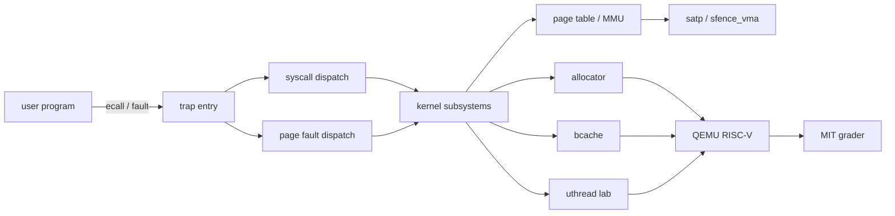
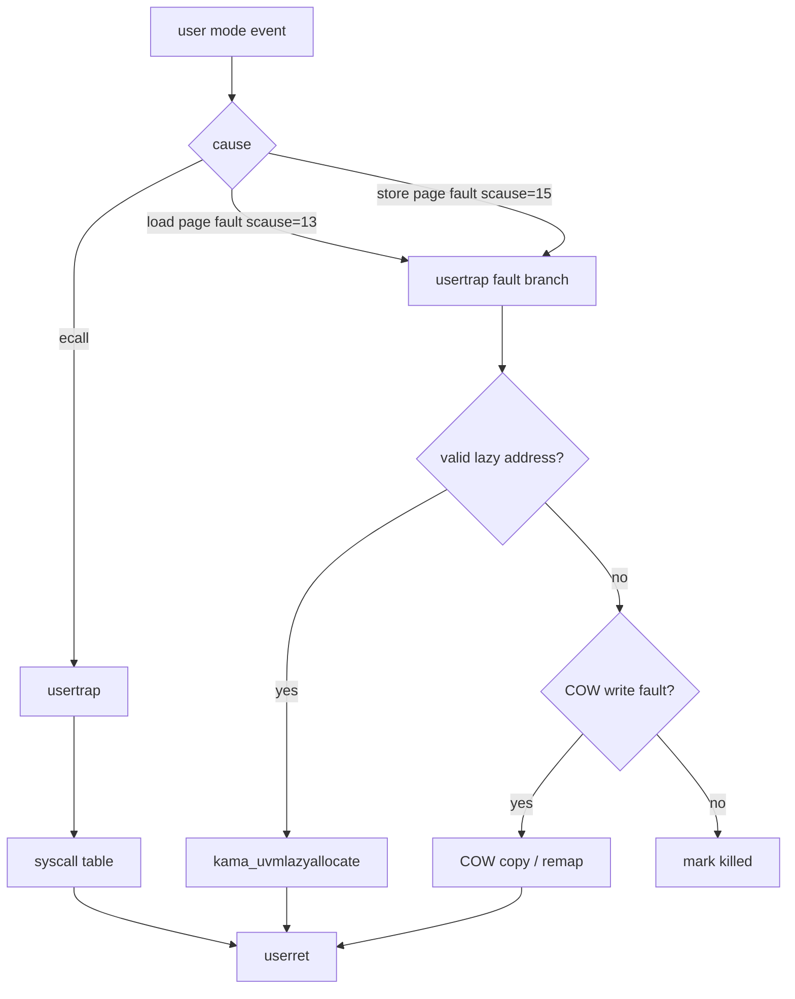
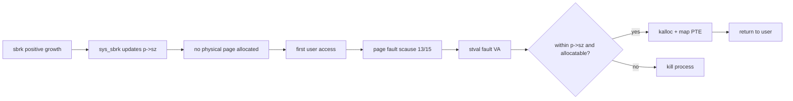
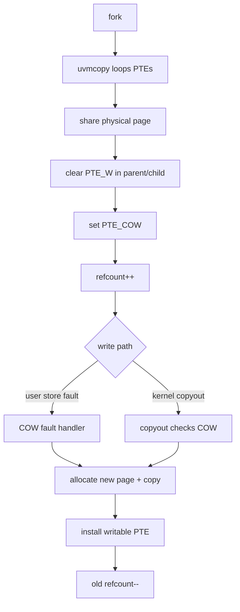
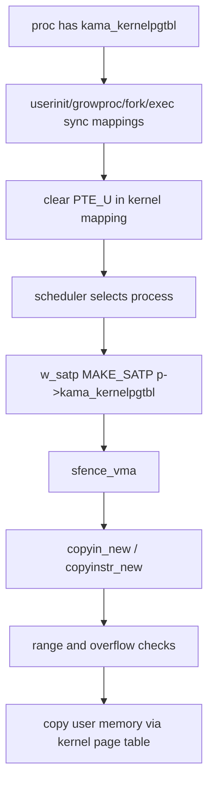
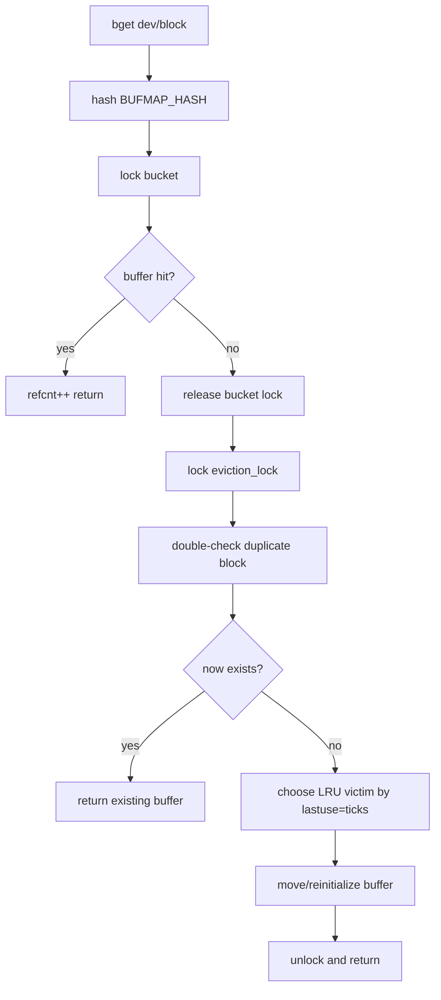
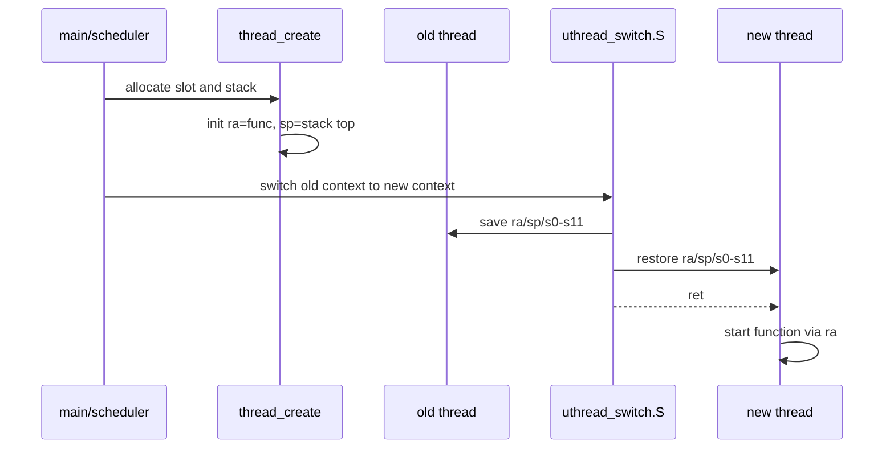
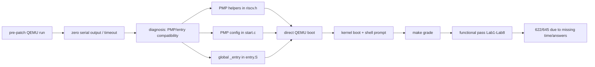
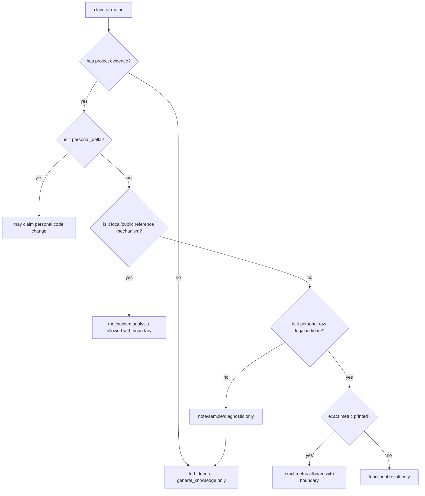
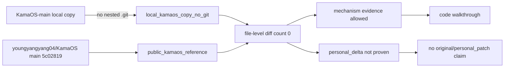

# DEEP_INTERVIEW_LONG_ANSWERS_AND_KNOWLEDGE_BASE.md
> 中文名：长答与知识库（Long Answers and Knowledge Base）  
阅读提示：这份文档是中文可读版。英文枚举、code path、claim_id、文件名、命令和日志名为了可追溯保留。若中文解释与英文枚举发生冲突，以 canonical fact boundary 为准。本轮只做中文可读性返修，不改变事实。  
导读：本文件保留技术长答主体和 Mermaid 图；这里只统一章节名与字段说明，不改成口语稿。
>

生成日期：2026-06-15

## 0. 使用说明与阶段边界
本文是阶段 6 Long Answers and Knowledge Base，目标是把前序 Interview Prep 和 Adversarial QA 中的短答、骨架答、风险题扩写成可讲 2 分钟、5 分钟的系统性技术回答，并补充 OS / RISC-V / xv6 / QEMU / 工具链八股和 Mermaid 图表。

本文解决内容深度、技术完整性、系统性讲解、项目事实与通用八股的连接、图示化解释能力。本文不解决最终口语自然度，不替代阶段 7 Spoken Answers，不生成最终背诵稿，不处理现场转场语和短句化。本文中的长答允许长句、系统性解释和证据引用，可以偏技术说明，不一定适合直接背。后续 Spoken Answers 需要把本文改写成自然口语。

本文不新增项目事实。项目事实仍以 canonical Evidence Map / Code Evidence Delta / Log Backfill / Resume Cross Exam 为准。通用 OS、RISC-V、xv6、QEMU、GDB、工具链知识只作为 `general_knowledge`，只能解释为什么机制合理，不能弥补项目没有完成或没有证据的事实。

本文不修改源码，不重新跑测试，不修改 Evidence Map / Code Delta / Log Backfill / Resume Cross Exam / Interview Prep / Adversarial QA，不生成 Spoken Answers，不新增其他 artifact。Mermaid 图表直接嵌入 markdown。

全局边界：

+ 项目名称：MIT 6.S081 xv6-riscv 操作系统内核实验实现。
+ KamaOS-main 是 `local_kamaos_copy_no_git` / `public_kamaos_reference`，能支持参考代码机制存在，不能证明 `personal_delta`。
+ 测试边界：在 QEMU 8.2.2 / WSL2 环境中，补入 PMP / entry 启动兼容补丁后，Lab1-Lab8 functional tests 均通过；总分 622/645，扣分来自 `time.txt` / `answers-*.txt` 缺失。
+ PMP / entry patch 是 `environment_compatibility_patch`，不是 lab implementation。
+ 推荐简历版本：Conservative Version；Optional Test-backed Add-on 只能带 environment compatibility patch boundary。

## 1. canonical 输入（Canonical Inputs）
| artifact 文件 | path 路径 | 作用 role |
| --- | --- | --- |
| DEEP_INTERVIEW_ADVERSARIAL_QA.md | `_local_archive/interview/xv6-riscv-labs/DEEP_INTERVIEW_ADVERSARIAL_QA.md` | 高压题库、long-answer candidates、expand_in_long_answers、连续追问、危险回答到安全回答、阶段边界 |
| DEEP_INTERVIEW_PREP_MAIN.md | `_local_archive/interview/xv6-riscv-labs/DEEP_INTERVIEW_PREP_MAIN.md` | 项目主线、模块深挖、Code Walkthrough Plan、Red Lines、Downstream Split Plan |
| RESUME_CROSS_EXAM.md | `_local_archive/interview/xv6-riscv-labs/RESUME_CROSS_EXAM.md` | Conservative Version、forbidden register、安全简历措辞 |
| DEEP_INTERVIEW_EVIDENCE_MAP_LOG_BACKFILLED.md | `_local_archive/interview/xv6-riscv-labs/DEEP_INTERVIEW_EVIDENCE_MAP_LOG_BACKFILLED.md` | canonical Evidence Map，C03-C22 claim 状态、source/test boundary |
| DEEP_INTERVIEW_CODE_EVIDENCE_DELTA_LOG_BACKFILLED.md | `_local_archive/interview/xv6-riscv-labs/DEEP_INTERVIEW_CODE_EVIDENCE_DELTA_LOG_BACKFILLED.md` | canonical Code Evidence Delta，模块级代码路径、日志边界 |
| DEEP_INTERVIEW_LOG_BACKFILL.md | `_local_archive/interview/xv6-riscv-labs/DEEP_INTERVIEW_LOG_BACKFILL.md` | post-PMP retest、metrics audit、C22 update |
| ENV_COMPAT_PATCH_AND_RETEST.md | `_local_archive/interview/xv6-riscv-labs/ENV_COMPAT_PATCH_AND_RETEST.md` | PMP / entry environment patch 与 Lab1-Lab8 retest summary |
| SOURCE_REBASE_KAMAOS_AUDIT.md | `_local_archive/interview/xv6-riscv-labs/SOURCE_REBASE_KAMAOS_AUDIT.md` | KamaOS-main source provenance、public reference、personal_delta absence |
| PROJECT_INTERVIEW_PREP_WORKFLOW_TEMPLATE_v2.1.md | `_local_archive/interview/xv6-riscv-labs/PROJECT_INTERVIEW_PREP_WORKFLOW_TEMPLATE_v2.1.md` | workflow stage contract and downstream Long Answers / Spoken Answers split |

## 2. 项目 5 分钟总讲稿（Project 5-minute Master Narrative）
这是一个围绕 MIT 6.S081 xv6-riscv labs 的操作系统内核实验实现与机制分析项目。它不是生产级 OS，也不是原创操作系统项目；更准确的定位是：在 xv6 这个小型教学内核上，把用户态到内核态、trap、页表、物理内存、锁并发、buffer cache、用户态线程、QEMU/grader 测试这些系统路径串起来。项目价值不在于宣称自己发明了新内核或做了原创深度优化，而在于能把 OS 机制从代码、测试、边界和调试证据四个层面讲清楚。

为什么做 xv6 / OS lab：xv6 足够小，能完整看到 syscall、trap、进程、页表、文件系统和锁；同时它又不是纯概念题，代码会在 RISC-V/QEMU 上实际启动。对嵌入式、端侧部署、系统性能诊断、内存问题定位都有基础价值，因为这些场景经常会涉及用户态/内核态边界、虚拟地址到物理地址翻译、缺页异常、共享状态并发、引用计数和低层调试。

总体架构可以按三层讲。第一层是 user/kernel boundary：用户程序通过 `ecall`、异常或 page fault 进入内核，内核通过 trap path 分发到 syscall、lazy allocation、COW 或 kill。第二层是内核子系统：进程、页表、allocator、bcache、copy path、uthread 等模块共同维护进程隔离、内存生命周期和共享资源一致性。第三层是运行与验证环境：QEMU 模拟 RISC-V 机器，grader 驱动 xv6 启动和测试，WSL2/QEMU 8.2.2 环境下需要 PMP / entry 启动兼容补丁才能让参考代码可测。

核心模块可以选三到五个展开。第一是 per-CPU allocator，它把空闲页链表拆到 `kmem[NCPU]`，配合 `push_off/pop_off` 获取稳定 `cpuid`，本 CPU 无页时从其他 CPU stealing，重点是降低全局 allocator lock 热点，但不能讲 exact `83,375 -> 0`。第二是 bucketed bcache，它用 `NBUFMAP_BUCKET 13`、`BUFMAP_HASH`、bucket locks、`eviction_lock`、`lastuse=ticks` 和 duplicate-block double-check 管理 buffer cache，并解决释放 bucket lock 到拿 eviction lock 之间的 race window，但不能讲 64B/MESI 或吞吐倍数。第三是 lazy allocation 和 COW fork：lazy 正向 `sbrk` 只更新 `p->sz`，首次访问通过 `scause` 13/15 和 `stval` 分配映射；COW fork 清 `PTE_W`、设 `PTE_COW`、共享 PA、维护 refcount，写 fault 或 `copyout` 时复制。第四是 per-process kernel page table，进程维护 `kama_kernelpgtbl`，scheduler 写 `satp` 并 `sfence_vma`，用户映射同步到 kernel page table 时清 `PTE_U`，copy path 使用 `copyin_new/copyinstr_new`。第五是 uthread，用户态协作线程保存/恢复 `ra/sp/s0-s11`，`thread_create` 初始化 `ra` 和 `sp`，汇编切换后 `ret` 进入线程函数。

测试与环境兼容必须带边界讲。当前 canonical 证据支持：在 QEMU 8.2.2 / WSL2 环境中，补入 PMP / entry 启动兼容补丁后，Lab1-Lab8 functional tests 均通过；总分 622/645，扣分来自 `time.txt` 和 `answers-*.txt` 缺失。这个结论不能说成 make grade 满分，不能说 unpatched code directly passed，也不能说 PMP patch 是 lab implementation。PMP / entry patch 只让当前 QEMU 环境中的参考代码能正常启动和输出，不证明 lab 机制是个人原创。

证据边界与风险边界也要主动讲：KamaOS-main 是 `local_kamaos_copy_no_git` / `public_kamaos_reference`。Source Rebase 显示本地 copy 与 public KamaOS main 文件级一致，`personal_delta_found_count: 0`。所以它可以支持“参考代码中存在机制，可以走查和分析”，不能支持“原创实现”“personal_patch”“原创深度优化”。性能数字、exact totals、严格复杂度、cache-line/MESI、安全加固等，如果没有 raw log 或 personal_delta，就只能删除或降级。

可迁移能力放在最后：这个项目能证明的是系统性理解、低层调试、边界意识和工程诚实。能把一个 OS 机制从触发条件讲到数据结构、锁、异常路径、测试输出和证据口径，这比单独背概念更接近实际系统工作。它不能证明生产级内核开发经验，但能作为操作系统、嵌入式、端侧部署和系统调试岗位的基础能力支撑。

## 3. Mermaid 图表合集
### 3.1 整体架构图（Overall Architecture Diagram）
图名：Overall Architecture Diagram  
用途：解释项目整体结构，从用户程序到内核机制再到 QEMU/grader。

面试讲解要点：trap 是 user/kernel 的统一入口；内核子系统不是孤立模块，内存、锁、copy path、测试环境都要串起来。  
风险边界：这是架构讲解图，不证明生产级 OS、原创实现或性能指标。

### 3.2 Trap / Page Fault 分发流程（Dispatch Flow）
图名：Trap / Page Fault Dispatch Flow  
用途：解释 syscall、lazy allocation、COW、非法访问如何分流。

面试讲解要点：page fault 不一定是错误；lazy 和 COW 都把 fault 当成延迟工作的触发点。  
风险边界：不要把 `scause` 13/15 泛化为所有异常；不要说所有 fault 都能恢复。

### 3.3 Lazy Allocation 流水线（Pipeline）
图名：Lazy Allocation Pipeline  
用途：解释正向 `sbrk` 延迟分配链路。

面试讲解要点：成本从 `sbrk` 转移到首次访问；`uvmunmap/uvmcopy` 需要 skip holes。  
风险边界：只能讲正向 lazy growth，不讲所有 `sbrk` 都 O(1)。

### 3.4 COW Fork 生命周期（Lifecycle）
图名：COW Fork Lifecycle  
用途：解释 COW 页面从 fork 到写入再到释放的生命周期。

面试讲解要点：COW 避免立即复制物理页，但 `uvmcopy` 仍遍历 PTE。  
风险边界：不能说 fork strict O(1)，不能说 `PTE_COW` 是个人原创位设计。

### 3.5 进程私有内核页表流程（Per-process Kernel Page Table Flow）
图名：Per-process Kernel Page Table Flow  
用途：解释进程私有内核页表、映射同步和 copy path。

面试讲解要点：`satp` 切换决定当前地址空间；清 `PTE_U` 是权限语义的一部分。  
风险边界：不要说实测加速，不要说个人安全加固 PLIC / overflow。

### 3.6 Bcache 加锁与驱逐流程（Locking / Eviction Flow）
图名：Bcache Locking / Eviction Flow  
用途：解释 bucketed bcache 的命中、miss、驱逐和 double-check。

面试讲解要点：double-check 主要覆盖 duplicate-block race window；`eviction_lock` 协调跨 bucket 驱逐。  
风险边界：不要说 double-check 是单独防死锁；不要讲 64B/MESI 或 1.7~2.4x。

### 3.7 Uthread 生命周期时序图（Lifecycle Sequence Diagram）
图名：Uthread Lifecycle Sequence Diagram  
用途：解释用户态协作线程如何从 create 到 switch 再到 function。

面试讲解要点：`ret` 使用恢复后的 `ra`；新线程不是内核线程，是用户态协作切换。  
风险边界：不要说 56%，不要把 `ra/sp` 都叫 callee-saved。

### 3.8 测试与环境兼容流程（Test / Environment Compatibility Flow）
图名：Test / Environment Compatibility Flow  
用途：解释 pre-patch zero output 到 post-patch functional pass 的证据链。

面试讲解要点：pre-patch 日志是 diagnostic；post-patch 日志只支持带 environment compatibility patch 的 functional pass。  
风险边界：不能说 unpatched code directly passed；不能说 make grade 满分。

### 3.9 指标证据决策树（Evidence Decision Tree for Metrics）
图名：Evidence Decision Tree for Metrics  
用途：解释一个指标或 claim 是否能写进简历/面试。

面试讲解要点：机制存在、功能测试通过、个人原创、性能指标是四类不同证据。  
风险边界：不要用 official sample、note output、diagnostic log 写 personal exact metric。

### 3.10 源码来源边界图（Source Provenance Boundary Diagram）
图名：Source Provenance Boundary Diagram  
用途：解释 KamaOS-main、public reference、personal_delta 的关系。

面试讲解要点：本地目录存在不等于 personal ownership；source boundary 要先讲清。  
风险边界：不能把 local copy、GitHub URL 或 PMP patch 当成 personal_delta。

## 4. 核心架构深度讲解
### 4.1 user/kernel 边界（boundary）
+ 通用知识：`general_knowledge`。现代 OS 用用户态和内核态隔离权限。用户态程序不能直接操作页表、磁盘、中断控制器或任意物理内存；进入内核通常通过 syscall、trap、interrupt 或 page fault。内核访问用户地址也不能把用户指针当普通可信指针，因为虚拟地址可能未映射、越界、权限不对，甚至在并发或异常路径中触发 fault。
+ 项目体现：本项目用 syscall/trap/page fault/copy path 串起 user/kernel boundary。lazy allocation 中，用户访问未映射但合法的地址会触发 page fault；COW 中，写 COW 页通过 fault 或 `copyout` 路径触发复制；per-process kernel page table 中，用户映射同步到进程内核页表并清 `PTE_U`，copy path 使用 `copyin_new/copyinstr_new`。
+ 代码路径：`KamaOS-main/KamaOS-main/Lab5-Lazy Page Allocation/kernel/trap.c`；`KamaOS-main/KamaOS-main/Lab6-Copy-on-Write Fork/kernel/vm.c`；`KamaOS-main/KamaOS-main/Lab3-Page Tables/kernel/vmcopyin.c`。
+ 面试高频追问：为什么 page fault 不一定是非法？为什么 `copyout` 也要处理 COW？为什么不能直接信任用户指针？清 `PTE_U` 是什么语义？
+ 风险边界：不能说这是个人安全加固；不能把参考代码机制说成 personal patch；不能把 copy path 的机制替换说成实测性能提升。
+ 可转 Spoken Answers 的要点：一句话先讲“边界是通过 trap 和 copy path 维护的”，再用 lazy、COW、kernel page table 三个例子展开。

### 4.2 page table / MMU / satp
+ 通用知识：`general_knowledge`。RISC-V Sv39 使用多级页表把虚拟地址翻译成物理地址，PTE flags 表示 valid、read、write、execute、user 等权限。`satp` 指向当前地址空间的根页表，切换页表后通常需要刷新地址翻译缓存。RSW 位可供软件使用，COW 常用软件位标记写时复制状态。
+ 项目体现：Lab3 per-process kernel page table 中，`struct proc` 有 `kama_kernelpgtbl`；scheduler 切换进程时写 `w_satp(MAKE_SATP(p->kama_kernelpgtbl))` 并 `sfence_vma()`；用户映射同步到 kernel page table 时清 `PTE_U`。Lab6 COW 使用 `PTE_COW (1L << 8)` 标记 COW 页，配合清 `PTE_W` 让写入触发复制。
+ 代码路径：`Lab3-Page Tables/kernel/proc.h`、`proc.c`、`vm.c`、`vmcopyin.c`、`exec.c`；`Lab6-Copy-on-Write Fork/kernel/riscv.h`、`vm.c`。
+ 面试高频追问：`satp` 为什么要切？`sfence_vma` 为什么需要？`PTE_U` 和 supervisor 访问有什么关系？`PTE_COW` 为什么能放在 bit 8？
+ 风险边界：Sv39 是通用知识，不是项目事实；`PTE_COW` 的具体使用是参考代码证据 C13，不是个人原创位设计。
+ 可转 Spoken Answers 的要点：把 `satp` 说成“当前页表根”，把 PTE flags 说成“硬件和软件共同维护的访问合同”。

### 4.3 内存管理架构（memory management architecture）
+ 通用知识：`general_knowledge`。内存管理要维护虚拟地址空间、物理页分配、映射权限和页面生命周期。lazy allocation 把物理页分配推迟到第一次访问；COW fork 把物理页复制推迟到第一次写；refcount 用于判断共享物理页何时可释放。
+ 项目体现：allocator 负责 `kalloc/kfree`；lazy allocation 的正向 `sbrk` 只更新 `p->sz`，page fault 后按 `stval` 分配映射；COW fork 清写位、设 COW、增加 refcount，写 fault 或 `copyout` 时复制并更新引用计数；`uvmunmap/uvmcopy` 对 lazy holes 做兼容。
+ 代码路径：`Lab8-Lock/kernel/kalloc.c`；`Lab5-Lazy Page Allocation/kernel/sysproc.c`、`trap.c`、`vm.c`；`Lab6-Copy-on-Write Fork/kernel/kalloc.c`、`vm.c`、`trap.c`。
+ 面试高频追问：lazy address 如何判合法？COW 父子为什么都要清 `PTE_W`？refcount 什么时候加减？`copyout` 为什么需要 COW？
+ 风险边界：不能说所有 `sbrk` O(1)；不能说 fork strict O(1)；不能说 exact kalloctest/cow 性能指标。
+ 可转 Spoken Answers 的要点：用“推迟分配”和“推迟复制”串 lazy + COW，但提醒一个推迟到首次访问，一个推迟到首次写。

### 4.4 并发架构（concurrency architecture）
+ 通用知识：`general_knowledge`。内核共享数据结构需要锁保护。锁粒度越粗，越容易形成热点；锁粒度越细，越需要处理跨桶、跨 CPU 的一致性和死锁顺序。spinlock 适合短临界区，不能在持锁时做可能阻塞的长操作。
+ 项目体现：per-CPU allocator 用 `kmem[NCPU]` 拆分 freelist，`kfree/kalloc` 保护对应 CPU 的链表，本 CPU 没页时 stealing。bcache 用 13 个 bucket 和 bucket locks 减少无关 block 的锁冲突，miss/eviction 路径用 `eviction_lock` 协调全局 victim 选择，并用 double-check 避免 duplicate block。
+ 代码路径：`Lab8-Lock/kernel/kalloc.c`；`Lab8-Lock/kernel/bio.c`。
+ 面试高频追问：为什么 `cpuid` 要配 `push_off/pop_off`？stealing 锁顺序是什么？double-check 检查什么？`eviction_lock` 为什么不能省？
+ 风险边界：不能说 64B/MESI；不能说吞吐提升 1.7~2.4x；不能把 double-check 简化成防死锁。
+ 可转 Spoken Answers 的要点：先讲“拆锁降低热点”，再讲“拆锁后必须维护跨桶一致性”。

### 4.5 用户态线程架构（user-level threading architecture）
+ 通用知识：`general_knowledge`。用户态线程可以在用户空间调度，不必每次切换都进入内核；协作式调度依赖线程主动 yield。上下文切换要保存足够的寄存器，使恢复后程序能从原位置或预设入口继续执行。RISC-V 调用约定中 `s0-s11` 是 saved registers，`ra` 保存返回地址，`sp` 保存栈位置。
+ 项目体现：uthread context 保存/恢复 `ra/sp/s0-s11`；`thread_create` 初始化 `ra=func`、`sp=stack top`；`uthread_switch.S` 保存旧线程上下文、恢复新线程上下文，最后 `ret` 使用新线程的 `ra` 进入函数。
+ 代码路径：`Lab7-Multithreading/user/uthread.c`；`Lab7-Multithreading/user/uthread_switch.S`。
+ 面试高频追问：为什么 `ret` 能进入新函数？为什么保存 `ra/sp/s0-s11`？为什么不叫 14 个 callee-saved？用户线程和内核线程有什么区别？
+ 风险边界：不能说 56%；不能说 `ra/sp` 都是 callee-saved；不能说这是个人原创 uthread。
+ 可转 Spoken Answers 的要点：把线程切换讲成“换栈、换返回地址、换 saved registers”。

## 5. 核心代码深度讲解
### 5.1 Per-CPU Allocator
+ 2 分钟技术解释：per-CPU allocator 的核心是把原本会被所有 CPU 争用的空闲物理页链表拆成每个 CPU 一份。`kfree` 释放页时通过 `push_off()` 关闭中断，获取稳定的 `cpuid()`，再把页插入当前 CPU 的 freelist；`kalloc` 优先从当前 CPU 的 freelist 取页。如果当前 CPU 没有空闲页，就进入 stealing 路径，从其他 CPU 的 freelist 借页。这个设计的面试重点不是背性能数字，而是解释共享状态为什么会形成锁竞争、per-CPU 拆分如何降低热点，以及 stealing 为什么需要锁保护。Code Evidence Delta 还校正了一个容易答错的点：当前参考实现是在持有当前 CPU `kmem[cpu].lock` 时，再获取其他 CPU `kmem[i].lock`，不能说先释放当前 CPU lock 再 steal。
+ 代码路径：`KamaOS-main/KamaOS-main/Lab8-Lock/kernel/kalloc.c`。
+ 核心变量 / 函数：`kmem[NCPU]`、`push_off`、`pop_off`、`cpuid`、`kfree`、`kalloc`。
+ 关键 invariant：每个 freelist 的链表操作必须在对应锁保护下完成；`cpuid` 必须在不会被中断迁移语义干扰的区间使用；stealing 不能破坏其他 CPU freelist。
+ 容易答错点：讲成个人原创 allocator；讲 exact `83,375 -> 0`；讲错 stealing 锁顺序。
+ 对应 Adversarial QA：Q31/Q32/Q33/Q47。
+ evidence claim_id：C03/C04/C05。
+ 是否 spoken_ready：needs_spoken_rewrite。

### 5.2 Bucketed Bcache
+ 2 分钟技术解释：bcache 缓存磁盘 block，正确性要求是同一个 `(dev, blockno)` 不能同时存在多个有效 buffer，否则文件系统会看到不一致数据。bucketed bcache 把 buffer 按 `BUFMAP_HASH` 分到 `NBUFMAP_BUCKET 13` 个 bucket，每个 bucket 有自己的锁。命中时只锁对应 bucket；miss 时会释放 bucket lock，再拿 `eviction_lock` 做跨 bucket 的 victim 选择。由于释放 bucket lock 到拿 eviction lock 之间存在 race window，其他 CPU 可能已经把同一 block 加入缓存，所以需要 double-check。驱逐时用 `lastuse=ticks` 做 timestamp LRU 选择 victim。这个模块的核心是锁粒度与一致性的 tradeoff：拆锁减少无关 block 竞争，但必须额外处理跨 bucket 驱逐和 duplicate block。
+ 代码路径：`KamaOS-main/KamaOS-main/Lab8-Lock/kernel/bio.c`。
+ 核心变量 / 函数：`NBUFMAP_BUCKET 13`、`BUFMAP_HASH`、`bufmap_locks`、`eviction_lock`、`lastuse=ticks`、`bget`。
+ 关键 invariant：同一 `(dev, blockno)` 最多对应一个缓存 buffer；bucket 链表迁移和 victim 选择不能留下重复块；LRU 信息只作为驱逐依据，不是性能指标。
+ 容易答错点：说 double-check 防死锁；说 64B/MESI；说 bcache 1.7~2.4x。
+ 对应 Adversarial QA：Q34/Q35/Q36/Q48/Q49/Q96。
+ evidence claim_id：C06/C07/C08/C09。
+ 是否 spoken_ready：needs_spoken_rewrite。

### 5.3 Lazy Allocation
+ 2 分钟技术解释：lazy allocation 把正向 `sbrk` 的物理页分配延迟到第一次访问。安全说法是：positive growth 的 `sys_sbrk` 只更新 `p->sz`，不立即调用 `kalloc` 和 map；当用户访问这段尚未映射的虚拟地址时，硬件产生 load/store page fault，trap path 看到 `scause` 13/15，并通过 `stval` 取得 fault address。内核再判断这个地址是否在进程大小内、是否符合 lazy allocation 条件，如果合法就分配物理页、清零、建立 PTE 映射并返回用户态；如果不合法就 kill。为了让 lazy holes 不破坏其他路径，`uvmunmap` 和 `uvmcopy` 要能跳过未实际映射的页。不能泛化为所有 `sbrk` 都 O(1)，因为 shrink path 仍需要释放映射。
+ 代码路径：`Lab5-Lazy Page Allocation/kernel/sysproc.c`、`trap.c`、`vm.c`。
+ 核心变量 / 函数：`p->sz`、`r_scause()`、`r_stval()`、`kama_uvmshouldallocate`、`kama_uvmlazyallocate`、`uvmunmap`、`uvmcopy`。
+ 关键 invariant：进程虚拟大小和实际 PTE 映射可以短暂不一致，但 fault address 必须通过合法性检查；holes 不能让 unmap/copy panic。
+ 容易答错点：把 page fault 全说成错误；忽略 shrink；忽略 skip holes。
+ 对应 Adversarial QA：Q15/Q37/Q38/Q91。
+ evidence claim_id：C10/C11/C22。
+ 是否 spoken_ready：needs_spoken_rewrite。

### 5.4 COW Fork
+ 2 分钟技术解释：COW fork 的目标是避免 fork 时立即复制所有物理页。`uvmcopy` 仍会按页遍历父进程 PTE；对可写页，父子都清 `PTE_W`，设置 `PTE_COW (1L << 8)`，映射到同一个物理页，并增加 refcount。之后任一进程写这个页时，会因为页只读而进入写 fault，或者内核在 `copyout` 写用户页前显式检查 COW。处理 COW 时，如果需要复制，就分配新物理页，把旧页内容复制过去，更新当前 PTE 为可写，旧页 refcount 减一。这里最重要的边界是：COW 避免的是物理页 deep copy，不是 fork strict O(1)，因为 PTE 遍历仍然存在。
+ 代码路径：`Lab6-Copy-on-Write Fork/kernel/riscv.h`、`vm.c`、`kalloc.c`、`trap.c`。
+ 核心变量 / 函数：`PTE_COW`、`PTE_W`、`uvmcopy`、`copyout`、`pageref[]`、`pgreflock`。
+ 关键 invariant：父子共享页必须都不可写且带 COW 标记；refcount 与映射数量一致；写路径必须在真正写前解除 COW。
+ 容易答错点：说 fork O(1)；只处理 user store fault 不处理 `copyout`；父进程不清 `PTE_W`。
+ 对应 Adversarial QA：Q16/Q39/Q40/Q41/Q42/Q50/Q51/Q95。
+ evidence claim_id：C12/C13/C14/C15/C22。
+ 是否 spoken_ready：needs_spoken_rewrite。

### 5.5 Per-process Kernel Page Table
+ 2 分钟技术解释：per-process kernel page table 是为了让每个进程有自己的内核页表，并把用户映射同步进去，copy path 可以通过当前 kernel page table 访问用户地址。`struct proc` 中有 `kama_kernelpgtbl`；`userinit/growproc/fork/exec` 等路径负责同步用户映射；同步到 kernel page table 时清 `PTE_U`；scheduler 切换到进程时写 `satp` 为 `MAKE_SATP(p->kama_kernelpgtbl)`，并 `sfence_vma`。`copyin` 和 `copyinstr` 切到 `copyin_new/copyinstr_new`，并保留范围和 overflow 检查。PLIC boundary 和 overflow guard 都是参考代码机制，不能包装成个人安全加固。
+ 代码路径：`Lab3-Page Tables/kernel/proc.h`、`proc.c`、`vm.c`、`vmcopyin.c`、`exec.c`。
+ 核心变量 / 函数：`kama_kernelpgtbl`、`w_satp`、`MAKE_SATP`、`sfence_vma`、`copyin_new`、`copyinstr_new`、`PTE_U`。
+ 关键 invariant：用户映射与进程内核页表同步；用户地址不能越过 PLIC MMIO 边界；copy path 必须检查地址范围和 overflow。
+ 容易答错点：说实测加速；说个人修复 PLIC/overflow；把 `PTE_U` 清除讲成用户页表本身被破坏。
+ 对应 Adversarial QA：Q18/Q26/Q43/Q44/Q45/Q52。
+ evidence claim_id：C16/C17/C18/C19/C22。
+ 是否 spoken_ready：needs_spoken_rewrite。

### 5.6 Uthread Context Switch
+ 2 分钟技术解释：uthread 是用户态协作线程，不是内核线程。它的上下文切换发生在用户态，核心是保存旧线程的寄存器上下文、恢复新线程的寄存器上下文，再通过 `ret` 跳到恢复后的 `ra`。参考代码中的 context 包含 `ra/sp/s0-s11`；`thread_create` 设置新线程的 `ra=func`，`sp` 指向栈顶；第一次调度到这个线程时，`uthread_switch.S` 恢复这些寄存器，执行 `ret`，于是控制流进入 `func`。术语要严谨：`s0-s11` 是 saved registers，`ra/sp` 不应简单归为 callee-saved。也不能写上下文体积压缩 56%。
+ 代码路径：`Lab7-Multithreading/user/uthread.c`、`user/uthread_switch.S`。
+ 核心变量 / 函数：`struct thread` context、`thread_create`、`thread_schedule`、`uthread_switch`。
+ 关键 invariant：每个线程有独立栈；切换后 `sp` 和 `ra` 必须来自同一线程上下文；协作式调度依赖主动 yield。
+ 容易答错点：说 14 个 callee-saved；说 56%；把用户线程说成内核抢占线程。
+ 对应 Adversarial QA：Q20/Q46/Q53。
+ evidence claim_id：C20/C21/C22。
+ 是否 spoken_ready：needs_spoken_rewrite。

### 5.7 PMP / Entry Environment Compatibility Patch
+ 2 分钟技术解释：pre-patch 的问题不是某个 lab 逻辑测试失败，而是在当前 QEMU 8.2.2 / WSL2 环境下出现 zero serial output / timeout，无法看到 kernel boot message 和 shell prompt。Log Backfill 归类为 diagnostic_log，根因口径是启动路径缺 PMP 配置：从 machine mode 切到 supervisor mode 后，supervisor 访问物理内存权限不足，早期 hang/fault。environment compatibility patch 添加 PMP CSR helper，在 `start.c` 配置 PMP，并在 `entry.S` export `_entry`。补丁后 direct QEMU boot 能看到 kernel/shell 输出，make grade functional tests 通过。它不修改 lab mechanism，也不修改 `user/*.c`，不能说成个人 lab implementation。
+ 代码路径：`kernel/riscv.h`、`kernel/start.c`、`kernel/entry.S` in Lab1-Lab8；`log_backfill/env_patch_retest/patch_diffs.txt`。
+ 核心变量 / 函数：`w_pmpcfg0`、`w_pmpaddr0`、PMP config、`.global _entry`。
+ 关键 invariant：补丁只影响启动可测性，不改变 locks/lazy/cow/page-table/uthread 机制逻辑。
+ 容易答错点：说 patch 后才过所以是 lab 逻辑 patch；说 unpatched code directly passed。
+ 对应 Adversarial QA：Q55/Q56/Q57/Q58/Q59/Q62/Q93。
+ evidence claim_id：C22。
+ 是否 spoken_ready：needs_spoken_rewrite。

### 5.8 Testing / Grader Evidence Path
+ 2 分钟技术解释：测试证据要分三类：pre-patch diagnostic log、post-patch direct QEMU boot log、post-patch make grade log。pre-patch zero serial output 只能说明当时测试体系不可用，不能说明功能通过或失败。direct boot logs 证明补丁后内核能输出 `xv6 kernel is booting`、`init: starting sh` 和 shell prompt。make grade logs 证明 Lab1-Lab8 functional tests 通过。总分 622/645，扣分来自 `time.txt` / `answers-*.txt` 缺失，是非功能文档/问答扣分。安全说法必须包含 QEMU 8.2.2 / WSL2、environment patch、functional pass、622/645 和缺失文件边界。
+ 代码路径：`ENV_COMPAT_PATCH_AND_RETEST.md`；`DEEP_INTERVIEW_LOG_BACKFILL.md`；`log_backfill/env_patch_retest/lab*_direct_qemu_boot.txt`；`log_backfill/env_patch_retest/lab*_make_grade_after_pmp_patch.txt`。
+ 核心变量 / 函数：N/A。
+ 关键 invariant：functional pass 不等于 full score；测试通过不等于 authorship proof；personal_raw_log_candidate 只能支持带边界的本地 functional result。
+ 容易答错点：说 make grade 满分；说 original/unpatched 全过；把 ALL TESTS PASSED 当全局满分。
+ 对应 Adversarial QA：Q60/Q61/Q69/Q70/Q71/Q74/Q75/Q78/Q84/Q98。
+ evidence claim_id：C22。
+ 是否 spoken_ready：needs_spoken_rewrite。

## 6. OS 机制链路深度讲解
### 6.1 syscall/trap 链路
+ 起点：用户程序执行 syscall 或发生异常。
+ 中间关键步骤：RISC-V trap 进入 kernel；`usertrap` 判断 cause；syscall 走 syscall table；异常按 page fault、非法访问等分支处理。
+ 终点：内核完成服务或标记进程 killed，最终 `userret` 返回用户态。
+ 关键代码路径：`kernel/trap.c`、`kernel/syscall.c`；lazy/COW 分支见 Lab5/Lab6。
+ 关键 invariant：trap 入口必须保存用户上下文；返回前恢复用户态执行环境。
+ 面试官会问什么：syscall 和 page fault 都叫 trap，有什么区别？为什么 page fault 可以恢复？
+ 2 分钟长答：syscall/trap 链路可以按“统一入口、按 cause 分流、返回用户态”讲。用户态不能直接调用内核函数，所以 syscall 通过 `ecall` 触发 trap。硬件切到 supervisor trap path 后，内核读取 cause，若是 syscall 就根据 syscall number 分派到具体系统调用；若是 page fault，就需要结合项目机制判断能否恢复。lazy allocation 中，合法地址的未映射访问可以分配页后返回；COW 中，只读 COW 页的写入可以复制后恢复；其他非法访问则 kill。这个链路体现 user/kernel boundary，也体现 xv6 为什么适合讲 OS：同一个 trap 入口连接权限、异常、页表和进程状态。
+ 风险边界：不要说所有 fault 都能恢复；不要把通用 trap 机制说成个人实现。

### 6.2 lazy allocation fault 链路
+ 起点：正向 `sbrk` 后用户首次访问新虚拟地址。
+ 中间关键步骤：`sys_sbrk` 更新 `p->sz`；访问触发 `scause` 13/15；`stval` 提供 fault VA；判断合法；`kalloc` 并 map。
+ 终点：返回用户态，访问成功。
+ 关键代码路径：`Lab5-Lazy Page Allocation/kernel/sysproc.c`、`trap.c`、`vm.c`。
+ 关键 invariant：VA 在 `p->sz` 内且符合 lazy allocate 条件；holes 在 unmap/copy 中可被跳过。
+ 面试官会问什么：为什么 `uvmunmap` 要 skip holes？为什么 shrink 不是 O(1)？
+ 2 分钟长答：lazy allocation 的链路本质是把“申请地址空间”和“分配物理页”拆开。正向 `sbrk` 只改变进程大小，让用户地址空间看起来变大，但页表中没有对应 PTE。第一次访问时，硬件发现地址没有有效映射，于是产生 load/store page fault。trap path 读取 `scause` 和 `stval`，再判断这个地址是否属于进程合法范围。如果合法，就分配物理页，建立映射，返回用户态；如果不合法，比如越界或低于栈保护区，就 kill。这个机制降低了未使用内存的立即分配，但代价是首次访问要处理 fault，并且 VM 辅助函数必须接受 lazy holes。
+ 风险边界：只能讲正向 lazy growth；不讲所有 `sbrk` O(1) 或个人 benchmark。

### 6.3 COW fork 写时复制链路
+ 起点：进程调用 fork。
+ 中间关键步骤：`uvmcopy` 遍历 PTE；父子共享 PA；清 `PTE_W`；设 `PTE_COW`；refcount++；写 fault 时复制。
+ 终点：写入进程得到私有可写副本，旧页 refcount 更新。
+ 关键代码路径：`Lab6-Copy-on-Write Fork/kernel/vm.c`、`kalloc.c`、`trap.c`、`riscv.h`。
+ 关键 invariant：共享 COW 页不可写；refcount 正确；写前必须解除 COW。
+ 面试官会问什么：为什么父进程也要清 `PTE_W`？为什么不是 strict O(1)？
+ 2 分钟长答：COW fork 的链路要避免一个误区：它不是让 fork 全流程变常数，而是推迟物理页复制。fork 时 `uvmcopy` 仍然遍历父进程页表，把原本可写的页改成父子共享的只读 COW 页。父进程也要清 `PTE_W`，否则父进程写共享页不会 fault，会直接修改子进程看到的数据。之后任何一方写该页，都会触发写路径：如果是用户态 store fault，trap 分支处理；如果是内核 `copyout` 写用户页，需要 `copyout` 主动检查 COW。处理时分配新页、复制内容、更新 PTE、调整 refcount。这个机制把内存复制从 fork 时推迟到真正写入时。
+ 风险边界：不说 fork strict O(1)，不说 personal COW patch。

### 6.4 copyout 写用户页链路
+ 起点：内核要向用户地址写数据，如 syscall 返回数据或 pipe/read 类路径。
+ 中间关键步骤：copyout 查用户 VA；发现 PTE_COW；执行 COW copy；安装 writable PTE；再写数据。
+ 终点：内核安全地把数据写入用户页。
+ 关键代码路径：`Lab6-Copy-on-Write Fork/kernel/vm.c`。
+ 关键 invariant：内核写用户页不能绕过 COW 语义；写共享页前必须复制。
+ 面试官会问什么：为什么用户态 store fault 已处理，还要处理 `copyout`？
+ 2 分钟长答：`copyout` 是 COW 中非常容易漏讲的路径。COW 的直觉是“用户写只读页会 fault”，但内核 `copyout` 是 supervisor 代码在替用户写用户地址，它不一定走用户态 store fault 的普通路径。如果 `copyout` 直接写入一个 COW 共享物理页，就会破坏父子进程隔离。因此 `copyout` 在写前要检查目标用户页是否是 COW，如果是，就执行与 fault handler 类似的复制逻辑：分配新页、复制旧内容、更新当前进程 PTE 为可写、减少旧页引用。这样无论写来自用户指令还是内核 copy path，COW invariant 都成立。
+ 风险边界：不要只讲 trap fault，忽略 `copyout` COW；不要说个人原创。

### 6.5 bcache miss / eviction 链路
+ 起点：`bget(dev, blockno)` 请求缓存块且 bucket miss。
+ 中间关键步骤：hash bucket；查找 miss；释放 bucket lock；拿 `eviction_lock`；double-check；选 LRU victim；迁移或初始化 buffer。
+ 终点：返回唯一 buffer。
+ 关键代码路径：`Lab8-Lock/kernel/bio.c`。
+ 关键 invariant：同一 block 不能重复缓存；victim 不能正在使用；跨 bucket 修改要受协调。
+ 面试官会问什么：为什么 double-check？为什么需要全局 eviction_lock？
+ 2 分钟长答：bcache miss 路径是细粒度锁的典型难点。命中时只锁一个 bucket 很简单；miss 时需要找 victim，victim 可能在别的 bucket，这就涉及跨 bucket 状态。实现会释放当前 bucket lock，获取 `eviction_lock` 来协调驱逐。但释放和重新检查之间，另一个 CPU 可能已经创建了同一 `(dev, blockno)` 的 buffer。如果不 double-check，就可能出现 duplicate block，破坏 buffer cache 的一致性。因此 double-check 的目的不是一句“防死锁”，而是保证唯一性 invariant。`lastuse=ticks` 提供 LRU 信息，用于选择 victim，但不能推出未验证性能倍数。
+ 风险边界：不讲 64B/MESI，不讲吞吐 x 倍。

### 6.6 uthread switch 链路
+ 起点：当前用户线程 yield 或 scheduler 选择新线程。
+ 中间关键步骤：保存旧 context 的 `ra/sp/s0-s11`；恢复新 context；`ret` 到新线程 `ra`。
+ 终点：新线程从上次暂停点或新函数入口继续执行。
+ 关键代码路径：`Lab7-Multithreading/user/uthread.c`、`uthread_switch.S`。
+ 关键 invariant：`sp` 对应线程栈；`ra` 对应返回位置；调度是协作式。
+ 面试官会问什么：为什么 `ret` 能进入函数？为什么不保存所有寄存器？
+ 2 分钟长答：uthread switch 可以按“保存旧现场、恢复新现场、ret 交还控制流”讲。用户态线程没有进入内核调度器，它只是把当前执行上下文保存在结构体里，再加载另一个线程的上下文。对新建线程，`thread_create` 已经把 `ra` 设置成函数入口、`sp` 设置成栈顶，所以第一次恢复后执行 `ret`，就像从一个函数返回到 `ra` 指向的位置一样进入线程函数。保存哪些寄存器要按调用约定解释：参考代码保存 `ra/sp/s0-s11`，不能粗略叫 14 个 callee-saved，也不能写 56% 指标。
+ 风险边界：不说内核线程，不说抢占式调度，不说 56%。

### 6.7 per-process kernel page table copyin 链路
+ 起点：内核需要读取用户地址。
+ 中间关键步骤：进程内核页表同步用户映射并清 `PTE_U`；scheduler 切 `satp`；`copyin_new` 做边界检查；通过当前 kernel page table 访问。
+ 终点：完成用户内存复制。
+ 关键代码路径：`Lab3-Page Tables/kernel/proc.c`、`vmcopyin.c`、`vm.c`、`exec.c`。
+ 关键 invariant：同步映射不越过 PLIC；`srcva+len` 不 overflow；用户范围在 `p->sz` 内。
+ 面试官会问什么：为什么不直接用用户页表？为什么清 `PTE_U`？
+ 2 分钟长答：per-process kernel page table 的 copyin 链路把用户映射同步到进程自己的 kernel page table。这样当调度器切到该进程时，`satp` 指向它的内核页表，copy path 可以通过硬件地址翻译访问用户 VA，而不需要原来的软件 walk 路径。同步时清 `PTE_U`，体现的是该映射在 kernel page table 中按 supervisor 访问语义使用。同时，`copyin_new` 仍然要做范围和 overflow 检查，避免用户地址越界或 `srcva+len` wraparound。PLIC boundary 防止用户地址空间碰到 MMIO 区域。
+ 风险边界：不说实测加速，不说个人安全加固。

### 6.8 PMP boot compatibility 链路
+ 起点：QEMU 8.2.2 / WSL2 中 pre-patch xv6 启动。
+ 中间关键步骤：zero serial output；诊断 PMP/entry；加 PMP helper/config 和 `_entry` export；direct boot 验证；make grade。
+ 终点：Lab1-Lab8 functional tests pass, 622/645。
+ 关键代码路径：`kernel/riscv.h`、`kernel/start.c`、`kernel/entry.S`；`ENV_COMPAT_PATCH_AND_RETEST.md`。
+ 关键 invariant：启动兼容补丁不改变 lab 机制代码。
+ 面试官会问什么：patch 后才过，可信度如何？这是不是 lab implementation？
+ 2 分钟长答：PMP boot compatibility 要讲成测试环境复盘，不讲成 lab 实现。pre-patch 的现象是 zero serial output 和 timeout，说明当前环境下 xv6 没有进入可观察的 kernel/shell 输出。诊断指向 machine mode 到 supervisor mode 后 PMP 未配置导致 supervisor 访问物理内存失败。补丁只添加 PMP CSR helper、PMP config 和 `_entry` export，使参考代码在 QEMU 8.2.2 / WSL2 可启动。补丁后 direct boot 有 kernel/shell 输出，make grade functional tests 通过。这个证据增强测试可信度，但不证明个人源码实现。
+ 风险边界：不说 unpatched 全过，不说满分，不说 personal lab patch。

## 7. 部署与工具链八股
### 7.1 QEMU 是什么，为什么用 QEMU
+ 通用知识：`general_knowledge`。QEMU 是机器模拟/虚拟化工具，可模拟 RISC-V 硬件，让 xv6 在普通开发机上启动。
+ 项目体现：本项目在 QEMU 8.2.2 / WSL2 中运行 xv6-riscv，并用 direct boot 和 make grade 验证。
+ 常见追问：QEMU 输出什么算启动成功？为什么不是裸机？
+ 安全回答：QEMU 提供可复现的教学 OS 运行环境；本项目只声明当前 QEMU 8.2.2 / WSL2 边界。
+ 风险边界：不要说 QEMU 结果等同真实硬件生产验证。

### 7.2 WSL2 环境边界
+ 通用知识：`general_knowledge`。WSL2 是 Windows 上的 Linux 虚拟化环境，工具链、文件系统和 QEMU 行为可能与原生 Linux 有差异。
+ 项目体现：C22 明确测试环境是 QEMU 8.2.2 / WSL2。
+ 常见追问：为什么需要额外 patch？
+ 安全回答：patch 是 environment compatibility，用于当前环境启动可测，不是 lab mechanism。
+ 风险边界：不要泛化到所有环境均相同。

### 7.3 RISC-V cross toolchain
+ 通用知识：`general_knowledge`。xv6-riscv 需要 RISC-V cross compiler 生成目标架构代码。
+ 项目体现：Log Backfill 记录工具链为 `riscv64-unknown-elf-gcc 13.2.0`，Makefile 已覆盖 GCC13 infinite-recursion Werror 兼容。
+ 常见追问：host gcc 和 cross gcc 区别？
+ 安全回答：host 运行在开发机，cross toolchain 生成 RISC-V ELF 给 QEMU 运行。
+ 风险边界：不要把 GCC13 兼容说成 lab 机制。

### 7.4 Makefile / grade-lab scripts / grader
+ 通用知识：`general_knowledge`。Makefile 编译 kernel/user 程序；grader 自动启动 QEMU、运行测试、匹配输出。
+ 项目体现：Lab1-Lab8 `make grade` logs 是 C22 bounded evidence。
+ 常见追问：为什么有 622/645？
+ 安全回答：functional tests pass；扣分来自 `time.txt` / `answers-*.txt` 缺失。
+ 风险边界：不要说 full score。

### 7.5 GDB 在 xv6 调试中的作用
+ 通用知识：`general_knowledge`。GDB 可连接 QEMU gdbstub，查看寄存器、断点、单步、页表相关状态。
+ 项目体现：项目技术栈包含 GDB；可用于解释 trap/page fault 和启动诊断，但本阶段不新增 GDB raw evidence。
+ 常见追问：如何定位 page fault？
+ 安全回答：看 `scause/stval/sepc`，结合 `trap.c` 分支和 PTE 状态。
+ 风险边界：不要声称已用 GDB 产生未记录的个人证据。

### 7.6 PMP / privilege mode / supervisor access
+ 通用知识：`general_knowledge`。RISC-V privilege mode 中，PMP 控制低特权模式对物理内存的访问权限。
+ 项目体现：pre-patch zero output 的诊断指向 PMP 配置缺失；patch 在 `riscv.h/start.c` 添加 helper/config。
+ 常见追问：为什么 supervisor 访问内存会失败？
+ 安全回答：缺 PMP 配置时，从 M-mode 到 S-mode 后物理内存访问权限不足，导致早期 hang/fault。
+ 风险边界：不要把 PMP patch 写成 lab implementation。

### 7.7 direct QEMU boot vs make grade
+ 通用知识：`general_knowledge`。direct boot 验证系统能启动和交互；make grade 验证测试脚本定义的功能点。
+ 项目体现：8 个 direct boot logs + 8 个 make grade logs。
+ 常见追问：为什么 timeout 不一定失败？
+ 安全回答：direct boot 为观察 shell prompt 后由外部 timeout 结束；make grade 的 OK/score 才用于功能判断。
+ 风险边界：不要把 direct boot 等同全部测试通过。

### 7.8 exit status 124 / exit status 2 如何解释
+ 通用知识：`general_knowledge`。`124` 常见于 timeout；`2` 常见于命令或测试脚本失败退出，具体要看上下文。
+ 项目体现：pre-patch timeout 是 diagnostic；direct boot timeout 可是观察后终止；make grade 需要看功能项和扣分原因。
+ 常见追问：看到 timeout 是否就是失败？
+ 安全回答：不能只看 exit code，要结合是否有 kernel output、shell prompt、grader functional OK。
+ 风险边界：不要把 negative-match 偶然 OK 当功能通过。

### 7.9 为什么 environment patch 不等于 lab implementation
+ 通用知识：`general_knowledge`。环境补丁解决运行平台兼容性；功能实现改变实验机制逻辑。
+ 项目体现：patch 只涉及 `riscv.h/start.c/entry.S`，不修改 locks/lazy/cow/page-table/uthread 或 `user/*.c`。
+ 常见追问：patch 后过了算不算改实现？
+ 安全回答：它让参考代码可启动可测，不改变 lab mechanism。
+ 风险边界：不要把它当 personal_patch。

### 7.10 如果面试官要复现测试，该怎么讲
+ 通用知识：`general_knowledge`。复现需要固定源码、工具链、QEMU、命令和 patch 边界。
+ 项目体现：提供 QEMU 8.2.2 / WSL2、PMP/entry patch、Lab1-Lab8 logs、622/645。
+ 常见追问：能否保证对方机器也一样？
+ 安全回答：我能说明当前环境和步骤；不同 QEMU/toolchain 可能需要适配。
+ 风险边界：不要承诺所有环境 unpatched 全过。

## 8. 实验数字 / 指标 provenance / 测试口径八股
| item | 结论 | 为什么 | 项目证据 | 安全说法 | 禁止说法 |
| --- | --- | --- | --- | --- | --- |
| 8.1 personal_raw_log | 用户本人历史原始日志，当前历史 confirmed count 为 0 | 需要原始命令输出支持个人结果 | Log Backfill | 当前没有 historical confirmed personal_raw_log | 把笔记输出当本人日志 |
| 8.2 personal_raw_log_candidate | post-PMP 本地复测日志候选，可支持带边界 functional result | 由当前本地环境生成，但要带 env patch | C22 | post-PMP functional tests pass with boundary | 无边界全过 |
| 8.3 diagnostic_log | 诊断日志，只说明问题现象 | pre-patch zero output 不能证明 pass | ALL_LABS_TESTABILITY_DIAGNOSIS | 修复前测试体系不可用 | 修复前也通过 |
| 8.4 official_lab_sample | 官方样例输出 | 可作课程背景，不是个人结果 | official html | 官方/样例中有目标指标 | 本人实测 |
| 8.5 note_output_block | 笔记输出块，provenance 未验证 | 不能独立证明运行者和环境 | personal notes | 笔记记录过 | 我的 raw output |
| 8.6 83,375 不能写 | 不能作为个人指标 | 来自笔记/官方样例风格 | C05 | 不背 exact metric，只讲锁竞争机制 | 83,375 -> 0 本人实测 |
| 8.7 kalloctest tot=0 不能写 | exact `tot=0` 未在 post-patch raw log 确认 | Lab8 functional pass 不打印 exact total | C05/C22 | kalloctest functional subtests pass with boundary | 本人 tot=0 |
| 8.8 bcache exact totals 不能写 | `tot=128/16142` 不可作为个人 raw metric | official/sample 或未打印 | C06/C08/C22 | bcachetest functional pass with boundary | 本人 exact tot=128/16142 |
| 8.9 1.7~2.4x 不能写 | 无 benchmark 方法、环境、原始输出 | C08 forbidden | C08 | 讲 bucketed bcache 机制 | 吞吐提升 1.7~2.4x |
| 8.10 622/645 可以写但必须带边界 | 有 post-PMP grade logs | 扣分非功能文件缺失 | C22 | env patch 后 functional pass, 622/645 | make grade 满分 |
| 8.11 functional pass vs full score | functional pass 是功能项 OK；full score 是所有得分项满分 | missing files 扣分 | C22 | functional tests pass | make grade full score |
| 8.12 ALL TESTS PASSED 局部含义 | 只能按具体测试输出解释 | 不代表全局 645/645 | Log Backfill metrics audit | 某个 usertests/functional marker | 全项目全过 |
| 8.13 ph_fast 1.25x official criterion | 可说 official criterion pass | Lab7 `ph_fast: OK` 是官方测试口径 | Log Backfill | 官方 `ph_fast` criterion passed | 自定义性能优化 1.25x |

## 9. 调试 / 可观测性 / 代码走查八股
| item | 2 分钟解释 | 证据路径 | 面试风险 | 安全话术 |
| --- | --- | --- | --- | --- |
| 9.1 zero serial output 如何诊断 | 先区分编译失败、QEMU 启动但无输出、kernel/shell 输出异常。pre-patch 是系统性 zero serial output，说明早期启动或权限配置问题，不是某个 lab 功能断言失败。进一步看 direct boot 无 boot message，定位到 PMP/entry compatibility。 | `ALL_LABS_TESTABILITY_DIAGNOSIS.md`; `DEEP_INTERVIEW_LOG_BACKFILL.md` | 说成 lab logic fail/pass | 修复前日志是 diagnostic_log |
| 9.2 区分环境问题和 lab logic failure | 环境问题表现为所有 lab 启动层面无输出；logic failure 通常是某个测试项输出不匹配。PMP patch 后 functional tests 均过，说明 pre-patch 主要是可测性问题。 | C22 logs | 绝对化为没有任何逻辑风险 | 当前证据支持 env-patched functional pass |
| 9.3 QEMU 输出判断 boot 成功 | 看 `xv6 kernel is booting`、hart startup、`init: starting sh`、shell prompt。direct boot timeout 可能是人为观察后终止。 | `lab*_direct_qemu_boot.txt` | 把 timeout 当失败 | direct boot 只验证启动可观察 |
| 9.4 grader output 判断 functional pass | 看各 functional test OK 和最终扣分项；本项目 622/645 由 missing files 扣分。 | `lab*_make_grade_after_pmp_patch.txt` | 说成满分 | functional tests pass, not full score |
| 9.5 GDB 解释 trap/page fault | 断在 trap path，看 `scause/stval/sepc`，结合 PTE flags 判断 lazy/COW/illegal。 | 技术栈 + code paths | 编造 GDB raw log | 可讲方法，不新增项目事实 |
| 9.6 现场走查 COW | 从 `uvmcopy` 讲清 `PTE_W`/`PTE_COW`/refcount，再到 trap/copyout。 | Lab6 `vm.c/kalloc.c/trap.c` | 说 O(1) | 避免物理页复制，但遍历 PTE |
| 9.7 现场走查 bcache | 从 `bget` hash bucket 命中讲到 miss、eviction_lock、double-check、LRU victim。 | Lab8 `bio.c` | 说 double-check 防死锁 | duplicate-block race window |
| 9.8 现场走查 uthread | 从 `thread_create` 初始化 `ra/sp` 到 `uthread_switch.S` 保存恢复并 `ret`。 | Lab7 `uthread.c/uthread_switch.S` | 说 14 callee-saved / 56% | 保存恢复 `ra/sp/s0-s11` |
| 9.9 面试官要求 commit/diff | 先说明当前 canonical 没有 personal_delta，再展示机制代码路径。 | Source Rebase | 临场编造 personal patch | 当前证据不证明个人 diff |
| 9.10 要求证据路径 | 按 claim_id 给 Evidence Map、Code Delta、Log Backfill、具体源码路径。 | C03-C22 | 用旧版 evidence map | LOG_BACKFILLED 是 canonical |

## 10. 指标口径深度解释
| item | 定义 | 本项目例子 | 面试中安全说法 | 危险说法 | 对应 Red Line |
| --- | --- | --- | --- | --- | --- |
| 原创实现 vs 机制实现与分析 | 原创证明需要 personal_delta；机制分析只需代码路径和理解 | KamaOS-main 无 personal_delta | 课程实验机制实现与分析 | 原创实现 | 原创实现 |
| personal_delta vs reference code evidence | personal_delta 是相对参考的真实改动；reference 只证明机制存在 | local/public KamaOS 文件级一致 | 参考代码机制存在 | personal_patch | personal_patch |
| full make grade vs functional pass | full score 是满分；functional pass 是功能项通过 | 622/645 | functional tests pass, non-functional missing files | make grade 满分 | make grade 满分 |
| benchmark vs official grader criterion | benchmark 要方法、环境、raw output；official criterion 是 grader 判定 | ph_fast OK | official criterion passed | 自定义吞吐提升 | bcache 1.7~2.4x |
| exact metric vs functional subtest pass | exact total 要日志打印；functional pass 不等于 exact total | kalloctest pass but no tot=0 | functional pass | tot=0 本人实测 | kalloctest exact tot=0 |
| environment_compatibility_patch vs lab implementation | 启动/环境补丁不改 lab 逻辑 | PMP / entry patch | environment compatibility | lab implementation patch | PMP patch boundary |
| source provenance vs project metadata | GitHub URL/本地目录不是 ownership 证明 | repo URL 可保留 | metadata 与 source boundary 分开 | repo 证明原创 | source boundary |
| general knowledge vs project fact | 通用知识解释机制；项目事实需证据 | Sv39/PMP/QEMU | general_knowledge | 外部知识补项目事实 | new project fact |
| code mechanism evidence vs performance claim | 代码结构不自动推出性能倍数 | bucketed bcache | 机制降低锁热点设计风险 | 吞吐提升 x 倍 | performance forbidden |
| test pass vs authorship proof | 测试证明当前代码在环境下行为，不证明作者 | C22 | 测试边界证明 functional result | 测试过所以我原创 | authorship proof |

## 11. 20 个 2 分钟长答模板
### LA01. 项目不是原创但如何讲价值
适用问题：Q01/Q05/Q09/Q10。  
回答目标：把项目价值从 ownership 转到机制理解、代码走查、测试边界和调试能力。

2 分钟长答：结论先讲清楚：我不会把这个项目说成原创 OS 或个人原创 patch。当前 canonical 证据显示 KamaOS-main 是 `local_kamaos_copy_no_git` / `public_kamaos_reference`，Source Rebase 中没有 personal_delta。因此安全定位是 MIT 6.S081 xv6-riscv 操作系统内核实验实现与机制分析。这个定位并不等于项目没有价值，价值在于它能把操作系统关键路径从代码层讲清楚：用户程序如何通过 syscall/trap 进入内核，page fault 如何分到 lazy allocation 或 COW，页表和 `satp` 如何决定地址翻译，allocator 和 bcache 如何处理共享状态和锁竞争，uthread 如何用 RISC-V 上下文保存恢复实现协作切换。我的回答重点不是“我发明了这些机制”，而是“我能走查这些机制、解释关键 invariant、说明测试证据和风险边界”。测试方面也要诚实：只能说在 QEMU 8.2.2 / WSL2 中补入 PMP / entry environment compatibility patch 后，Lab1-Lab8 functional tests 通过，总分 622/645，非功能扣分来自缺失文件。不能说 make grade 满分、unpatched 全过或原创深度优化。这样讲的好处是既不虚构 ownership，也能展示系统能力：一个候选人能否在压力追问下区分项目事实、参考代码、测试边界和通用知识，本身就是工程素养的一部分。

项目事实：KamaOS-main 为 local/public reference；personal_delta_found_count 0；C22 bounded functional pass。  
通用知识：OS lab 可用于训练系统机制理解。  
代码路径：N/A。  
evidence claim_id：source boundary; C03-C22; C22。  
风险边界：不说原创实现、personal_patch、深度优化。  
是否适合直接背：needs_spoken_rewrite。  
建议 spoken rewrite 方向：压缩成“先承认边界，再讲价值”的 60-90 秒口语版。

### LA02. KamaOS-main source boundary
适用问题：Q02/Q03/Q04/Q97。  
回答目标：解释 KamaOS-main 和 GitHub metadata、public reference、personal_delta 的区别。

2 分钟长答：KamaOS-main 的边界必须先讲，否则后续所有机制都会被误解成 ownership claim。当前审计结论是：`KamaOS-main/KamaOS-main/` 是本地源码副本，没有嵌套 `.git`，source_type 是 `local_kamaos_copy_no_git`。Source Rebase 阶段又临时浅克隆 public KamaOS main，HEAD 是 `5c02819 Update`，文件级比较显示本地 KamaOS-main 与 public main 差异数为 0。所以它能证明什么？能证明本地/公共参考代码中存在 per-CPU allocator、bucketed bcache、lazy allocation、COW、per-process kernel page table、uthread 等机制，能支持我现场走查代码和解释 invariant。它不能证明什么？不能证明这些机制是我的原创实现，不能证明 personal_delta，不能证明 personal_patch，也不能证明原创深度优化。GitHub URL 可以作为项目入口 metadata，但不能替代 source provenance 审计。如果面试官要求 commit 或 diff，我会说当前 canonical 材料没有验证个人 diff；我可以展示机制路径，但不会把未审计内容说成个人贡献。这个边界是为了避免把“能讲清参考实现”包装成“我原创写了完整内核”。

项目事实：本地 KamaOS-main 无 `.git`；public reference 文件级 diff 为 0；personal_delta_found_count 0。  
通用知识：源码 provenance 和项目 metadata 是不同证据类型。  
代码路径：`KamaOS-main/KamaOS-main/`。  
evidence claim_id：source boundary; C03-C22。  
风险边界：不把 local copy / GitHub URL 当 authorship proof。  
是否适合直接背：needs_spoken_rewrite。  
建议 spoken rewrite 方向：准备一个“本地参考代码，不是 personal diff”的边界模板。

### LA03. PMP patch 与测试可信度
适用问题：Q55/Q56/Q58/Q59/Q62/Q93。  
回答目标：解释为什么 patch 后测试仍有价值，但 patch 不是 lab implementation。

2 分钟长答：PMP patch 要按测试环境兼容复盘讲。pre-patch 的现象是 Lab1-Lab8 在当前 QEMU 8.2.2 / WSL2 环境中出现 zero serial output / timeout，看不到 `xv6 kernel is booting`、shell prompt 或有效命令输出。这个阶段的日志被归类为 `diagnostic_log`，只能说明测试体系当时不可用，不能支持功能通过，也不能直接说明某个 lab logic 失败。诊断指向启动路径缺 PMP 配置：从 machine mode `mret` 到 supervisor mode 后，如果 PMP 没有开放物理内存访问，supervisor 早期访问内存会 fault/hang，外部表现就是无串口输出。补丁内容是 `riscv.h` 添加 PMP CSR helper，`start.c` 配置 PMP，`entry.S` export `_entry`。重要边界是：这个 patch 不改 locks/lazy/cow/page-table/uthread 等 lab mechanism，不改 `user/*.c`，所以它是 `environment_compatibility_patch`，不是 lab implementation。patch 后 direct QEMU boot 能看到 kernel/shell 输出，make grade functional tests 通过。因此测试可信度来自“环境可启动后官方功能测试通过”，而不是“patch 证明个人实现正确”。

项目事实：pre-patch zero output；patch files 为 `riscv.h/start.c/entry.S`；post-patch functional pass。  
通用知识：RISC-V PMP 控制低特权模式物理内存访问。  
代码路径：`log_backfill/env_patch_retest/patch_diffs.txt`。  
evidence claim_id：C22。  
风险边界：不说 unpatched 全过；不说 lab implementation patch。  
是否适合直接背：needs_spoken_rewrite。  
建议 spoken rewrite 方向：改写成 failure STAR：现象、定位、修复、验证、边界。

### LA04. 622/645 与 functional tests pass
适用问题：Q22/Q60/Q61/Q69/Q70/Q84/Q98。  
回答目标：清楚区分 functional pass、score、missing files 和 full score。

2 分钟长答：测试结果最稳的说法是：在 QEMU 8.2.2 / WSL2 环境中，补入 PMP / entry environment compatibility patch 后，Lab1-Lab8 functional tests 均通过；总分 622/645，扣分来自 `time.txt` / `answers-*.txt` 缺失。这里有三个层次不能混淆。第一，functional tests pass 指每个 lab 的功能性测试项通过，比如 lazytests/usertests、cowtest/usertests、uthread/ph/barrier、lock lab functional tests 等。第二，622/645 是 grader 总分，包含非功能文件项；缺 `time.txt` 和 answers 文件会扣分，但不是内核机制功能失败。第三，full score 或 make grade 满分是 645/645，这个项目没有证据支持，明确 forbidden。为什么可以写 622/645？因为 post-PMP make grade logs 是 `personal_raw_log_candidate` / local functional test logs，能在 environment patch 边界下支持本地测试结果。为什么不能写“全部满分通过”？因为 Evidence Map C22 明确总分不是满分，非功能扣分存在。面试中如果被问“ALL TESTS PASSED”，也要说它只能按具体 usertests 或 grader 子项解释，不代表全局 full score。

项目事实：Lab1-Lab8 functional tests pass；total 622/645；missing `time.txt` / `answers-*.txt`。  
通用知识：grader score 可同时包含功能项和非功能提交项。  
代码路径：`log_backfill/env_patch_retest/lab*_make_grade_after_pmp_patch.txt`。  
evidence claim_id：C22。  
风险边界：不说 make grade 满分；不说 unpatched pass。  
是否适合直接背：needs_spoken_rewrite。  
建议 spoken rewrite 方向：准备 30 秒“为什么不是满分”的防守版。

### LA05. Per-CPU allocator
适用问题：Q31/Q32/Q33/Q47。  
回答目标：讲清 per-CPU freelist、`cpuid`、stealing、锁顺序和指标边界。

2 分钟长答：per-CPU allocator 的出发点是减少所有 CPU 在同一个 allocator freelist 上争锁。参考实现把空闲物理页链表拆成 `kmem[NCPU]`，每个 CPU 有自己的 freelist 和 lock。`kfree` 释放物理页时，需要知道当前 CPU，把页插入对应 CPU 的链表；因为 `cpuid()` 的结果要在稳定的关中断区间使用，所以代码配合 `push_off()` / `pop_off()`。`kalloc` 先从当前 CPU 的 freelist 取页，如果没有空闲页，再从其他 CPU freelist stealing。stealing 的关键不是“随便拿别人的链表”，而是所有链表操作都要在对应锁保护下完成，避免并发破坏链表。Code Evidence Delta 还特别校正了锁顺序：当前参考实现是在持有当前 CPU `kmem[cpu].lock` 时，再获取其他 CPU `kmem[i].lock`，不能讲成先释放本 CPU lock 再 steal。面试官常问“会不会死锁”，回答要回到具体实现锁顺序和短临界区，而不是泛泛说不会。指标边界同样重要：可以讲 per-CPU freelist 和 stealing 机制，不能讲本人实测 `83,375 -> 0` 或 exact `tot=0`，因为 C05 仍缺 exact raw metric。

项目事实：`kmem[NCPU]`; stealing while holding current lock; no exact personal metric。  
通用知识：per-CPU 数据结构常用于降低共享锁热点。  
代码路径：`Lab8-Lock/kernel/kalloc.c`。  
evidence claim_id：C03/C04/C05。  
风险边界：不说原创 allocator，不说 exact metric。  
是否适合直接背：needs_spoken_rewrite。  
建议 spoken rewrite 方向：把技术段压成“拆锁、关中断取 CPU、没页 stealing、指标不背”。

### LA06. bcache double-check
适用问题：Q35/Q36/Q48/Q49/Q96。  
回答目标：讲清 duplicate-block race window，而不是说防死锁。

2 分钟长答：bcache double-check 的核心作用是维护同一 `(dev, blockno)` 只能有一个 buffer 的一致性。bucketed bcache 用 `BUFMAP_HASH` 把 block 分到 13 个 bucket，每个 bucket 有自己的锁。命中路径很直接：锁 bucket、查找、增加 refcnt、返回。复杂的是 miss 路径，因为需要选择 victim，而 victim 可能在其他 bucket，所以会释放原 bucket lock，再获取 `eviction_lock` 协调驱逐。这里出现 race window：在释放 bucket lock 到拿到 eviction lock 之间，另一个 CPU 可能已经为同一个 `(dev, blockno)` 创建了 buffer。如果当前 CPU 不重新检查，就可能再创建一个重复 buffer，导致缓存一致性错误。因此 double-check 是为了覆盖 duplicate-block race window，不是简单“防死锁”。`eviction_lock` 解决的是跨 bucket 驱逐的全局协调；bucket lock 解决的是桶内链表并发；`lastuse=ticks` 提供 LRU victim 选择依据。安全边界是只能讲这些机制，不能讲 64B cache-line/MESI，也不能讲 bcache 吞吐提升 1.7~2.4x。

项目事实：13 buckets; `eviction_lock`; `lastuse=ticks`; double-check for duplicate block。  
通用知识：细粒度锁需要额外处理跨分片一致性。  
代码路径：`Lab8-Lock/kernel/bio.c`。  
evidence claim_id：C06/C07/C08/C09。  
风险边界：不说 double-check 防死锁；不说性能倍数。  
是否适合直接背：needs_spoken_rewrite。  
建议 spoken rewrite 方向：用“miss 时释放锁产生窗口”作为主线。

### LA07. Lazy allocation page fault path
适用问题：Q15/Q37/Q38/Q91。  
回答目标：讲清 positive `sbrk`、`scause/stval`、lazy allocate、skip holes。

2 分钟长答：lazy allocation 的安全讲法是：正向 `sbrk` lazy growth 只更新 `p->sz`，不立即分配物理页；实际分配推迟到第一次访问。用户第一次访问尚未映射的新虚拟地址时，硬件触发 page fault。trap path 读取 `r_scause()`，load page fault 是 13，store page fault 是 15，再用 `r_stval()` 获取 fault virtual address。然后内核判断这个地址是否在进程合法地址空间内、是否应该 lazy allocate；如果合法，就 `kalloc` 一个物理页、清零、建立 PTE 映射并返回用户态；如果不合法，就 mark killed。这个机制还要求 `uvmunmap` 和 `uvmcopy` 能 skip holes，因为进程地址空间内可能存在“大小上属于进程，但页表尚未映射”的 lazy 区间。如果这些函数遇到未映射页就 panic，fork 或退出 lazy process 会出错。边界是：不能说所有 `sbrk` 都 O(1)，因为 shrink path 仍释放映射；也不能说有个人性能 benchmark。

项目事实：`sys_sbrk` positive growth updates `p->sz`; `scause` 13/15; `stval`; skip holes。  
通用知识：demand paging 把分配推迟到 fault。  
代码路径：`Lab5-Lazy Page Allocation/kernel/sysproc.c`; `trap.c`; `vm.c`。  
evidence claim_id：C10/C11。  
风险边界：不泛化所有 `sbrk` O(1)。  
是否适合直接背：needs_spoken_rewrite。  
建议 spoken rewrite 方向：按“申请、访问、fault、分配、返回”五步讲。

### LA08. COW fork 为什么不是 strict O(1)
适用问题：Q16/Q39/Q40/Q51/Q95。  
回答目标：纠正 fork O(1)，同时讲清 COW 的真正价值。

2 分钟长答：COW fork 不是 strict O(1)，这是必须主动纠正的复杂度边界。COW 的价值是避免 fork 阶段立即复制所有物理页，但它没有消除页表遍历。参考代码的 `uvmcopy` 仍然 `for(i = 0; i < sz; i += PGSIZE)` 遍历父进程地址空间，对每个相关 PTE 做处理：把可写页的 `PTE_W` 清掉，设置 `PTE_COW`，让父子都映射同一个物理页，并增加 refcount。父进程也要清 `PTE_W`，否则父进程写共享页不会触发 COW，会直接修改子进程看到的数据。之后真正写入时，才分配新页、复制内容、更新 PTE。也就是说，COW 把大块物理内存复制从 fork 时推迟到写时，降低的是立即复制成本和内存占用，而不是把 fork 全路径变成常数时间。面试里安全说法是“COW 避免 fork 阶段立即复制物理页，但 `uvmcopy` 仍按页遍历 PTE”，不能写“fork Deep Copy -> O(1)”。

项目事实：`uvmcopy` loops by page; `PTE_COW (1L << 8)`; refcount。  
通用知识：COW 是延迟复制策略。  
代码路径：`Lab6-Copy-on-Write Fork/kernel/vm.c`; `riscv.h`; `kalloc.c`。  
evidence claim_id：C12/C13/C15。  
风险边界：不说 fork strict O(1)。  
是否适合直接背：needs_spoken_rewrite。  
建议 spoken rewrite 方向：先承认“不是 O(1)”，再讲“价值是避免物理页复制”。

### LA09. copyout COW
适用问题：Q42。  
回答目标：解释为什么内核写用户页也必须处理 COW。

2 分钟长答：`copyout` COW 是 COW 实现完整性的关键点。很多回答只讲用户态写 COW 页会因为 `PTE_W` 被清而触发 store page fault，但内核 `copyout` 是另一条写用户页路径。比如系统调用需要把数据从内核复制到用户缓冲区，执行写入的是 supervisor 代码，不一定会按照用户态 store fault 的路径触发 COW。如果 `copyout` 不检查目标页是否 COW，就可能直接写入父子共享的物理页，破坏进程隔离。因此参考代码中 `copyout` 在写用户页前检测 COW，必要时分配新页、复制旧内容、更新当前进程 PTE 为可写、调整旧页 refcount，然后再执行实际 copy。这个链路说明 COW 的 invariant 不是只靠 trap handler 维护，而是所有可能写用户页的路径都要遵守“写共享页前先私有化”。安全边界是可以讲 `copyout` COW 机制，不能说这是个人原创 patch。

项目事实：`copyout` handles COW before writing user memory。  
通用知识：内核 copy path 是 user/kernel boundary 的一部分。  
代码路径：`Lab6-Copy-on-Write Fork/kernel/vm.c`。  
evidence claim_id：C14。  
风险边界：不漏掉 copyout；不说原创。  
是否适合直接背：needs_spoken_rewrite。  
建议 spoken rewrite 方向：用“不是所有写都来自用户态 store”开头。

### LA10. Per-process kernel page table
适用问题：Q18/Q26/Q43/Q52。  
回答目标：讲清 `kama_kernelpgtbl`、mapping sync、`satp`、copy path。

2 分钟长答：per-process kernel page table 的核心是每个进程有自己的 kernel page table，并把用户映射同步进去，让内核 copy path 可以通过当前页表访问用户地址。参考代码中 `struct proc` 有 `kama_kernelpgtbl`；`userinit`、`growproc`、`fork`、`exec` 等路径维护用户映射到进程内核页表的同步；scheduler 切换进程时写 `w_satp(MAKE_SATP(p->kama_kernelpgtbl))`，随后 `sfence_vma()` 刷新地址翻译缓存。同步用户映射时清 `PTE_U`，因为这是 kernel page table 中供 supervisor 使用的映射，不应保留用户权限语义。copy path 上，`copyin`/`copyinstr` 切换到 `copyin_new/copyinstr_new`。但不能把这个机制说成实测加速，因为没有 benchmark；也不能说 personal security patch。正确说法是：参考代码实现了 per-process kernel page table 与用户映射同步，并在 copy path 使用新函数。

项目事实：`kama_kernelpgtbl`; scheduler `w_satp`; `copyin_new/copyinstr_new`; mapping sync。  
通用知识：`satp` 指向当前地址空间根页表。  
代码路径：`Lab3-Page Tables/kernel/proc.h`; `proc.c`; `vm.c`; `vmcopyin.c`; `exec.c`。  
evidence claim_id：C16/C17。  
风险边界：不说实测加速。  
是否适合直接背：needs_spoken_rewrite。  
建议 spoken rewrite 方向：按“为什么、如何同步、如何切换、copy path”四段。

### LA11. PTE_U / PLIC / overflow guard
适用问题：Q19/Q44/Q45。  
回答目标：讲清边界检查机制，同时避免个人安全加固 claim。

2 分钟长答：PTE_U、PLIC boundary 和 overflow guard 都可以讲机制，但不能讲成个人安全加固。`PTE_U` 表示用户态是否可以访问该页。per-process kernel page table 把用户映射同步到 kernel page table 时清 `PTE_U`，目的是让这个映射以 supervisor copy path 的语义使用，而不是让用户权限原样进入内核页表。PLIC boundary 是另一类边界：PLIC 是 RISC-V 平台上的中断控制器 MMIO 区域，用户虚拟地址空间不能越过这类内核/设备映射边界，否则可能和 MMIO 地址范围冲突。overflow guard 是 copy path 的范围检查，例如 `srcva+len < srcva` 可以发现整数加法 wraparound，避免攻击者用溢出绕过上界检查。以上都是参考代码机制证据 C18/C19 支持的内容。安全说法是“参考代码有 PLIC boundary 和 overflow check”，危险说法是“我个人做了安全加固或拦截攻击”。

项目事实：`exec.c` rejects `sz1 >= PLIC`; `copyin_new` checks overflow; clear `PTE_U`。  
通用知识：MMIO 区域和整数溢出检查是 OS 边界保护常见主题。  
代码路径：`Lab3-Page Tables/kernel/exec.c`; `vm.c`; `vmcopyin.c`。  
evidence claim_id：C18/C19/C16。  
风险边界：不说个人安全加固。  
是否适合直接背：needs_spoken_rewrite。  
建议 spoken rewrite 方向：把三点合并为“copy path 的权限、地址和范围边界”。

### LA12. Uthread context switch
适用问题：Q20/Q46/Q53。  
回答目标：讲清 `ra/sp/s0-s11`、`ret` 和协作式用户线程。

2 分钟长答：uthread context switch 可以从“用户态、协作式、寄存器上下文”三个词讲。它不是内核线程，不由内核抢占调度，而是在用户态线程库中由线程主动 yield 或 scheduler 选择下一个 runnable 线程。参考代码的 context 保存/恢复 `ra/sp/s0-s11`。`sp` 决定线程自己的栈，`ra` 决定 `ret` 后跳到哪里，`s0-s11` 是按 RISC-V 调用约定需要跨调用保持的 saved registers。`thread_create` 初始化新线程时，把 `ra` 设置成线程函数入口，把 `sp` 设置到栈顶；第一次切换到该线程时，汇编恢复这些寄存器，然后执行 `ret`，于是控制流进入函数。这里要避免两个危险说法：第一，不要说“14 个 callee-saved registers”，因为 `ra/sp` 不能简单归为 callee-saved；第二，不要说 56% 上下文体积压缩，因为没有指标证据。

项目事实：context `ra/sp/s0-s11`; `thread_create`; `uthread_switch.S`; `ret`。  
通用知识：RISC-V calling convention 区分 saved/temp/arg registers。  
代码路径：`Lab7-Multithreading/user/uthread.c`; `user/uthread_switch.S`。  
evidence claim_id：C20/C21。  
风险边界：不说 56%；不说 14 callee-saved。  
是否适合直接背：needs_spoken_rewrite。  
建议 spoken rewrite 方向：用“恢复 ra 后 ret 就进入函数”讲出画面感。

### LA13. 删除性能指标的原因
适用问题：Q11/Q12/Q13/Q14/Q21/Q63-Q68/Q79-Q81/Q94。  
回答目标：建立指标 provenance 决策逻辑。

2 分钟长答：删除性能指标不是因为机制不重要，而是因为项目证据不能支持这些指标作为个人结果。一个指标要写进简历，至少要有明确命令、环境、原始输出、对照口径，最好还能和 personal_delta 对齐。当前 Evidence Map 中，`83,375`、`kalloctest tot=0`、`bcache tot=128/16142` 多数来自 note output block、official sample 或没有在 post-PMP logs 中打印 exact total，不能作为本人实测。`bcache 1.7~2.4x` 没有 benchmark 方法、环境和 raw output，C08 forbidden。`64B/MESI` 没有 64B padding/alignment 或 false-sharing 消除证据，C07 forbidden。`56%` 没有实验指标，C21 forbidden。正确处理方式是保留机制、删除数字：allocator 讲 per-CPU freelist 和 stealing；bcache 讲 bucket locks、timestamp LRU、eviction_lock、double-check；uthread 讲 `ra/sp/s0-s11`。面试中这反而是加分项，因为能说明自己不会用官方样例或笔记输出冒充个人实测。

项目事实：C04/C07/C08/C21 forbidden; C05 risky; C22 bounded。  
通用知识：性能 claim 需要 benchmark provenance。  
代码路径：N/A。  
evidence claim_id：C04/C05/C07/C08/C21/C22。  
风险边界：不恢复任何 forbidden metric。  
是否适合直接背：needs_spoken_rewrite。  
建议 spoken rewrite 方向：准备“机制保留，数字删除”的防守模板。

### LA14. Official tests 能证明什么
适用问题：Q73/Q74/Q78/Q85。  
回答目标：说明 grader 的证明力。

2 分钟长答：official tests 能证明的是：在指定源码、工具链和运行环境下，代码通过了 MIT 6.S081 grader 定义的功能性行为检查。对本项目而言，C22 支持的是：QEMU 8.2.2 / WSL2 中补入 environment compatibility patch 后，Lab1-Lab8 functional tests 均通过。这个证明力很有价值，因为它不是纯口头理解，而是 xv6 能启动、测试程序能运行、grader 能匹配预期输出。比如 lazytests/usertests、cowtest/usertests、uthread/ph/barrier、lock lab functional tests 等通过，说明这些机制在测试覆盖的场景中行为符合课程要求。同时，direct QEMU boot logs 也证明 patch 后内核能输出 boot message 和 shell prompt。面试中可以把 official tests 当成功能正确性的下界证据：它证明“在这些测试场景中没暴露错误”，而不是证明所有边界都完整、性能达标、长期稳定或作者归属。

项目事实：post-PMP local functional test logs; 8 labs functional pass。  
通用知识：测试证明的是覆盖范围内行为。  
代码路径：`log_backfill/env_patch_retest/lab*_make_grade_after_pmp_patch.txt`。  
evidence claim_id：C22。  
风险边界：不说 full correctness proof。  
是否适合直接背：needs_spoken_rewrite。  
建议 spoken rewrite 方向：用“证明下界，不证明全集”表述。

### LA15. Official tests 不能证明什么
适用问题：Q75/Q76/Q77/Q86。  
回答目标：说明测试边界和 authorship 边界。

2 分钟长答：official tests 不能证明三类事情。第一，不能证明 authorship。一个代码库通过测试，只能说明当前代码在当前环境下通过测试，不能说明代码是谁原创写的。本项目尤其要注意 KamaOS-main 是 local/public reference，不是 personal_delta。第二，不能证明性能指标。functional tests 通过不等于 bcache 吞吐提升 1.7~2.4x，不等于 kalloctest exact `tot=0`，不等于 56%。第三，不能证明生产级完整正确性。grader 覆盖课程定义的功能场景，不覆盖所有并发 interleaving、长期稳定性、真实硬件差异、完整安全审计或生产级故障恢复。所以面试中如果被问“测试都过了是不是实现完全正确”，安全回答是：它证明在官方功能测试覆盖范围内行为符合预期，结合代码走查可以增强可信度，但不能扩展为全局证明、性能证明或原创证明。这个边界和工程里的测试观念一致。

项目事实：C22 bounded; personal_delta not found; forbidden metrics kept。  
通用知识：测试覆盖有限，不能证明不存在 bug。  
代码路径：N/A。  
evidence claim_id：C22; source boundary; C04/C07/C08/C12/C21。  
风险边界：不把 test pass 当 authorship proof。  
是否适合直接背：needs_spoken_rewrite。  
建议 spoken rewrite 方向：整理成“三不能”：不能证明原创、性能、全集正确。

### LA16. OS lab 与嵌入式/端侧部署关系
适用问题：Q28。  
回答目标：把 OS lab 能力迁移到嵌入式/端侧，但不硬编生产经验。

2 分钟长答：OS lab 和嵌入式/端侧部署的关系不是“我做了生产级嵌入式 OS”，而是底层机制能力可迁移。端侧部署经常遇到内存紧张、进程隔离、系统调用开销、缺页、锁竞争、工具链交叉编译和 QEMU/仿真调试等问题。xv6 项目覆盖的 user/kernel boundary、page table/MMU、copyin/copyout、lazy allocation、COW、allocator、bcache、RISC-V calling convention、QEMU/GDB，都是理解这些问题的基础。比如端侧内存问题可以用 lazy/COW/refcount 的思路理解“虚拟地址空间”和“实际物理占用”的差异；并发问题可以用 allocator/bcache 的锁粒度 tradeoff 分析热点；启动问题可以用 PMP zero serial output 复盘说明自己能从现象定位到 privilege/config。边界是：这不是生产项目，不证明真实设备部署经验，也不证明安全加固或性能优化，只能作为系统底层理解和调试能力的支撑。

项目事实：项目覆盖 OS mechanisms and QEMU/RISC-V tooling; not production OS。  
通用知识：嵌入式/端侧常涉及交叉编译、内存、权限和调试。  
代码路径：N/A。  
evidence claim_id：general boundary; C03-C22。  
风险边界：不硬编嵌入式生产经历。  
是否适合直接背：needs_spoken_rewrite。  
建议 spoken rewrite 方向：转成“能力迁移，不是经验冒充”的 1 分钟版。

### LA17. 课程实验怎么证明系统能力
适用问题：Q29/Q30/Q99。  
回答目标：防守“课程实验不算项目”的质疑。

2 分钟长答：课程实验是否算项目，关键看怎么讲。如果把它包装成原创工业项目，那是不合适的；但如果定位为系统机制训练项目，它是有价值的。MIT 6.S081 xv6 labs 的特点是代码小而完整，能把概念落到具体路径。一个人如果只能说“我学过页表和系统调用”，可信度有限；但如果能现场从 `scause/stval` 讲 lazy fault，从 `PTE_COW` 和 `copyout` 讲 COW，从 `eviction_lock` 和 double-check 讲 bcache race，从 `ra/sp/s0-s11` 讲 uthread switch，再能说明 QEMU/grader/WSL2/PMP 的测试边界，就能体现系统思维、代码阅读、调试和证据意识。这个项目不证明原创论文能力，也不证明生产 OS 能力；它证明的是候选人能在复杂底层系统中建立控制流、数据结构、并发和测试之间的联系。面试里要避免和工业项目硬比，而是强调它补的是底层基础能力。

项目事实：核心机制覆盖；代码路径和 C22 边界存在。  
通用知识：课程 lab 可作为基础能力项目。  
代码路径：Lab3/Lab5/Lab6/Lab7/Lab8 key paths。  
evidence claim_id：C03/C06/C09/C10-C20/C22。  
风险边界：不说生产级项目。  
是否适合直接背：needs_spoken_rewrite。  
建议 spoken rewrite 方向：做成“不是创新项目，是基础能力项目”的防守。

### LA18. GDB/QEMU 调试价值
适用问题：Q83/Q87/Q88/Q89/Q91/Q92。  
回答目标：解释低层调试方法，不新增未记录事实。

2 分钟长答：GDB/QEMU 的价值在于让 OS 机制可观察。QEMU 提供 RISC-V 机器环境，能看到 xv6 是否从早期 boot 走到 kernel message、init 和 shell；GDB 可以连接 QEMU，断在 trap 或启动路径，查看 `sepc/scause/stval/satp` 等寄存器和内存状态。对本项目，实际证据中最重要的是 QEMU/grader logs：pre-patch zero serial output 指向启动可测性问题，post-patch direct boot 能看到 kernel/shell 输出，make grade logs 给出 functional pass 和 622/645。GDB 可以作为面试中解释定位思路：如果 page fault 异常，要看 `scause` 是 load/store fault，`stval` 是哪个 VA，再结合 PTE flags 判断 lazy、COW 或非法地址；如果 boot 没输出，要区分编译、入口、privilege/PMP、串口输出等层面。但要诚实：本阶段没有新增 GDB raw log，所以不能把 GDB 调试过程说成已记录的个人证据，只能讲方法和项目技术栈。

项目事实：QEMU 8.2.2 / WSL2 logs; GDB in tech stack; no new GDB raw evidence。  
通用知识：GDB+QEMU 是 xv6 常见调试方式。  
代码路径：trap/page fault paths; boot patch paths。  
evidence claim_id：C22; technical stack metadata。  
风险边界：不编造 GDB raw evidence。  
是否适合直接背：needs_spoken_rewrite。  
建议 spoken rewrite 方向：分成“我会怎么看 QEMU 输出”和“我会用 GDB 看哪些寄存器”。

### LA19. Source provenance 追问
适用问题：Q03/Q04/Q07/Q97/Q100。  
回答目标：面对 commit/diff/证据追问时不慌、不编造。

2 分钟长答：如果面试官追问 source provenance，我会先给边界再给证据路径。边界是：当前 canonical 输入没有证明 personal_delta；KamaOS-main 是 local copy，无 nested `.git`；与 public KamaOS main 文件级一致；因此不能说 personal_patch。证据路径是：Source Rebase Audit 说明 source identity，Evidence Map LOG_BACKFILLED 给 C03-C22 claim 状态，Code Evidence Delta LOG_BACKFILLED 给模块代码路径，Log Backfill 给 post-PMP 测试边界。如果面试官要求看 commit history，我不会临场把未审计 repo 说成证据；我会说可以看项目入口和代码，但 ownership 需要单独 diff 审计。如果面试官要求现场走查，我会选 COW 或 bcache，因为这两个模块能展示机制深度：COW 讲 PTE/refcount/copyout，bcache 讲 bucket/eviction/double-check。这个回答的关键是承认材料不能证明的部分，同时把能证明的机制讲扎实。

项目事实：Source Rebase boundary; personal_delta_found_count 0。  
通用知识：commit history 与代码机制证据是不同层次。  
代码路径：Source Rebase; Evidence Map; Code Delta; selected source paths。  
evidence claim_id：source boundary; C03-C22。  
风险边界：不临场编造 diff。  
是否适合直接背：needs_spoken_rewrite。  
建议 spoken rewrite 方向：形成“先边界、再路径、再走代码”的模板。

### LA20. Code walkthrough strategy
适用问题：Q90/Q100。  
回答目标：给现场代码走查路线，体现可验证技术深度。

2 分钟长答：现场代码走查不应该从“我做了很多”开始，而应该选择一个最能体现机制闭环的路径。我建议优先选 COW，其次 bcache，再其次 lazy 或 uthread。COW 路线是：先打开 `Lab6-Copy-on-Write Fork/kernel/riscv.h` 看 `PTE_COW`，再到 `vm.c` 看 `uvmcopy` 如何清 `PTE_W`、设 COW、共享 PA，然后到 `kalloc.c` 看 `pageref[]/pgreflock`，最后回到 `vm.c` 的 `copyout` 说明内核写用户页也要处理 COW。讲的时候主动说不能叫 fork strict O(1)。bcache 路线是：打开 `Lab8-Lock/kernel/bio.c`，从 `NBUFMAP_BUCKET 13` 和 hash 讲 bucket locks，再走 `bget` miss path、`eviction_lock`、double-check、`lastuse=ticks`，主动说不讲 64B/MESI 和吞吐倍数。lazy 路线是 `sys_sbrk`、`trap.c`、`uvmunmap/uvmcopy` skip holes。uthread 路线是 `thread_create` 到 `uthread_switch.S`。走查策略的核心是每个模块都讲 invariant 和风险边界，而不是只读代码行。

项目事实：Code Delta key paths; C03-C20。  
通用知识：代码走查应围绕控制流和 invariant。  
代码路径：Lab3/Lab5/Lab6/Lab7/Lab8 selected files。  
evidence claim_id：C03/C06/C09/C10-C20。  
风险边界：不把 walk-through 当 authorship proof。  
是否适合直接背：needs_spoken_rewrite。  
建议 spoken rewrite 方向：准备 3 分钟 COW 走查和 3 分钟 bcache 走查。

## 12. 10 个 5 分钟系统设计长答
### SD01. 5 分钟完整项目讲解
适用场景：面试官要求完整介绍项目。

5 分钟系统性回答：这个项目的定位是 MIT 6.S081 xv6-riscv 操作系统内核实验实现与机制分析。第一句话必须先设边界：它不是生产级 OS，也不是原创 OS；KamaOS-main 当前被 canonical 文档归为 `local_kamaos_copy_no_git` / `public_kamaos_reference`，不能证明 personal_delta。这个边界不是弱化项目，而是把项目价值放在正确位置：通过一个小而完整的教学内核，把用户态/内核态、trap、页表、物理内存、锁并发、buffer cache、用户态线程和 QEMU/grader 测试串成一张系统图。

从架构分层讲，第一层是 user/kernel boundary。用户程序不能直接访问内核资源，通过 syscall 或异常进入 trap。trap path 根据 cause 分发：syscall 进入系统调用表；lazy allocation 的 load/store page fault 使用 `scause` 13/15 和 `stval` 触发分配；COW 的写 fault 或 `copyout` 路径触发写时复制；非法访问则 kill。第二层是 memory and VM。RISC-V 的页表和 `satp` 决定地址翻译，PTE flags 决定读写执行和用户权限。Lab3 per-process kernel page table 维护 `kama_kernelpgtbl`，在 scheduler 中切 `satp` 并 `sfence_vma`，用户映射同步到 kernel page table 时清 `PTE_U`，copy path 使用 `copyin_new/copyinstr_new`。Lab5 lazy allocation 让正向 `sbrk` 只更新 `p->sz`，首次访问再分配。Lab6 COW fork 清 `PTE_W`、设置 `PTE_COW (1L << 8)`、共享物理页并维护 `pageref[]/pgreflock`，写入时复制。

第三层是 concurrency。Lab8 allocator 用 `kmem[NCPU]` 把 freelist 按 CPU 拆开，`push_off/cpuid/pop_off` 保证释放页时选择稳定 CPU，本 CPU 没页时 stealing。bcache 用 13 个 hash bucket、bucket locks、`eviction_lock`、`lastuse=ticks` 和 double-check 管理 buffer cache。这个模块能体现锁粒度 tradeoff：拆锁降低无关请求的竞争，但跨 bucket 驱逐必须用全局协调和二次检查维护唯一性。第四层是 user-level threading。Lab7 uthread 在用户态保存恢复 `ra/sp/s0-s11`，新线程通过初始化 `ra=func`、`sp=stack top`，在 `uthread_switch.S` 恢复后 `ret` 进入函数。

测试与环境层也要讲，因为这个项目最大的风险点之一是测试口径。pre-patch 在 QEMU 8.2.2 / WSL2 下 zero serial output，属于 diagnostic log；补入 PMP helper/config 和 `.global _entry` 后，direct QEMU boot 能看到 kernel/shell 输出，make grade functional tests pass。最终可写的是：Lab1-Lab8 functional tests 均通过，总分 622/645，扣分来自 `time.txt` / `answers-*.txt` 缺失。这个结论不能扩展成 make grade 满分、unpatched 全过或个人原创实现。

最后讲能力迁移：这个项目证明的是系统机制理解、低层调试、代码走查和证据边界意识。它不能证明生产内核经验，但能支撑我在嵌入式/端侧/系统调试场景中理解虚拟内存、异常、锁竞争、交叉工具链和仿真环境问题。

建议配图：3.1、3.8、3.9。  
核心代码路径：Lab3/Lab5/Lab6/Lab7/Lab8 key paths。  
项目事实：C03-C22; C22 bounded; source boundary。  
通用 OS 知识：user/kernel, trap, VM, locks, threading。  
风险边界：不说原创、满分、性能倍数。  
是否适合直接背：needs_spoken_rewrite。

### SD02. xv6 user/kernel/trap/page fault 总体机制
适用场景：面试官问 OS 机制主线或 user/kernel boundary。

5 分钟系统性回答：可以把 xv6 user/kernel/trap/page fault 机制讲成一个分层控制流。最外层是权限边界：用户程序运行在 user mode，只能访问自己的用户地址空间和被允许的指令；内核运行在 supervisor mode，负责系统调用、进程、页表、文件系统和设备。用户程序需要内核服务时通过 `ecall` 进入 trap；访问未映射或权限不允许的地址时也会进入 trap；时钟或设备中断也会进入 trap。trap 是统一入口，但不是统一处理，内核必须根据 cause 做分发。

在这个项目里，trap path 最重要的两个分支是 syscall 和 page fault。syscall 分支是正常服务请求：用户程序把 syscall number 和参数放到约定位置，`ecall` 后内核进入 syscall dispatch，执行后返回用户态。page fault 分支更能体现内存机制。Lab5 lazy allocation 中，正向 `sbrk` 只是增加 `p->sz`，没有立即建立 PTE；第一次访问时触发 load/store page fault，`scause` 是 13 或 15，`stval` 是 fault VA。内核判断该 VA 是否属于合法 lazy 区间，如果是就分配物理页并 map，如果不是就 kill。Lab6 COW 中，fork 把可写页改成只读 COW 页，写入时触发 page fault；处理逻辑会分配新页、复制数据、更新 PTE 和 refcount。

还要讲 `copyin/copyout`，因为 user/kernel boundary 不只在 trap 入口。内核处理 syscall 时经常要读写用户缓冲区，不能直接相信用户指针。Lab3 per-process kernel page table 让 copy path 通过进程内核页表访问用户映射，但仍然保留范围、权限和 overflow 检查。Lab6 `copyout` 还要处理 COW，因为内核写用户页可能绕过用户态 store fault。这个例子能说明：边界检查不是某一个函数的事，而是 trap、页表、copy path 共同维护的系统 invariant。

最后可以把非法访问和可恢复 fault 区分开。page fault 不一定是错误，lazy 和 COW 都把 fault 作为延迟工作的触发点；但如果 fault address 越界、PTE 状态不符合预期或权限非法，就不能恢复，进程会被 killed。风险边界是不能把这些机制说成个人安全加固，也不能把通用 OS 知识扩展成未经证据支持的项目事实。

建议配图：3.2、3.3、3.4。  
核心代码路径：Lab5 `trap.c/sysproc.c/vm.c`; Lab6 `trap.c/vm.c`; Lab3 `vmcopyin.c`。  
项目事实：C10/C11/C13/C14/C16/C19。  
通用 OS 知识：trap, syscall, page fault, copyin/copyout。  
风险边界：不说所有 fault 可恢复；不说个人安全 patch。  
是否适合直接背：needs_spoken_rewrite。

### SD03. lazy allocation + COW fork 联合讲解
适用场景：面试官要求讲虚拟内存、缺页、内存优化。

5 分钟系统性回答：lazy allocation 和 COW fork 可以放在同一套“延迟工作”的框架下讲，但要明确它们延迟的是不同事情。lazy allocation 延迟的是物理页分配：进程请求扩大地址空间时，先只更新 `p->sz`，不实际分配物理页，直到第一次访问该地址产生 page fault。COW fork 延迟的是物理页复制：fork 时父子先共享同一物理页，清写位并标记 COW，直到某一方写入时再复制。两者都利用 page fault 把成本推迟到真正需要的时候，但 lazy 处理的是未映射页，COW 处理的是已映射但不可写的共享页。

lazy 路径从 `sys_sbrk` 开始。正向增长只更新进程大小，导致地址空间大小和页表实际映射之间出现 holes。用户首次访问 hole 时，硬件产生 load/store page fault；trap path 通过 `scause` 13/15 确认 fault 类型，通过 `stval` 得到 fault VA，再判断是否在合法范围内。合法就分配物理页并 map，不合法就 kill。因为 holes 是设计预期，`uvmunmap` 和 `uvmcopy` 也要兼容 holes，不能遇到未映射页就 panic。

COW 路径从 fork 的 `uvmcopy` 开始。它仍然按页遍历 PTE，这一点决定了不能说 fork strict O(1)。对可写页，父子都清 `PTE_W`，设置 `PTE_COW (1L << 8)`，共享同一 PA，并增加 `pageref[]`。当用户写该页时，store fault 进入 COW handler；当内核通过 `copyout` 写用户页时，`copyout` 必须主动检查 COW。处理流程是分配新页、复制旧页内容、把当前 PTE 改成 writable private mapping，并减少旧页 refcount。

两个机制的共同 invariant 是：虚拟地址空间的语义必须对用户透明。lazy 中，用户只要访问合法增长区间，就应该看到一页清零内存；COW 中，父子 fork 后只要不写可以共享，一旦写就必须彼此隔离。两个机制的风险边界也不同：lazy 不能泛化所有 `sbrk` O(1)，因为 shrink 仍释放映射；COW 不能说 fork O(1)，因为 PTE 遍历仍存在。测试上可以说 Lab5/Lab6 functional tests 在 env patch 边界下通过，但不能说个人性能指标。

建议配图：3.3、3.4、3.2。  
核心代码路径：Lab5 `sysproc.c/trap.c/vm.c`; Lab6 `riscv.h/vm.c/kalloc.c/trap.c`。  
项目事实：C10/C11/C12/C13/C14/C15/C22。  
通用 OS 知识：demand paging, copy-on-write, refcount。  
风险边界：不说 all sbrk O(1), fork strict O(1), personal benchmark。  
是否适合直接背：needs_spoken_rewrite。

### SD04. per-process kernel page table + copy path
适用场景：面试官问页表、MMU、copyin/copyout、`satp`。

5 分钟系统性回答：per-process kernel page table 的系统设计可以从“为什么 copy path 需要页表支持”讲起。传统 xv6 内核有全局 kernel page table，用户页表单独存在。内核要读取用户地址时，不能直接把用户 VA 当普通内核地址解引用，需要做软件页表 walk 和权限检查。Lab3 的 per-process kernel page table 思路是：每个进程维护自己的 kernel page table，把用户映射同步进去，这样当内核在该进程上下文中执行 copy path 时，可以通过当前 kernel page table 的硬件地址翻译访问用户映射。

实现上，`struct proc` 中有 `kama_kernelpgtbl`。在 `userinit`、`growproc`、`fork`、`exec` 等会改变用户地址空间的路径上，需要同步用户映射到进程内核页表。同步时清 `PTE_U`，因为这是 kernel page table 中给 supervisor 使用的映射，不应保留“用户态可访问”权限语义。scheduler 切换到某个进程时，写 `w_satp(MAKE_SATP(p->kama_kernelpgtbl))`，再 `sfence_vma()` 刷新地址翻译缓存。`copyin` 和 `copyinstr` 切到 `copyin_new/copyinstr_new`，但仍需要范围检查和 overflow guard，例如 `srcva+len < srcva`。

这个机制还涉及 PLIC boundary。PLIC 是平台中断控制器 MMIO 区域，用户地址空间不能越过该边界，否则用户映射可能与设备 MMIO 区域冲突。参考代码在 `exec.c` / `vm.c` 有相关限制和映射。面试时要讲成“参考代码有边界机制”，不能讲成“我个人修复了 PLIC 漏洞”。

性能口径也要保守。可以说这个机制把 copy path 从手动 walk 用户页表切到通过进程内核页表访问，机制上避免该路径的软件 walk；但没有个人 benchmark，所以不能说实测加速、消除开销或 MMU 硬件直读带来多少提升。项目事实支持 C16/C17/C18/C19 的机制存在，不支持 personal security/performance claim。

建议配图：3.5。  
核心代码路径：Lab3 `proc.h/proc.c/vm.c/vmcopyin.c/exec.c`。  
项目事实：C16/C17/C18/C19/C22。  
通用 OS 知识：MMU, `satp`, TLB flush, PTE permissions。  
风险边界：不说个人安全加固或实测加速。  
是否适合直接背：needs_spoken_rewrite。

### SD05. bcache + allocator 并发锁机制
适用场景：面试官问锁、并发、锁粒度 tradeoff。

5 分钟系统性回答：allocator 和 bcache 可以放在同一个并发架构问题下讲：如何在共享内核数据结构上减少锁热点，同时不破坏一致性。allocator 管物理页 freelist；bcache 管磁盘 block 缓存。二者都会被多个 CPU 或进程频繁访问，如果只用单把全局锁，简单但容易形成竞争；如果拆成多把锁，竞争下降，但一致性和跨分片操作更复杂。

per-CPU allocator 的设计是把 freelist 拆成 `kmem[NCPU]`。释放页时通过 `push_off/cpuid/pop_off` 得到当前 CPU，把页挂到对应 freelist；分配页时先取当前 CPU freelist，本地没有再从其他 CPU stealing。这里的关键 invariant 是链表操作必须在对应锁保护下完成，stealing 不能并发破坏其他 CPU 的 freelist。Code Delta 校正了锁顺序：当前参考实现是在持有当前 CPU lock 时再获取其他 CPU lock，不能讲错。这个模块可以解释为什么 per-CPU 数据结构能减少共享热点，但不能讲 exact `83,375 -> 0` 或 `tot=0`。

bcache 的并发难点更高，因为它不只是链表分片，还要求同一 `(dev, blockno)` 只能有一个 buffer。参考实现用 `NBUFMAP_BUCKET 13` 和 `BUFMAP_HASH` 分桶，每个 bucket 有自己的 lock。命中路径只锁一个 bucket。miss 路径需要 victim，可能跨 bucket，因此用 `eviction_lock` 协调驱逐。释放 bucket lock 到拿到 eviction lock 之间存在 race window，所以要 double-check，避免另一个 CPU 已经创建同一 block 后当前 CPU 再创建 duplicate block。`lastuse=ticks` 作为 timestamp LRU 信息，用于选择 victim。

这两个模块共同体现锁粒度 tradeoff：粗锁简单但竞争大；细锁降低无关操作互相阻塞，但需要更严格的锁顺序、race window 检查和全局协调。风险边界必须明确：代码机制存在不等于性能倍数存在；没有 64B alignment/MESI false sharing 消除证据；没有 bcache 1.7~2.4x benchmark；double-check 主要是 duplicate-block consistency，不是单独防死锁。

建议配图：3.6、3.9。  
核心代码路径：Lab8 `kernel/kalloc.c`; `kernel/bio.c`。  
项目事实：C03/C05/C06/C07/C08/C09/C22。  
通用 OS 知识：spinlock, lock granularity, race window。  
风险边界：不说 forbidden metrics。  
是否适合直接背：needs_spoken_rewrite。

### SD06. uthread + RISC-V calling convention
适用场景：面试官问用户态线程、汇编上下文切换。

5 分钟系统性回答：uthread 可以当作一个很好的 RISC-V calling convention 应用题。先设定位：这是用户态协作线程，不是内核线程。线程切换不进入内核调度器，不涉及抢占；线程主动 yield 或 scheduler 选择另一个用户线程，然后通过汇编保存恢复上下文。

从数据结构看，每个线程需要保存足够的执行状态：栈位置、返回位置和跨函数调用保持的寄存器。参考实现保存/恢复 `ra/sp/s0-s11`。`sp` 指向当前线程栈，恢复后栈帧回到该线程自己的栈；`ra` 是返回地址，`ret` 会跳到 `ra` 指向的位置；`s0-s11` 是 RISC-V saved registers，按调用约定需要跨调用保持。不能把它们粗暴叫 14 个 callee-saved，因为 `ra/sp` 的分类不准确。

从生命周期看，`thread_create` 分配线程 slot 和 stack，把新线程 context 的 `ra` 设置为函数入口，把 `sp` 设置为栈顶。scheduler 第一次切到该线程时，调用 `uthread_switch.S`，汇编先保存旧线程的 `ra/sp/s0-s11`，再恢复新线程的同一组寄存器，最后执行 `ret`。因为新线程的 `ra` 已经被设置成函数入口，`ret` 就进入该函数。后续如果该线程 yield，再切回来时，`ra/sp/s0-s11` 会让它从暂停位置继续。

面试中常见追问是为什么不保存所有寄存器。回答应回到调用约定：临时寄存器和参数寄存器按 ABI 由调用者负责，线程库的 switch 可以只保存跨调用需要保持的上下文以及 `ra/sp`。当然，这里讨论的是课程实验级用户态协作线程，不是完整生产 pthread 实现。风险边界是不能写上下文体积压缩 56%，不能说原创 uthread，也不能把用户态协作线程说成内核抢占式线程。

建议配图：3.7。  
核心代码路径：Lab7 `user/uthread.c`; `user/uthread_switch.S`。  
项目事实：C20/C21/C22。  
通用 OS 知识：calling convention, cooperative scheduling。  
风险边界：不说 56%，不说 14 callee-saved。  
是否适合直接背：needs_spoken_rewrite。

### SD07. PMP zero serial output 失败复盘
适用场景：面试官问失败经历、调试复盘、环境兼容。

5 分钟系统性回答：这个失败复盘可以按 STAR 结构讲，但本阶段先保留技术完整性。Situation 是：在当前 QEMU 8.2.2 / WSL2 环境下，Lab1-Lab8 pre-patch 运行出现 zero serial output / timeout。没有 kernel boot message、没有 shell prompt、没有有效命令输出。Task 是判断这是 lab logic failure、编译问题、QEMU 问题，还是启动环境兼容问题。Action 是先把 pre-patch 日志归类为 diagnostic_log，不把偶然 negative-match OK 当功能通过；再观察 direct QEMU boot 是否有早期输出；结合 RISC-V 启动路径判断 machine mode 到 supervisor mode 后的权限配置。

Root cause 口径是 PMP 配置缺失。RISC-V 中 PMP 控制低特权模式对物理内存的访问。如果从 M-mode 切到 S-mode 后，S-mode 没有被允许访问物理内存，kernel 早期访问会 fault/hang，串口上看就是 zero output。patch 内容很窄：`kernel/riscv.h` 添加 `w_pmpcfg0()` / `w_pmpaddr0()` CSR helper；`kernel/start.c` 配置 PMP；`kernel/entry.S` 添加 `.global _entry`。Log Backfill 明确这些是 environment compatibility patch，不改 lab mechanism，不改 `user/*.c`。

Result 是 patch 后 8 个 direct QEMU boot logs 都能看到 `xv6 kernel is booting`、hart startup、`init: starting sh`、shell prompt；8 个 make grade logs 显示 functional tests pass，总分 622/645，缺 `time.txt` / `answers-*.txt` 扣分。这个复盘的价值是展示调试分层：先区分“系统没启动”和“某个功能测试失败”，再定位 privilege/PMP 这类启动配置问题，最后用 direct boot 和 grader 双层验证。

风险边界是这个复盘最重要的部分。不能说 pre-patch code directly passed，因为 pre-patch 是 zero output。不能说 patch 是 lab implementation，因为它不改 lab 逻辑。不能说测试满分，因为 score 是 622/645。不能说 patch 证明个人原创实现，因为 KamaOS-main 仍是 reference boundary。安全说法是：当前环境下补入启动兼容补丁后，参考代码可启动可测，functional tests 通过。

建议配图：3.8。  
核心代码路径：`kernel/riscv.h`; `kernel/start.c`; `kernel/entry.S`; patch_diffs。  
项目事实：C22; Log Backfill。  
通用 OS 知识：RISC-V privilege mode and PMP。  
风险边界：environment patch only。  
是否适合直接背：needs_spoken_rewrite。

### SD08. 测试可信度与指标口径
适用场景：面试官质疑测试、分数、指标真实性。

5 分钟系统性回答：测试可信度与指标口径要按证据类型讲，而不是按“我觉得能写”讲。第一类是 source evidence。KamaOS-main 是 local/public reference，可以支持机制存在，但不能支持 personal_delta。第二类是 diagnostic log。pre-PMP zero serial output 只能说明修复前不可测，不能证明 pass。第三类是 post-PMP `personal_raw_log_candidate`，也就是本地环境补入 compatibility patch 后的 direct QEMU boot 和 make grade logs，它们能支持 bounded functional results。第四类是 note output block 或 official sample，它们只能作课程背景，不能作个人 exact metric。

测试结论最稳的说法是：QEMU 8.2.2 / WSL2 中补入 PMP / entry environment compatibility patch 后，Lab1-Lab8 functional tests 均通过；总分 622/645，扣分来自 `time.txt` / `answers-*.txt` 缺失。这个结论可以写 Optional Test-backed Add-on，但必须带完整边界。functional tests pass 说明课程功能测试覆盖范围内行为符合预期；622/645 说明不是满分；missing files 说明扣分不是内核机制功能失败。

指标口径要更严格。`83,375 -> 0`、kalloctest exact `tot=0`、bcache exact `tot=128/16142`、bcache 1.7~2.4x、56% 都不能作为个人结果。原因分别是 note/sample provenance、post-patch logs 未打印 exact metric、没有 benchmark 方法和 raw output、没有实验指标。ph_fast 1.25x 只能说 official criterion passed，不能扩展为自定义性能优化。COW 复杂度也要按代码事实说：避免物理页复制，但 `uvmcopy` 仍遍历 PTE，所以不说 fork strict O(1)。

这个系统回答要让面试官看到你不仅会写代码，还知道如何管理事实边界。工程中测试、指标、benchmark、性能 claim、authorship claim 都是不同证据类型。把它们混在一起会造成简历风险；区分清楚反而能提高可信度。

建议配图：3.9。  
核心代码路径：Evidence Map / Code Delta / Log Backfill / grade logs。  
项目事实：C05/C08/C12/C21/C22。  
通用 OS 知识：test coverage and benchmark provenance。  
风险边界：不说 full score, exact metrics, authorship proof。  
是否适合直接背：needs_spoken_rewrite。

### SD09. source provenance / ownership 防守
适用场景：面试官追问原创、抄袭、commit、GitHub。

5 分钟系统性回答：source provenance 防守的原则是“能证明什么就说什么，不能证明的不要补”。当前 canonical 结论非常明确：`KamaOS-main/KamaOS-main/` 是本地源码副本，没有 nested `.git`；public KamaOS main `5c02819 Update` 与本地 copy 文件级 diff 为 0；因此 KamaOS-main 是 `local_kamaos_copy_no_git` / `public_kamaos_reference`，不是 personal_delta。`xv6-riscv/` 是 MIT official upstream submodule，无本地 diff。这个事实决定了简历和面试中不能说原创实现、personal_patch、原创深度优化。

但 source boundary 不等于项目完全不能讲。它可以支持两类能力：第一，机制理解和代码走查。参考代码中存在 per-CPU allocator、bucketed bcache、lazy allocation、COW、per-process kernel page table、uthread 等机制，我可以按 C03-C20 的路径逐个走查。第二，测试边界整理。Log Backfill 中 post-PMP logs 支持带 environment patch 的 functional pass。也就是说，我能讲“我围绕课程 lab 实现并分析机制，当前代码证据来自 local/public reference，测试证据来自 bounded local logs”，不能讲“这些代码都是我原创写的”。

如果面试官问“那你到底做了什么”，安全回答是：做了机制梳理、代码走查、测试复核、环境兼容问题定位和风险口径校正。如果问 commit/diff，我会说当前材料没有 personal_delta，后续若要证明个人源码贡献，需要单独对用户自有 repo 与 public KamaOS/MIT upstream 做 diff 审计。现场可展示代码路径，但代码路径不等于 authorship proof。

这个防守要避免两个极端：一个极端是嘴硬说原创，会被 source provenance 反杀；另一个极端是把项目说得毫无价值。正确方式是诚实降级 ownership，同时提升机制深度。

建议配图：3.10、3.9。  
核心代码路径：Source Rebase; Evidence Map; Code Delta; selected source paths。  
项目事实：source boundary; personal_delta_found_count 0。  
通用 OS 知识：N/A。  
风险边界：不说 personal_patch。  
是否适合直接背：needs_spoken_rewrite。

### SD10. 从 OS lab 到嵌入式/端侧部署能力迁移
适用场景：面试官问项目和目标岗位有什么关系。

5 分钟系统性回答：从 OS lab 到嵌入式/端侧部署的迁移要讲能力，不讲虚假的生产经验。这个 xv6 项目不是生产级 OS，也不是真实设备 BSP 项目；但它覆盖了很多底层系统问题的共同基础。第一是用户态/内核态边界。端侧应用出问题时，经常会涉及 syscall、权限、buffer copy、驱动接口和异常处理。xv6 的 syscall/trap/copyin/copyout 路径能帮助理解这些边界。

第二是虚拟内存和物理内存。端侧资源受限，内存占用、共享页、复制成本、缺页和地址空间隔离都很重要。lazy allocation 说明虚拟地址空间扩大不等于立即占用物理页；COW fork 说明共享和写时复制如何降低立即复制成本；refcount 说明共享资源何时释放。这些不会直接证明我做过端侧内存优化，但能证明我理解相关机制。

第三是并发和锁。端侧多线程、多核、IO 缓存都可能遇到共享状态竞争。per-CPU allocator 和 bucketed bcache 展示了从全局锁到细粒度锁的 tradeoff：减少锁热点的同时必须处理 stealing、跨 bucket eviction 和 duplicate-block consistency。这类思维可以迁移到 runtime、缓存、资源池和驱动队列的设计分析。

第四是工具链和可观测性。xv6-riscv 需要 RISC-V cross toolchain、QEMU、grader、GDB 思路。PMP zero serial output 复盘也很像嵌入式 bring-up：系统没输出时不能立刻判定业务逻辑错，要分层看编译、入口、特权级、内存权限、串口输出和测试脚本。这个项目能证明我有低层调试意识。

边界同样要讲：我不会把它包装成生产部署、真实硬件验证、安全加固或性能 benchmark。它能支持的是系统基础能力迁移：看得懂地址、权限、寄存器、锁、异常和工具链输出。

建议配图：3.1、3.8。  
核心代码路径：trap/page table/COW/lock/uthread/tooling paths。  
项目事实：project scope and test boundary。  
通用 OS 知识：embedded/edge systems often require memory/concurrency/debugging literacy。  
风险边界：不硬编生产经验。  
是否适合直接背：needs_spoken_rewrite。

## 13. 最后背诵版
### 13.1 10 条必须背熟的技术结论
1. trap 是 syscall、page fault 和异常的统一入口，lazy/COW 都利用 page fault 延迟工作。
2. 正向 `sbrk` lazy growth 只更新 `p->sz`，实际分配在首次访问 page fault 时发生。
3. COW fork 避免 fork 阶段复制物理页，但 `uvmcopy` 仍遍历 PTE，不能说 strict O(1)。
4. `copyout` 也必须处理 COW，因为内核写用户页可能绕过用户态 store fault。
5. per-process kernel page table 通过 `kama_kernelpgtbl`、mapping sync、`satp` switch 和 `copyin_new` 改变 copy path。
6. 清 `PTE_U` 是同步到 kernel page table 后的权限语义，不是个人安全加固。
7. allocator 用 `kmem[NCPU]`、`push_off/cpuid/pop_off` 和 stealing 降低全局 freelist 热点。
8. bcache double-check 是为了 duplicate-block race window，不是简单防死锁。
9. uthread 保存/恢复 `ra/sp/s0-s11`，新线程靠 `ra=func` 和 `ret` 进入函数。
10. PMP patch 解决当前 QEMU/WSL2 启动可测性，不是 lab implementation。

### 13.2 10 条必须背熟的边界结论
1. KamaOS-main 是 local/public reference，不能证明 personal_delta。
2. 可以讲机制实现与分析，不能讲原创实现。
3. C22 只能支持 env-patched functional pass，不支持 unpatched pass。
4. 总分是 622/645，不是 make grade 满分。
5. `83,375 -> 0` 不能写成本人实测。
6. kalloctest exact `tot=0` 未确认，不能写。
7. bcache exact totals 和 1.7~2.4x 不能写。
8. 64B/MESI false sharing 消除没有证据，不能写。
9. 56% 上下文体积压缩没有证据，不能写。
10. 测试通过不能证明 authorship。

### 13.3 10 个必须能画的图
1. 3.1 Overall Architecture Diagram。
2. 3.2 Trap / Page Fault Dispatch Flow。
3. 3.3 Lazy Allocation Pipeline。
4. 3.4 COW Fork Lifecycle。
5. 3.5 Per-process Kernel Page Table Flow。
6. 3.6 Bcache Locking / Eviction Flow。
7. 3.7 Uthread Lifecycle Sequence Diagram。
8. 3.8 Test / Environment Compatibility Flow。
9. 3.9 Evidence Decision Tree for Metrics。
10. 3.10 Source Provenance Boundary Diagram。

### 13.4 10 个必须能现场指的代码路径
| topic | file path | what to show | what not to claim |
| --- | --- | --- | --- |
| per-CPU allocator | `KamaOS-main/KamaOS-main/Lab8-Lock/kernel/kalloc.c` | `kmem[NCPU]`, `kalloc/kfree`, stealing | `83,375 -> 0`, personal patch |
| bcache | `KamaOS-main/KamaOS-main/Lab8-Lock/kernel/bio.c` | 13 buckets, eviction_lock, double-check | 64B/MESI, 1.7~2.4x |
| lazy sbrk | `KamaOS-main/KamaOS-main/Lab5-Lazy Page Allocation/kernel/sysproc.c` | positive `sbrk` updates `p->sz` | all `sbrk` O(1) |
| lazy fault | `KamaOS-main/KamaOS-main/Lab5-Lazy Page Allocation/kernel/trap.c` | `scause` 13/15, `stval` | all faults recover |
| lazy holes | `KamaOS-main/KamaOS-main/Lab5-Lazy Page Allocation/kernel/vm.c` | `uvmunmap/uvmcopy` skip holes | benchmark claim |
| COW PTE/copy | `KamaOS-main/KamaOS-main/Lab6-Copy-on-Write Fork/kernel/vm.c` | `uvmcopy`, `copyout` COW | fork strict O(1) |
| COW refcount | `KamaOS-main/KamaOS-main/Lab6-Copy-on-Write Fork/kernel/kalloc.c` | `pageref[]`, `pgreflock` | personally proved no race |
| kernel page table | `KamaOS-main/KamaOS-main/Lab3-Page Tables/kernel/proc.c` | `w_satp`, `sfence_vma` | measured acceleration |
| copyin_new | `KamaOS-main/KamaOS-main/Lab3-Page Tables/kernel/vmcopyin.c` | overflow/range checks | personal security hardening |
| uthread | `KamaOS-main/KamaOS-main/Lab7-Multithreading/user/uthread_switch.S` | save/restore `ra/sp/s0-s11` | 56%, 14 callee-saved |

### 13.5 10 个必须避免的危险句
| dangerous sentence | safe replacement |
| --- | --- |
| 这是我原创实现的 xv6 内核 | 这是 MIT 6.S081 xv6-riscv labs 的实验实现与机制分析 |
| KamaOS-main 是我的 personal patch | KamaOS-main 是 local/public reference code |
| make grade 全部满分通过 | env patch 后 functional tests 通过，总分 622/645 |
| 原始未补丁代码直接全过 | pre-patch zero output；补入 environment patch 后可测并通过功能测试 |
| kalloctest 从 83,375 降到 0 | allocator 机制为 per-CPU freelist + stealing，exact metric 不写 |
| bcache 吞吐提升 1.7~2.4x | bcache 机制为 13 buckets、eviction_lock、double-check |
| 64B cache-line 对齐消除 MESI false sharing | 当前证据只支持 bucket locks/hash buckets |
| fork 是 O(1) | COW 避免物理页复制，但 `uvmcopy` 仍遍历 PTE |
| 我做了 PLIC/overflow 安全加固 | 参考代码有 PLIC boundary 和 overflow guard |
| uthread 上下文体积压缩 56% | 保存/恢复 `ra/sp/s0-s11` |

## 14. 需要转入口语表达的回答清单
| rank | 来源回答 source_answer | 转换原因 why_convert | 口语目标 spoken_target | 改写优先级 rewrite_priority |
| ---: | --- | --- | --- | --- |
| 1 | SD01 | 项目总开场必备 | 5min project walkthrough | P0 |
| 2 | LA01 | ownership 风险最高 | boundary template | P0 |
| 3 | LA02 | source provenance 高频 | bullet defense | P0 |
| 4 | LA03 | PMP failure story | failure STAR | P0 |
| 5 | LA04 | 测试分数必问 | bullet defense | P0 |
| 6 | LA05 | allocator 核心模块 | 2min deep answer | P0 |
| 7 | LA06 | bcache race 高频 | 2min deep answer | P0 |
| 8 | LA07 | lazy fault 高频 | 2min deep answer | P0 |
| 9 | LA08 | COW O(1) 风险 | 2min deep answer | P0 |
| 10 | LA09 | copyout COW 易漏 | 1min follow-up | P0 |
| 11 | LA10 | page table 核心 | 2min deep answer | P0 |
| 12 | LA11 | 安全 claim 边界 | bullet defense | P1 |
| 13 | LA12 | uthread 汇编 | 2min deep answer | P0 |
| 14 | LA13 | 指标删除防守 | boundary template | P0 |
| 15 | LA14 | official tests 能证明什么 | bullet defense | P1 |
| 16 | LA15 | official tests 不能证明什么 | bullet defense | P1 |
| 17 | LA16 | 端侧迁移 | 1min follow-up | P1 |
| 18 | LA17 | 课程实验价值 | 1min follow-up | P1 |
| 19 | LA18 | QEMU/GDB 调试 | 2min deep answer | P1 |
| 20 | LA19 | commit/diff 追问 | bullet defense | P0 |
| 21 | LA20 | 代码走查策略 | code walkthrough narration | P0 |
| 22 | SD02 | trap 总体机制 | 3min project walkthrough | P1 |
| 23 | SD03 | lazy + COW 联合 | 3min project walkthrough | P1 |
| 24 | SD04 | kernel page table | 2min deep answer | P1 |
| 25 | SD05 | 并发锁机制 | 3min project walkthrough | P1 |
| 26 | SD06 | uthread + ABI | 2min deep answer | P1 |
| 27 | SD07 | PMP 复盘 | failure STAR | P0 |
| 28 | SD08 | 测试口径 | boundary template | P0 |
| 29 | SD09 | ownership 防守 | bullet defense | P0 |
| 30 | SD10 | 能力迁移 | 1min follow-up | P2 |

## 15. Long Answers 覆盖矩阵（Coverage Matrix）
| topic | covered_by_sections | has_mermaid | has_code_path | has_risk_boundary | spoken_ready_status |
| --- | --- | --- | --- | --- | --- |
| project overview | 2, SD01, LA17 | yes | yes | yes | needs_spoken_rewrite |
| source boundary | LA02, LA19, SD09 | yes | yes | yes | needs_spoken_rewrite |
| resume boundary | 0, 10, 13 | yes | no | yes | needs_spoken_rewrite |
| test boundary | LA04, SD08, 8 | yes | yes | yes | needs_spoken_rewrite |
| PMP patch | LA03, SD07, 7, 9 | yes | yes | yes | needs_spoken_rewrite |
| per-CPU allocator | 5.1, LA05, SD05 | no | yes | yes | needs_spoken_rewrite |
| bcache | 5.2, LA06, SD05 | yes | yes | yes | needs_spoken_rewrite |
| lazy allocation | 5.3, LA07, SD03 | yes | yes | yes | needs_spoken_rewrite |
| COW fork | 5.4, LA08, SD03 | yes | yes | yes | needs_spoken_rewrite |
| copyout COW | LA09, 6.4 | yes | yes | yes | needs_spoken_rewrite |
| per-process kernel page table | 5.5, LA10, SD04 | yes | yes | yes | needs_spoken_rewrite |
| PTE_U / PLIC / overflow | LA11, SD04 | yes | yes | yes | needs_spoken_rewrite |
| uthread | 5.6, LA12, SD06 | yes | yes | yes | needs_spoken_rewrite |
| metrics provenance | 8, 10, LA13, SD08 | yes | no | yes | needs_spoken_rewrite |
| QEMU/GDB/grader | 7, 9, LA18 | yes | yes | yes | needs_spoken_rewrite |
| failure story | LA03, SD07 | yes | yes | yes | needs_spoken_rewrite |
| embedded/edge connection | LA16, SD10 | no | no | yes | needs_spoken_rewrite |

## 16. 回填建议（Backfill Suggestions）
| finding | backfill_to | severity | action |
| --- | --- | --- | --- |
| no evidence backfill required | Evidence Map | none | no action |
| no resume rewrite required | Resume Cross Exam | none | no action |
| no code delta update required | Code Evidence Delta | none | no action |
| no adversarial qa rewrite required | Adversarial QA | none | no action |
| long answers need oral shortening | Spoken Answers | normal | handle in Spoken Answers |

## 17. 通用知识参考（General Knowledge References）
no external references used

## 18. 最终结论（Final Verdict）
| 检查项 item | 值 value |
| --- | --- |
| long_answers_structural_complete | yes |
| mermaid_diagram_count | 10 |
| two_minute_answer_count | 20 |
| five_minute_answer_count | 10 |
| spoken_conversion_candidates_count | 30 |
| external_references_used | no |
| external_facts_marked_general_knowledge | not_applicable |
| forbidden_claims_reintroduced | no |
| new_project_facts_introduced | no |
| evidence_backfill_required | no |
| can_start_spoken_answers | yes |
| next_stage | Spoken Answers |

Spoken Answers 仍需要把本文改写成自然口语。本文不是直接背诵稿。

## 19. 自检（Self-check）
| 检查项 item | 值 value |
| --- | --- |
| canonical_inputs_used | yes |
| old_evidence_map_not_used_as_primary | yes |
| no_source_modified | yes |
| no_tests_rerun | yes |
| no_extra_artifacts_created | yes |
| no_new_project_fact_introduced | yes |
| external_knowledge_marked_general | yes |
| forbidden_metrics_removed | yes |
| personal_patch_avoided | yes |
| pmp_patch_boundary_preserved | yes |
| test_boundary_preserved | yes |
| source_boundary_preserved | yes |
| mermaid_diagrams_added | yes |
| two_minute_answers_added | yes |
| five_minute_answers_added | yes |
| project_facts_connected_to_general_knowledge | yes |
| risk_boundaries_included | yes |
| spoken_conversion_list_added | yes |
| can_start_spoken_answers | yes |

