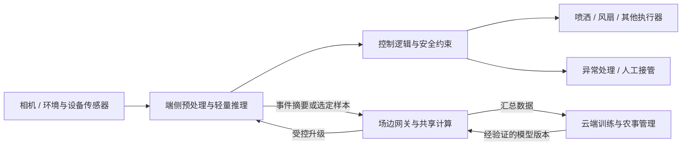

# 图表构思（8个；不含自动生成图片）

所有图均由撰写方自行绘制。以下结构是【你的推断/整理】，不是“官方架构”；复用论文原图须按07_images/image_credits.csv署名。CSV空缺与“未公开”不能绘为0。

## F01 端—边—云农业闭环架构
**观点：** 区分实时执行、场边共享计算与云端训练，并显示断网仍可保留的本地安全路径。[P06,P13,O06,S06]

**数据位置：** 04_data/hardware_specs.csv的tier、frameworks_and_toolchains；04_data/case_metrics.csv筛选system_id=C04（闭环）与C06（协作）。不画未经公开确认的具体协议带宽。此图不是宣称六案例均有云层。

## F02 模型部署与安全更新流程
**观点：** 从训练权重到设备可执行产物需要转换、校准、兼容检查和回归测试。[O01,O02,O03,O04,O05,O06,P14]
**模块关系：** 农业数据与划分 → 基线训练 → 剪枝/蒸馏/量化 → 路线分支：MCU的模型数组/运行时；SoC的硬件编译；GPU的TensorRT；Hailo的HEF → 实机验证 → 版本签名/兼容检查 → 灰度发布 → 监测与失败回滚。安全设计节点是建议，不冒称每一案例已实现。
**数据位置：** hardware_specs.csv的frameworks_and_toolchains；case_metrics.csv中system_id=P10的精度设置。量化校准集必须来自任务数据，具体样本数本包未统一获得。

## F03 硬件平台“算力—功耗口径”对照
**观点：** 展示三档平台而非制造不公平能效榜。[H01,H02,H03,H04,H05,H06,H07,H08]
**画法：** 左侧按MCU/SoC/加速器分组；中间列算力与精度、稀疏性；右侧列功耗类型及范围。只有原文明确、同精度同稀疏口径的数据才可作同轴比较；对未知用斜线/空白，不置零。
**数据位置：** hardware_specs.csv的ai_throughput、precision_and_sparsity、power_w、power_boundary。H08普通与Super分子行，H06注明芯片功耗，H05供电规格不得画成25 W实测值。没有充分同口径数据时，保留注释表而非TOPS/W散点图。

## F04 轻量化技术分类与作用位置
**观点：** 文件变小、计算变少、实际提速属于不同层次。[P01,P02,P03,P04,O05,P10]
**模块关系：** 轻量化 → 参数层（剪枝/量化/编码）；知识层（蒸馏）；结构层（轻量网络/NAS）；执行层（算子融合/内存安排/优化内核）。以虚线表示可组合而非收益可简单相乘。
**数据位置：** 概念图无需外部数值；若加部署示例，引用case_metrics.csv的P10表9记录。经典论文结果在03_papers，不另造农业实验数据。

## F05 智慧农业任务全景与证据成熟度
**观点：** 按任务和成熟度组织，不把“论文存在”当作“商业落地”。[P08,P09,P10,P11,P13,P14,P15,O11,O12]
**模块关系：** 横向任务为监测/病虫害/杂草/果实估测/无人机作业；纵向标注离线算法、实机原型、短期田间报告、商业产品。C01/C04/C05/C06与C02/C03用不同形状；问答/知识服务仅作为P07/P11扩展方向。
**数据位置：** case_metrics.csv的system_id与recommended_use，再回到05_cases读取stage。mAP、AEP、除草率不可合并为同一颜色强度。

## F06 技术与政策时间线
**观点：** 区分方法起源、设备发布、论文进展与未来目标。[P01–P15,O07,O08,O09,O10,O14,S01]
**模块关系：** 2015蒸馏/压缩预印本 → 2016压缩会议 → 2019MobileNetV3 → 2020MCUNet与ESP32-S3 → 2023Pi 5及中文农业边缘研究 → 2024STM32N6/Orin Nano Super与中国行动计划 → 2025–2026新农业部署论文。2026/2028政策目标用空心旗帜，而不是已完成里程碑。
**数据位置：** hardware_specs.csv的release_year/release_basis；market_data.csv的M11/M12。文献日期来自02_sources.csv；P12在线/卷期两日期写在一个节点，P13/P15仅用年月。

## F07 同论文数值精度权衡：YOLO-PLNet
**观点：** 示范量化收益及测量边界审查，而非给出跨设备优劣结论。[P10]
**画法：** 各精度独立列延迟、mAP与原文功耗；附注“表9、640×640、作者报告”。不把FPS自动换算为延迟，也不与表6的15.6 ms混合。图注明确功耗采样范围未核清。
**数据位置：** case_metrics.csv筛选system_id=P10且source_location=表9；表6条目仅用于异常提示。所需字段metric、value、unit、limitations。数据有疑点时可改成带警示的原值表，而不是漂亮的优胜图。

## F08 本地—云—混合系统对比：只呈现作者报告
**观点：** 更复杂模型、硬件与网络的组合存在折中，但不是部署位置的单因果实验。[P15]
**画法：** 以三个独立面板或表格展示F1、能量/预测和时延；另加测量审计框“LoRaWAN载荷、计时路径、服务器能量边界待核”。阈值法可作第四基线，但不可把更低延迟解释为同等智能能力。
**数据位置：** case_metrics.csv筛选system_id=C06及source_location=表1。保留±值。若人工核验仍不能解释通信与计量方法，则不要使用此图作为核心结论，改绘C04本地控制路径示意且不自造云基准。
