# DEEP_INTERVIEW_LONG_ANSWERS_AND_KNOWLEDGE_BASE.md
> 输入路径说明：用户指定的 `_local_archive/interview/DEEP_INTERVIEW_EVIDENCE_MAP.md` 等五份归档文件在当前仓库中未找到；本文件基于仓库根目录同名五份文档生成，并输出到 `_local_archive/interview/`。  
事实边界：项目事实、指标、phase、sample size、环境、代码路径和禁区仍以 `DEEP_INTERVIEW_EVIDENCE_MAP.md` 与 `DEEP_INTERVIEW_CODE_EVIDENCE_DELTA.md` 为准。  
通用知识说明：本文件会补充面试常考八股；凡是通用知识均明确标注“通用知识，不是项目新增成果”。
>

## 0. 使用说明
这份文档不是第六轮事实审计，也不是简历改写稿。前五份文档各有分工：`DEEP_INTERVIEW_EVIDENCE_MAP.md` 管事实边界和 claim_id，决定哪些话能说、哪些话不能说；`DEEP_INTERVIEW_PREP_RK3588_EDGE_AI.md` 管项目主线和面试叙事；`DEEP_INTERVIEW_CODE_EVIDENCE_DELTA.md` 管代码级证据，告诉你每个机制对应哪个 file path、class、function；`RESUME_BULLET_CROSS_EXAMINATION.md` 管简历逐词安全性；`DEEP_INTERVIEW_ADVERSARIAL_QA.md` 管高压刷题，适合临面前快速问答。

本文件管三件事：第一，把短答扩展成 2 分钟和 5 分钟能自然讲出来的长答；第二，把 C++ runtime、模型部署、量化、Backend/Frontend 等项目相关八股补齐；第三，用 Mermaid 图把架构、链路、指标口径和禁区画出来。背诵时先用 Evidence Map 校准事实，再用本文件练“讲法”。如果本文件和 Evidence Map 有冲突，以 Evidence Map 为准；如果本文件和 Code Delta 有冲突，以 Code Delta 为准。

另外，本文件主要提供底层原理与详细机理推导，如需查阅对应口语回答版本，请统一参阅 [DEEP_INTERVIEW_SPOKEN_ANSWERS.md](file:_home_qbz415_vlm-sam-industrial-vision-v2__local_archive_interview_deep_interview_spoken_answers)。

## 1. 项目 5 分钟总讲稿
我这个项目可以先定义成一个 RK3588 端云分离工业视觉 AI 部署验证系统，但这里第一句话就要把边界说清楚：它不是已经在真实工厂上线的产线项目，也不是客户现场 SLA 项目，而是基于 MVTec AD 15 类公开数据集，在 RK3588/16GB 板端做多模型部署、推理 runtime、后端契约和前端可观测性的工程验证。这个边界很重要，因为后面所有指标都必须带 phase、sample size 和运行环境，不能把公开 benchmark 说成真实产线。

系统上我做的是端云分离。Edge 端负责实时链路，核心是 C++20 四线程 runtime：T1 Capture 从 image_loop 数据源取帧，T2 EfficientAD 做 anomaly gate，T3 根据配置走两种路径，一种是 Phase 7/9 的 FastSAM + Qwen3-VL VLM 路径，另一种是 Phase 10 的 YOLOv8n ORT CPU localizer 路径，T4 Upload 用 libcurl multipart 把 image 和 meta JSON 上传。Backend 用 FastAPI 接收 multipart，做 schema、bbox、JPEG size 校验，写 SQLite WAL，并通过 WebSocket broadcast 给 Frontend。Frontend 是 Next.js dashboard，支持 live API、historical snapshot、mock fallback、source-aware bbox overlay 和 Chrome Trace export。Edge 只 HTTP POST，WebSocket 只在 Backend 到 Frontend 之间，这一点不能说错。

模型链路上最早验证的是 Phase 7/9 VLM 路径，也就是 EfficientAD-S FP16 raw RKNN gate 加 FastSAM FP16/no-quant bbox proposal，再接 Qwen3-VL-2B W8A8 RKLLM 输出结构化 JSON。Phase 9 threshold soak 是这条路径的关键工程证据：RK3588/16GB 上跑 30.2min，capture=366，gate_pass=37，VLM completions=36，edge/backend crash=0，dropped_count=0，json_parse_ok=36/36，RSS=3322MB stable。这里的 36/36 必须说成 JSON parse success，只代表结构化输出解析成功，不是检测准确率。Phase 9 证明的是 VLM 路径能在板端跑通并稳定一段时间，但它同时暴露了瓶颈：VLM total latency avg=15419ms，min=8628ms，max=28902ms，所以它不适合同步低延迟主链路。

因此项目演进到 Phase 10。Phase 10 的思路不是“把 VLM 加速了很多”，而是架构上把同步定位从 VLM 路径切到 YOLOv8n localizer。YOLOv8n 训练范围也必须说清楚：只覆盖 metal_nut + cable 两类、12 defect type 子集，数据规模 185 images，train/val=126/59，mAP50=0.593，mAP50-95=0.432。YOLO RKNN 方向做过 smoke 和诊断，但 numeric consistency blocked，class score channels near-zero correlation，所以当前主路径不是 RKNN/NPU，而是 YOLOv8n ONNX Runtime CPU FP32 fallback。Phase 10 extended soak 的证据是 27m27s、2082 frames、0 crash、0 HTTP 400、RSS=34MB、T3 localizer avg=187.7ms。这个 187.7ms 只能说 T3 localizer 平均延迟，不是端到端延迟，也不是 RKNN/NPU 延迟。

项目里有几类失败和取舍反而是面试重点。FastSAM INT8 失败的关键证据是 output0 zp=-119、scale=2.820890，conf>0.25 后 raw candidates=0，因此安全主线切到 FP16/no-quant，但仍然只是 bbox proposal，mask decode 未实现。EfficientAD 的 raw_score Phase 8 mean AUROC=0.5320，高于 map_mean=0.4561，但这个指标说明它不适合作 final detector，所以定位为 load-shedding gate。LoRA 则是另一个典型量化 cliff：PC bf16 n=409 时 2B LoRA defect_type_exact=212/409，也就是 51.8%，但 RK3588 W8A8 board n=14 中 defect_type_exact=0/7，说明 LoRA 在 PC 上有效并不等于在 RK3588 W8A8 端侧有效，简历和面试都不能说 LoRA 端侧有效方案。

因为 VLM 同步太慢，Phase 10.1 的方向是把 VLM 转为异步 enrichment。后端有 enrichment guard 和 worker，guard 只允许 observation、severity_reason、accepted_box_ids，禁止 bbox、category、defect_type、confidence、anomaly_score 等 canonical fields。real RK3588 EdgeVLM smoke 有 4/4 valid VLM calls、median VLM 约 12s、canonical field mutations=0，但 5d live soak halted at 38/200，是 blocker，不是 completed full soak。所以我在面试里会把 Phase 10.1 说成 smoke + guard + worker path，而不是完整长稳通过。

总结一下，这个项目的价值不是包装成真实工厂落地，而是完整走了一遍端侧 AI 部署会遇到的工程问题：C++20 worker lifecycle、有界队列和背压、RKNN/RKLLM/ORT 混合部署、量化和数值一致性诊断、后端契约测试、前端可观测，以及失败之后如何做安全 fallback。能讲的成果要绑定 Evidence Map：Phase 9 证明 VLM 路径可跑通，Phase 10 证明 ORT CPU localizer 更适合同步低延迟主链路，Code Delta 证明 jthread、stop_token、BoundedQueue、libcurl multipart、enrichment guard 等机制确实在代码里存在。不能说的也要主动避开：不说真实产线，不说 ORT/NPU，不说 JSON parse 是准确率，不说 FastSAM mask segmentation，不说 LoRA RK3588 端侧有效，不说 Phase 10.1 full soak completed。

## 2. Mermaid 图表合集
### 2.1 总体架构图
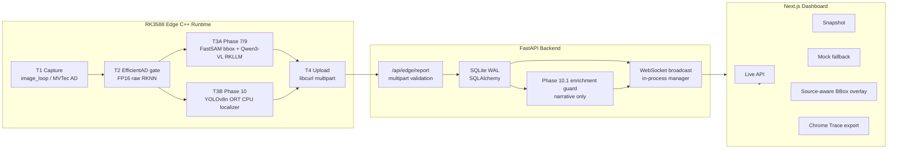

+ 图怎么讲：先讲 Edge 是同步推理链路，Backend 是契约和广播，Frontend 是观测层。强调 Edge 只 HTTP POST，WebSocket 只 Backend 到 Frontend。
+ 面试官可能怎么问：这是生产分布式架构吗？
+ 安全回答：不是，SQLite WAL 和进程内 WebSocket manager 是工程验证，不是分布式生产集群。
+ 禁区：不能说真实产线、不能说 Edge 起 WebSocket、不能说 SQLite WAL 生产级。

### 2.2 Edge T1/T2/T3/T4 Pipeline
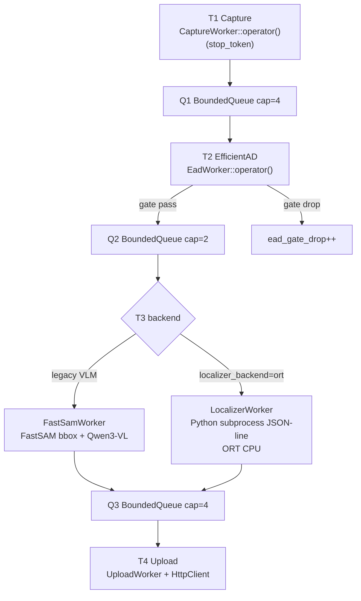

+ 图怎么讲：四个 worker 都由 `std::jthread` 启动，队列有界，T3 可以走 VLM 或 ORT。
+ 面试官可能怎么问：为什么 Q2 cap 只有 2？
+ 安全回答：T3 可能是慢 VLM，Q2 小可以尽早暴露背压；Phase 9 Q2 high_watermark=2 但 dropped_count=0。
+ 禁区：不能说队列有 close/shutdown/drain；不能说任意压力都不 drop。

### 2.3 Phase 7/9 VLM vs Phase 10 ORT 对比图
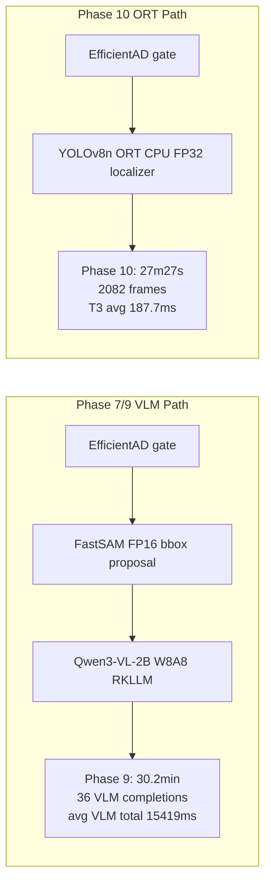

+ 图怎么讲：这是架构路径对比，不是同一模型加速。
+ 面试官可能怎么问：Phase 10 是不是把 VLM 优化到 187.7ms？
+ 安全回答：不是，187.7ms 是 YOLOv8n ORT CPU T3 localizer；Phase 10 v1 没调用 VLM。
+ 禁区：不能说 ORT NPU；不能说 VLM 同步主链路低延迟完成。

### 2.4 C++ Worker Lifecycle Sequence Diagram
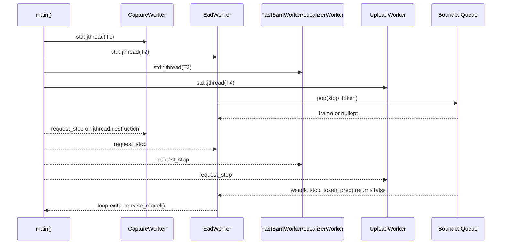

+ 图怎么讲：退出靠 `std::jthread` + `stop_token` + stop-aware queue pop。
+ 面试官可能怎么问：有没有 lifecycle manager？
+ 安全回答：当前是协作退出，不是生产级 supervisor；队列没有 close/shutdown/drain。
+ 禁区：不能说有完整 supervisor 或 queue close protocol。

### 2.5 BoundedQueue Drop-Oldest 流程图
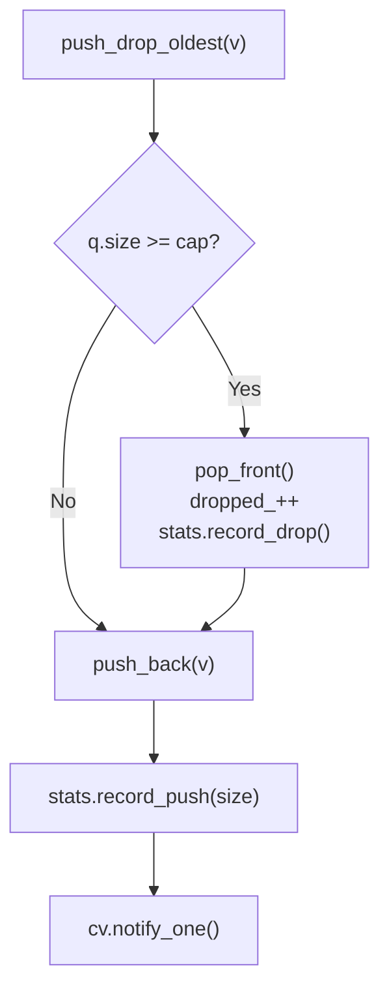

+ 图怎么讲：满队列丢最旧帧，保留最新帧，记录 drop。
+ 面试官可能怎么问：为什么不是阻塞？
+ 安全回答：实时视觉旧帧价值下降，阻塞会放大延迟；drop-oldest 是实时性优先取舍。
+ 禁区：不能说“永不丢帧”；不能说 queue 有 close。

### 2.6 量化诊断决策树
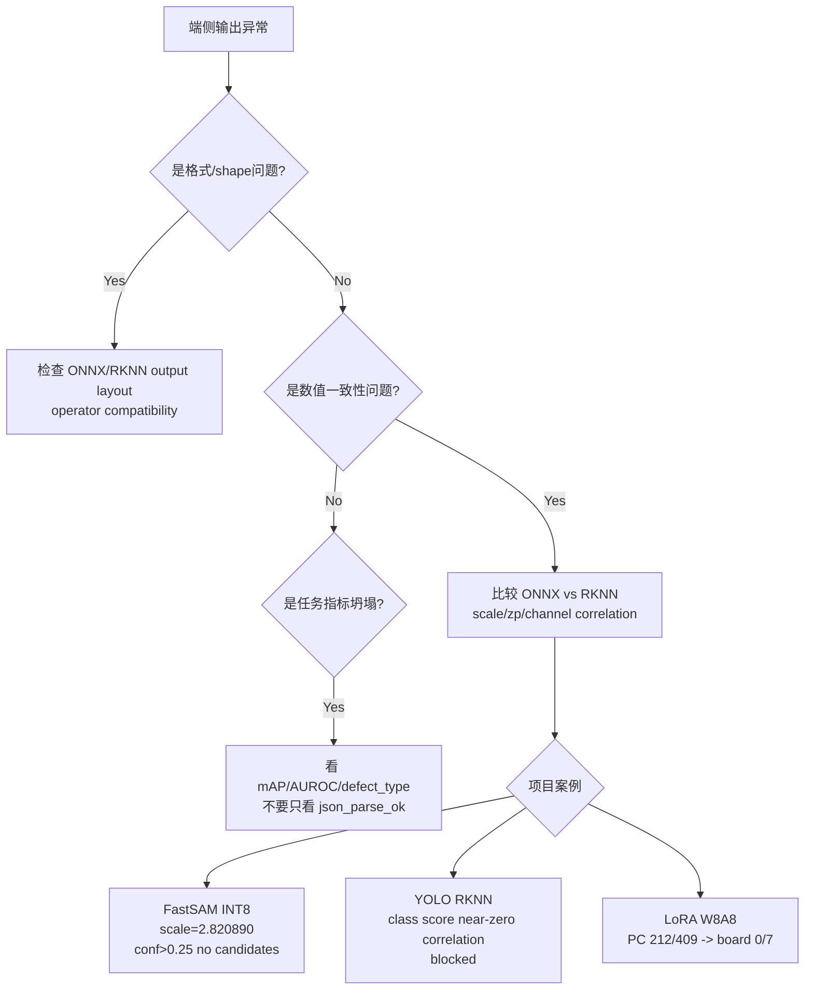

+ 图怎么讲：先区分格式、数值、一致性和任务指标，不把 smoke 当成功。
+ 面试官可能怎么问：为什么 JSON 100% 还失败？
+ 安全回答：JSON 只是格式，LoRA board 14/14 JSON 但 defect_type 0/7。
+ 禁区：不能把 json_parse_ok 当 accuracy。

### 2.7 Backend Contract Path
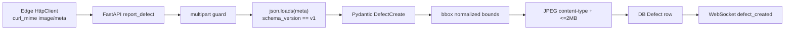

+ 图怎么讲：后端不是只收文件，它有 contract validation 和广播。
+ 面试官可能怎么问：schema_version 是 v1.3 吗？
+ 安全回答：payload 是 `"v1"`；v1.3 是 contract 文档/字段演进版本。
+ 禁区：不要混淆 contract version 和 payload schema_version。

### 2.8 Enrichment Guard Path
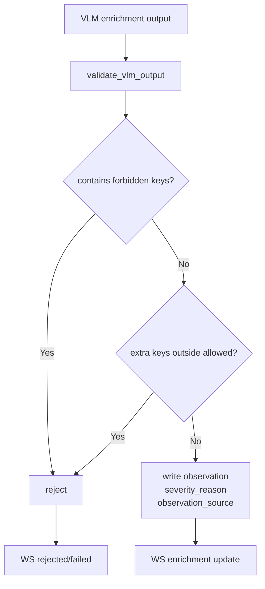

+ 图怎么讲：VLM enrichment 只写 narrative fields，不改检测 canonical fields。
+ 面试官可能怎么问：VLM 会不会覆盖 bbox？
+ 安全回答：guard 禁止 bbox/category/defect_type/confidence/anomaly_score 等字段。
+ 禁区：不能说 Phase 10.1 full soak completed；只能说 smoke + guard + worker path。

### 2.9 Frontend Live/Snapshot/Mock Fallback
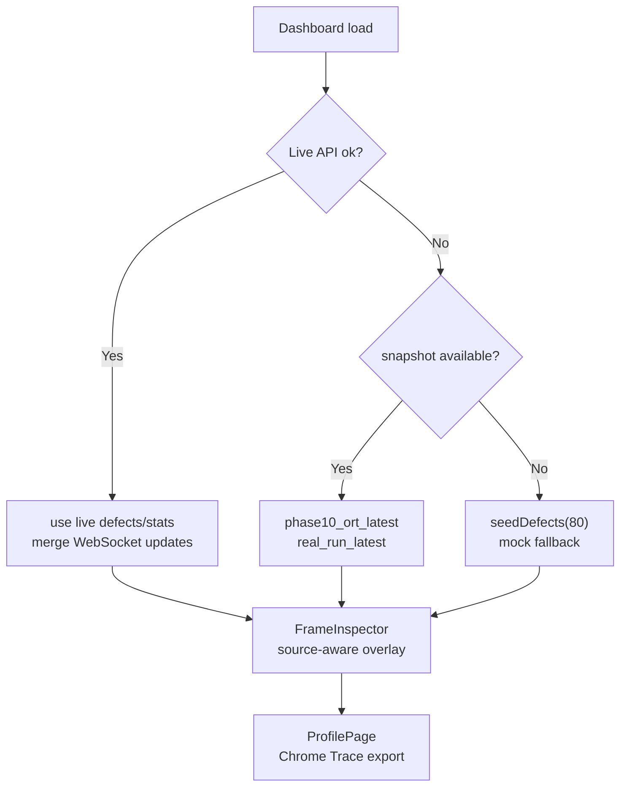

+ 图怎么讲：Frontend 有真实 live 链路，也有历史 snapshot 和 synthetic mock fallback。
+ 面试官可能怎么问：前端是不是全是 mock？
+ 安全回答：不是，但 mock/snapshot 都不能当 full run 指标。
+ 禁区：不能把 snapshot 40 records 当 Phase 10 2082 frames。

### 2.10 指标口径关系图
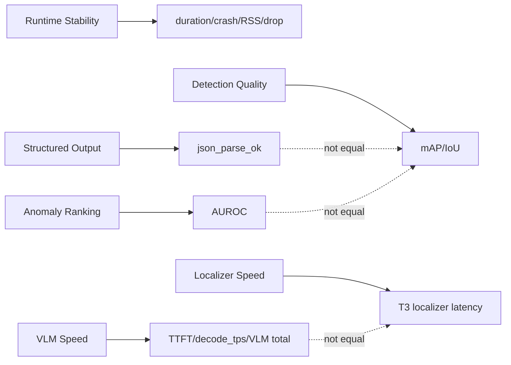

+ 图怎么讲：不同指标回答不同问题，不能跨口径混用。
+ 面试官可能怎么问：为什么不说总准确率？
+ 安全回答：项目有 AUROC、mAP、JSON parse、latency、RSS 等不同口径，没有一个可合并的总准确率。
+ 禁区：不能编 p50/p95；不能把 json_parse_ok 写成 accuracy。

## 3. Edge C++ Runtime 深度讲解
### 3.1 `std::jthread` vs `std::thread`
+ 通用八股解释：`std::thread` 析构时如果仍 joinable 会调用 `std::terminate`，需要显式 join/detach；`std::jthread` 是 C++20 的 RAII thread，析构时会 request_stop 并 join，更适合有协作退出语义的 worker。
+ 项目中怎么体现：`edge/src/main.cpp::main` 实际创建 `std::jthread t1_th/t2_th/t3_th/t4_th`，不是只停留在文档。
+ 关键代码路径：`edge/src/main.cpp::main`。
+ 2 分钟面试回答：我这里用 `std::jthread` 的原因不是为了语法新，而是为了让四个 worker 的生命周期和作用域绑定。T1/T2/T3/T4 都是长期循环，如果用 `std::thread`，异常或退出路径里必须非常小心地 join，否则容易 terminate 或泄漏线程。`jthread` 析构会发 stop request 并 join，和 worker 的 `operator()(std::stop_token)` 配合。这个项目不是生产级 supervisor，但代码层面确实做了 C++20 协作退出。
+ 面试官追问：如果 worker 卡在 queue pop 呢？
+ 风险边界：只能说 `jthread + stop_token + stop-aware pop`，不能说有完整生产级 lifecycle manager。

### 3.2 `stop_token` 协作退出
+ 通用八股解释：`stop_token` 是取消请求的传播机制，不会强杀线程；worker 必须在循环、等待或阻塞点主动检查。
+ 项目中怎么体现：`CaptureWorker::operator()` 主循环检查 `st.stop_requested()`；T2/T3/T4 都通过 `in_.pop(st)` 等待。
+ 关键代码路径：`edge/src/capture/capture_worker.cpp::operator()`；`edge/src/pipeline/ead_worker.cpp::operator()`；`edge/src/pipeline/localizer_worker.cpp::operator()`；`edge/src/upload/upload_worker.cpp::operator()`。
+ 2 分钟面试回答：这个项目的 stop 不是强行 kill 线程，而是协作式的。T1 在 capture loop 和 sleep 等待里检查 stop；T2/T3/T4 是 consumer，主要阻塞点在队列 pop，所以队列 pop 接收 stop_token。这样 SIGINT/SIGTERM 触发主循环退出后，jthread 析构请求 stop，worker 能从空队列等待里返回并退出。
+ 面试官追问：如果子进程没退出呢？
+ 风险边界：ORT subprocess 路径有 `__EXIT__` 和 `kill_subprocess()` 清理，但没有把 nonzero exit code 显式分类处理。

### 3.3 `condition_variable_any` stop-aware wait
+ 通用八股解释：普通 `condition_variable` 不支持 C++20 stop_token wait 重载；`condition_variable_any` 支持 `wait(lock, stop_token, pred)`，适合可取消等待。
+ 项目中怎么体现：`BoundedQueue<T>::pop` 调用 `cv_.wait(lk, st, [&]{ return !q_.empty(); })`。
+ 关键代码路径：`edge/include/edge/common/bounded_queue.hpp::BoundedQueue<T>::pop`。
+ 2 分钟面试回答：queue 空时，consumer 不能 busy spin，也不能永久卡住。这个项目用 `condition_variable_any` 的 stop-aware wait，让 consumer 在队列有数据时正常取数据，在 stop request 到来且队列仍空时返回 `std::nullopt`。worker 收到 nullopt 后 break，所以这是 shutdown 的关键代码证据。
+ 面试官追问：有没有 timeout pop？
+ 风险边界：没有 timeout pop；不要编 close/shutdown/drain API。

### 3.4 BoundedQueue cap=4/2/4
+ 通用八股解释：bounded buffer 用容量限制生产者和消费者速率差造成的内存膨胀，是 backpressure 的基础。
+ 项目中怎么体现：`main` 中 Q1 cap=4，Q2 cap=2，Q3 cap=4；Q2 小是因为 T3 可能很慢。
+ 关键代码路径：`edge/src/main.cpp::main`。
+ 2 分钟面试回答：Q1 是 T1 到 T2，cap=4；Q2 是 T2 到 T3，cap=2；Q3 是 T3 到 T4，cap=4。这个容量不是为了追求最大吞吐，而是为了让慢 stage 的压力可见。尤其 T3 在 VLM 路径下是秒级瓶颈，Q2 小可以尽早暴露 high_watermark/drop。
+ 面试官追问：Q2 high_watermark=2 是不是危险？
+ 风险边界：Phase 9 Q2 high_watermark=2 但 dropped_count=0，只能说明该 threshold run 可跑通。

### 3.5 drop-oldest 为什么适合实时视觉
+ 通用八股解释：实时视觉中旧帧的时效性快速下降；阻塞上游会导致延迟扩散，drop-oldest 保留最新状态。
+ 项目中怎么体现：`push_drop_oldest` 满队列时 `pop_front()`，记录 drop，再 push 新帧。
+ 关键代码路径：`edge/include/edge/common/bounded_queue.hpp::push_drop_oldest`。
+ 2 分钟面试回答：我这里选 drop-oldest，不是说丢帧没代价，而是实时链路的取舍。VLM 很慢时，如果上游阻塞，系统会处理越来越旧的帧，延迟失去意义。drop-oldest 让系统保留最新帧，并通过 drop_count 暴露压力。Phase 9 threshold run dropped_count=0，但 Phase 8C pass_all beat=5000ms 有 drop=23，说明机制确实能暴露过载。
+ 面试官追问：为什么不是 drop-newest？
+ 风险边界：不能说永不丢帧；这是实时性优先，不是完整处理率优先。

### 3.6 QueueStats 如何支撑 telemetry
+ 通用八股解释：可观测性需要在核心机制处埋点，而不是运行后猜测。
+ 项目中怎么体现：`QueueStats` 有 push_count、pop_count、drop_count、high_watermark，`print_queue_stats` 打印队列状态。
+ 关键代码路径：`edge/include/edge/common/bounded_queue.hpp::QueueStats`；`edge/src/main.cpp::print_queue_stats`。
+ 2 分钟面试回答：队列背压如果不可观测，就很难解释稳定性。这个项目把 push/pop/drop/high_watermark 放在 QueueStats 里，用原子计数记录。Phase 9 能说 dropped_count=0、Q2 high_watermark=2，不是凭印象，而是 telemetry 支撑。
+ 面试官追问：PipelineMetrics 的 dropped_count 什么时候汇总？
+ 风险边界：运行中主要看 queue stats；最终 dropped_count 汇总 q1/q2/q3 dropped。

### 3.7 RAII wrapper 如何管理 RKNN/RKLLM handle
+ 通用八股解释：RAII 把资源生命周期绑定到对象生命周期，move-only 防止重复释放。
+ 项目中怎么体现：`UniqueRknnCtx` 析构/reset 调 `rknn_destroy`，`UniqueRkllmHandle` 析构/reset 调 `rkllm_destroy`。
+ 关键代码路径：`edge/include/edge/common/unique_rknn.hpp`；`edge/include/edge/common/unique_rkllm.hpp`。
+ 2 分钟面试回答：端侧 runtime 里模型 context 是典型非托管资源，如果失败路径不释放会造成板端内存或 handle 泄漏。我这里用 move-only wrapper 删除 copy constructor，析构和 reset 释放旧 handle。它能证明资源管理有代码支撑，但 RAII 不证明模型数值正确，数值正确要看 consistency 和实验报告。
+ 面试官追问：所有 RKLLM 都用 wrapper 吗？
+ 风险边界：不能说所有路径统一 wrapper；`Qwen3VLRunner` 有例外。

### 3.8 Qwen3VLRunner 的例外路径
+ 通用八股解释：真实项目里常有过渡实现，面试时要能指出例外和边界。
+ 项目中怎么体现：`Qwen3VLRunner` 的 vision encoder 用 `UniqueRknnCtx`，但 LLM handle 是直接 `LLMHandle llm_handle_{nullptr}`，析构函数手工 `rkllm_destroy`。
+ 关键代码路径：`edge/include/edge/vlm/qwen3vl_runner.hpp`；`edge/src/vlm/qwen3vl_runner.cpp::~Qwen3VLRunner`。
+ 2 分钟面试回答：如果被问 RAII，我不会说所有资源都完美统一封装。准确说法是项目提供了 RKNN/RKLLM RAII wrapper，vision path 确实用 `UniqueRknnCtx`；但 `Qwen3VLRunner` 的 LLM handle 当前是直接持有，并在析构里手工释放。这是代码里的例外路径，不能夸大。
+ 面试官追问：这是不是技术债？
+ 风险边界：可以说是可改进点，不能说不存在例外。

### 3.9 libcurl multipart 上传
+ 通用八股解释：multipart/form-data 适合同时传二进制文件和结构化字段，比 Base64 少编码膨胀。
+ 项目中怎么体现：`HttpClient::post_report` 用 `curl_mime` 添加 `image` file part 和 `meta` JSON part，`main` 中全局 `curl_global_init`。
+ 关键代码路径：`edge/src/common/http_client.cpp::post_report`；`edge/src/main.cpp::main`。
+ 2 分钟面试回答：Edge 上传不是 Base64，而是 multipart。image part 是 JPEG 文件，meta part 是 JSON，后端 `/api/edge/report` 按 multipart 接收。这样图片和结构化检测结果在一个 request 里，后端再做 schema/bbox/JPEG size validation。libcurl global init 在 worker 启动前做，避免在线程里重复初始化。
+ 面试官追问：服务端检查真实图片内容吗？
+ 风险边界：后端检查 content_type 和 size，没有看到魔数/解码级校验。

### 3.10 ORT Python subprocess JSON-line bridge
+ 通用八股解释：C++ 调 Python subprocess 是工程 fallback，优点是复用 Python ORT/postprocess，缺点是 IPC 和进程管理复杂。
+ 项目中怎么体现：`LocalizerWorker::spawn_subprocess` 用 fork/pipe/execlp 启动 `python3`，`infer_one` 写 image path 一行，读 JSON 一行。
+ 关键代码路径：`edge/src/pipeline/localizer_worker.cpp::spawn_subprocess`；`infer_one`；`parse_result`。
+ 2 分钟面试回答：Phase 10 的 ORT 接入不是纯 C++ ORT API，而是 C++ T3 worker 调 Python subprocess，stdin/stdout 做 JSON-line bridge。这是因为 YOLO RKNN numeric consistency blocked，工程上需要一个可运行、可验证的 fallback。代码里 source 字段写成 `ort_yolov8n_cpu`，VLM metrics 置 0，说明这是 CPU localizer path，不是 NPU。
+ 面试官追问：这算不算失败？
+ 风险边界：不能写成 RKNN/NPU；它是工程保底，不是最终 NPU 优化完成。

### 3.11 timeout / fallback / restart 的边界
+ 通用八股解释：外部子进程必须有 timeout 和 fallback，否则一个 frame 卡住会拖垮整个 consumer。
+ 项目中怎么体现：`read_line_timeout` 5s timeout；empty output 会 kill/restart subprocess，并生成 fallback report；`ok:false` 走 inference_error fallback。
+ 关键代码路径：`edge/src/pipeline/localizer_worker.cpp::read_line_timeout`；`LocalizerWorker::operator()`。
+ 2 分钟面试回答：ORT bridge 有基本韧性：每帧 read timeout 5s，timeout 或 empty output 会 kill subprocess、记录 restart，并为该帧生成 fallback report。这样 T3 不会无限等待。但我不能说它显式分类处理了 subprocess nonzero exit，因为 Code Delta 没找到 `waitpid` exit status 分类；非零退出更多表现为 ready fail、EOF/empty read 或 timeout。
+ 面试官追问：fallback bbox 能当真实检测吗？
+ 风险边界：fallback 是保护链路，不是模型质量结果。

### 3.12 upload retry loop 和 upload_retry metric 的区别
+ 通用八股解释：机制存在和指标上报是两回事；代码有 retry 不等于 telemetry 已记录 retry 次数。
+ 项目中怎么体现：`HttpClient::post_report` 对 timeout/connect/408/429/5xx 做 retry/backoff；但 `PipelineMetrics.upload_retry` 未找到 increment。
+ 关键代码路径：`edge/src/common/http_client.cpp::post_report`；`edge/include/edge/common/metrics.hpp`。
+ 2 分钟面试回答：上传路径可以说有 retry loop 和 exponential backoff，因为代码里确实有 `max_retries` 和 should_retry 判断。但不能说 `upload_retry` metric 已上报，因为 Code Delta 明确没找到 increment。面试里要分开说：机制有，指标上报未证实。
+ 面试官追问：上传失败会阻塞前面吗？
+ 风险边界：T4 failure 不直接反馈 T1/T2/T3，但后端长期不可达会让 T4 自己耗时，Q3 可能积压/drop。

## 4. 模型链路深度讲解
### 4.1 EfficientAD 为什么是 gate，不是 detector
+ 背景：anomaly detection 可以输出异常分数，但不天然等价于类别检测或精确定位。
+ 项目事实：Phase 8 raw_score mean AUROC=0.5320，map_mean=0.4561，项目将 EfficientAD 定位为 load-shedding gate。
+ 通用知识，不是项目新增成果：AUROC 衡量分数排序能力，不等于 mAP，也不等于 bbox 定位能力。
+ 2 分钟回答：EfficientAD 在我项目里不是最终 detector，而是 T2 gate。原因是 Phase 8 全 15 类、1725 images 校准后 raw_score mean AUROC 只有 0.5320，说明它作为精确检测器不够可靠。但工程上 VLM 很慢，所以需要一个前置 gate 减少进入 T3 的帧。Phase 9 capture=366、gate_pass=37、VLM=36，就是这个 load-shedding 的体现。
+ 5 分钟回答：如果展开讲，我会先区分 anomaly detection 和 object detection。EfficientAD 更像对整帧或异常区域给 anomaly score，它回答的是“这张图像是否异常、异常分数排序如何”，而不是“缺陷框在哪里、缺陷类型是什么”。项目里曾比较 raw_score、map_mean 等 score mode，raw_score mean AUROC=0.5320，map_mean=0.4561，raw_score 更适合作 gate，但这个数值也说明它不能被包装成高精度 final detector。所以架构上把它放在 T2，用于负载削减；T3 再由 FastSAM/VLM 或 YOLO ORT localizer 负责更具体的 bbox/label。这样讲既能说明它有工程价值，也不夸大算法效果。
+ 禁区：不能说 EfficientAD 解决了最终缺陷检测；不能把 AUROC 0.5320 包装成高精度。

### 4.2 raw_score / map_mean / threshold calibration
+ 背景：不同 score mode 会改变阈值分布，阈值不能跨 mode 混用。
+ 项目事实：Phase 8 raw_score mean AUROC=0.5320，高于 map_mean=0.4561；threshold 使用 raw_score good_p95 口径。
+ 通用知识，不是项目新增成果：threshold calibration 是把模型分数映射到业务决策门槛，需要固定 score mode、数据集和统计口径。
+ 2 分钟回答：我会说项目里最终安全口径是 raw_score gate，因为 Phase 8 比较过 score mode，raw_score 高于 map_mean。map_mean 容易被背景区域稀释，而 raw_score 代表更强的局部异常响应。阈值也必须跟 score mode 绑定，不能拿 map_mean 的阈值去切 raw_score。
+ 5 分钟回答：面试官追阈值时，不要只说“调了阈值”。要说明阈值校准的输入分布、score mode、good/defect 样本和目标。项目里 raw_score 的 AUROC 并不高，所以 threshold 不是生产认证，而是工程起点。它帮助 T2 控制进入 T3 的负载，配合 queue telemetry 和 soak 指标验证运行稳定性。真正的 bbox 和 label 还要靠 T3。
+ 禁区：不能把 threshold calibration 说成生产认证；不能混用 raw_score/map_mean。

### 4.3 FastSAM INT8 failure 和 FP16/no-quant
+ 背景：检测/分割模型的输出头对量化误差很敏感，尤其 confidence/logits。
+ 项目事实：FastSAM INT8 output0 zp=-119、scale=2.820890，conf>0.25 后 raw candidates=0；切换 FP16/no-quant，Phase 7 2E avg FastSAM=250.1ms。
+ 通用知识，不是项目新增成果：INT8 通过 scale/zero_point 表示浮点范围，scale 过大时小幅 confidence 差异会丢失。
+ 2 分钟回答：FastSAM 的问题不是“模型不能跑”，而是 INT8 输出的数值分辨率不适合后处理阈值。output0 scale=2.820890，阈值 conf>0.25 后候选为 0，所以项目把安全主线切到 FP16/no-quant。这里不能说 INT8 已修复，只能说诊断出问题并采取 FP16 fallback。
+ 5 分钟回答：我会按转换、运行、后处理三层讲。转换产物能生成不代表任务可用；运行能返回 tensor 也不代表后处理有效。FastSAM INT8 的 output0 是 detection head，confidence 需要细粒度数值；scale 过大导致阈值后无候选。工程上先保功能正确，选 FP16/no-quant；后续如果要追性能，可以考虑更好的 calibration、per-channel 或 QAT，但这些不是当前已完成成果。
+ 禁区：不能说 FastSAM INT8 已修好；不能说 FP16 后完成 mask segmentation。

### 4.4 FastSAM bbox proposal 和 mask decode 未实现
+ 背景：segmentation model 可以输出 mask，但实际工程要实现 decode、resize、filter 和可视化。
+ 项目事实：当前 FastSAM 路径只 decode bbox proposal，有 5 级清洗；mask decode 未实现。
+ 通用知识，不是项目新增成果：bbox proposal 是候选框，mask segmentation 是像素级区域，两者不是同一个能力。
+ 2 分钟回答：我会明确说 FastSAM 在项目里不是完整 mask segmentation，而是 bbox proposal。代码里做的是 bbox decode 和清洗，比如 clamp、面积过滤、IoU 去重、max count 等，mask decode 仍未实现。
+ 5 分钟回答：如果被问为什么用 FastSAM，我会说它在 Phase 7/9 VLM 路径里承担 proposal 的角色，给 VLM 提供候选区域，而不是直接输出最终像素级缺陷 mask。这样设计能先把端侧链路跑通，但也必须承认边界：UI 的 source-aware tooltip 会把 FastSAM/VLM proposal 和 YOLO localizer 区分开，避免用户误以为是 ground-truth localization。
+ 禁区：不能写 mask segmentation、精准分割、像素级缺陷 mask 已完成。

### 4.5 Qwen3-VL 2B W8A8 板端部署
+ 背景：VLM 端侧部署要同时考虑 vision encoder、LLM runtime、TTFT、decode_tps、RSS 和结构化输出。
+ 项目事实：Phase 7 2E n=24，TTFT=2174ms，decode=9.97 tok/s，qwen3vl=11350ms，RSS=3324MB，json=24/24；Phase 9 VLM total avg=15419ms。
+ 通用知识，不是项目新增成果：TTFT 是首 token 延迟，decode_tps 是生成吞吐，total latency 还包含视觉编码、prompt、decode 和后处理。
+ 2 分钟回答：Qwen3-VL-2B W8A8 在 RK3588 上跑通，这是 resume_safe，但要带数字和边界。它能输出结构化 JSON，但 latency 是秒级，所以后续不适合同步主链路。
+ 5 分钟回答：展开时我会说 2B base 的意义是证明 RKLLM VLM 路径可运行，并给出板端 TTFT/decode/RSS 证据。Phase 7 是 n=24 的 E2E acceptance，Phase 9 是 threshold soak，二者指标口径不同。它不是检测准确率证明，也不是低延迟证明。真正的架构结论是：VLM 可以跑，可以做解释，但同步定位应交给低延迟 localizer。
+ 禁区：不能把 json_parse_ok 当准确率；不能把 Phase 7 指标混成 Phase 9 full-run TTFT。

### 4.6 Qwen3-VL 4B smoke/regression 边界
+ 背景：更大 VLM 往往更慢，占用更高，端侧部署更容易遇到 shape/layout bug。
+ 项目事实：4B Phase 8 14-image smoke TTFT=4650ms、decode=4.9 tok/s、RSS=5689MB；Phase 9 carpet-only 5 frames regression avg total=36473ms。
+ 通用知识，不是项目新增成果：smoke test 验证能否跑通，regression 验证特定 bug，不等于 full soak。
+ 2 分钟回答：4B 做过 smoke 和 carpet spatial merge regression，但不是 full 4B soak。它性能更慢，也不是默认主线。
+ 5 分钟回答：我会主动说 4B 的价值是排障和扩展验证，而不是简历主成果。Phase 8 有 non-carpet smoke，后来修 spatial patch merge，Phase 9 只做 carpet 5 frames regression。这个边界很重要，因为如果说“4B 全类别稳定 long run”，就超出证据。
+ 禁区：不能说 4B full soak 稳定。

### 4.7 LoRA PC bf16 vs RK3588 W8A8 cliff
+ 背景：LoRA 微调的 delta 权重可能幅度较小，低比特量化会损伤细粒度行为。
+ 项目事实：PC bf16 n=409，2B LoRA defect_type_exact=212/409；board W8A8 n=14，defect_type_exact=0/7，category 约 93%。
+ 通用知识，不是项目新增成果：量化可能保留粗粒度语义但破坏细粒度分类边界。
+ 2 分钟回答：LoRA 在 PC bf16 有效，但不能写 RK3588 端侧有效。板端 W8A8 下 defect_type 直接掉到 0/7，这是典型 cliff。
+ 5 分钟回答：我会把它当成失败复盘讲。PC bf16 说明微调方向不是完全无效，category 和 defect_type 都有一定提升；但 W8A8 部署后，粗粒度 category 还能保留，细粒度 defect_type 坍塌。这说明端侧部署不能只看训练指标，必须上板验证量化后的任务指标。最终架构上 LoRA 不作为当前端侧有效方案。
+ 禁区：不能说 LoRA 在 RK3588 端侧有效；不能用 JSON parse 掩盖 defect_type 失败。

### 4.8 YOLOv8n ORT CPU fallback
+ 背景：工程部署里 fallback 不是投降，而是在主优化路径 blocked 时保住可运行链路。
+ 项目事实：Phase 10 YOLOv8n 只覆盖 metal_nut+cable，185 images，mAP50=0.593，mAP50-95=0.432；主线 ORT CPU FP32，soak 27m27s/2082 frames，T3 avg=187.7ms。
+ 通用知识，不是项目新增成果：ORT CPU 是通用推理 runtime，可作为一致性基线和工程保底。
+ 2 分钟回答：ORT CPU fallback 是 Phase 10 的工程主线，不是 RKNN/NPU。它让系统从 15s 级 VLM 同步链路切到 188ms 级 localizer stage。
+ 5 分钟回答：我会强调这是架构演进。YOLO 的 RKNN 方向 blocked，但需求是构建低延迟同步主链路，所以先用 ORT CPU FP32 保证数值正确和系统稳定。它不是最终 NPU 优化完成，但 Phase 10 soak 证明这条低延迟路径比 VLM 更适合主链路。
+ 禁区：不能说 ORT 跑在 NPU；不能说覆盖全 15 类。

### 4.9 YOLO RKNN numeric consistency blocked
+ 背景：模型转换成功不等于数值一致，尤其多输出 detection head 容易遇到 layout/scale/postprocess 差异。
+ 项目事实：YOLO RKNN 有 2-image smoke latency total=136.7ms，但 class score channels near-zero correlation，standard 和 airockchip multi-output 都 fail。
+ 通用知识，不是项目新增成果：numeric consistency debug 要比较 ONNX 与端侧输出的 shape、scale、channel、top-k、postprocess 前后结果。
+ 2 分钟回答：YOLO RKNN 不能写成主路径，因为 smoke latency 只是能跑，数值一致性没过。当前主线是 ORT CPU。
+ 5 分钟回答：我会把“转换成功、能跑、数值一致、任务可用”分成四层。YOLO RKNN 到了能跑和 smoke latency 层，但 class score 相关性失败，说明任务输出不可用。工程上保留诊断记录，同时切 ORT CPU fallback，让系统先稳定跑通。
+ 禁区：不能说 YOLO RKNN/NPU 已部署完成。

### 4.10 为什么形成 “YOLO 同步主链路 + VLM 异步增强”
+ 背景：同步链路需要低延迟和稳定，VLM 更适合慢速解释和结构化补充。
+ 项目事实：Phase 9 VLM avg=15419ms；Phase 10 ORT T3 avg=187.7ms；Phase 10.1 guard 禁止 VLM 改 canonical fields。
+ 通用知识，不是项目新增成果：localizer 负责位置/类别，VLM enrichment 负责自然语言解释，职责分离可以降低风险。
+ 2 分钟回答：最终架构不是抛弃 VLM，而是把 VLM 从同步定位主链路后移到异步 enrichment。主链路由 YOLO ORT CPU localizer 保证低延迟，VLM 只补 observation/severity_reason。
+ 5 分钟回答：如果系统要在端侧实时跑，最怕慢模型把整条 pipeline 拖垮。Phase 9 已经证明 VLM 可跑，但 15s 级 latency 不适合同步主链路。Phase 10 用 ORT CPU localizer 做低延迟路径，Phase 10.1 用 guard 把 VLM 输出面限制在 narrative fields，避免它改 bbox/category/confidence。这就是从“VLM 同步检测”转向“localizer 同步 + VLM 异步解释”的原因。
+ 禁区：不能说 Phase 10.1 full soak completed；不能说 VLM 修改主检测结果。

## 5. 部署与工具链八股
### 5.1 ONNX 是什么，为什么导出 ONNX 不等于部署成功
ONNX 是通用模型交换格式，能把 PyTorch 图导出给不同 runtime 或编译器使用。通用知识，不是项目新增成果：ONNX 导出只代表图结构和权重能表达出来，不代表目标硬件 runtime 支持所有 operator、layout、dynamic shape，也不代表数值一致。项目案例里 EfficientAD/FastSAM/YOLO 都涉及 ONNX/RKNN/ORT 路径，但 YOLO RKNN 就是典型反例：artifact 和 smoke latency 存在，但 numeric consistency blocked，所以主线只能用 ORT CPU fallback。面试回答要分层：导出成功、转换成功、运行成功、数值一致、任务指标达标是五件事，不能混成“部署完成”。

### 5.2 RKNN Toolkit2 / RKNN Runtime / RKNPU driver 的角色
通用知识，不是项目新增成果：RKNN Toolkit2 通常在 PC/转换环境里把 ONNX 等模型转换成 `.rknn`，RKNN Runtime/lite 在板端加载和执行 `.rknn`，底层依赖 RKNPU driver。项目里 EfficientAD 和 FastSAM 走 RKNN，Qwen3-VL vision encoder 走 RKNN；但 Qwen3-VL LLM 走 RKLLM，不要说 LLM 经 ONNX/RKNN。面试时可以说：转换工具解决格式和图编译，runtime 解决板端执行，driver 解决硬件调度；任何一层都可能失败，最终还要看 output consistency 和任务指标。

### 5.3 RKLLM 和 RKNN 的区别
通用知识，不是项目新增成果：RKNN 面向 NPU 上的通用神经网络图，RKLLM 面向大语言模型推理，通常处理 tokenizer、KV cache、decode 等 LLM runtime 逻辑。本项目 Qwen3-VL-2B LLM 路径是 RKLLM W8A8，vision encoder 是 RKNN；EfficientAD/FastSAM 是 RKNN。面试时不要把 RKLLM 说成 ONNX，也不要把 RKNN 说成负责 LLM decode。安全回答是：视觉编码和 CV 模型走 RKNN，语言模型 decode 走 RKLLM，Phase 10 YOLO fallback 走 ONNX Runtime CPU。

### 5.4 ORT CPU fallback 为什么不是失败，而是工程保底
通用知识，不是项目新增成果：fallback 是工程系统在主优化路径不可用时保持功能闭环的手段。项目里 YOLO RKNN numeric consistency blocked，如果继续把它当主线，会把不可信输出推到后端和前端；改用 ORT CPU FP32 可以保住数值正确性和可验证性。Phase 10 27m27s/2082 frames、0 crash、T3 localizer avg=187.7ms 说明这条链路工程上可用。边界是：它不是 NPU，不是 RKNN 主路径完成，也不是最终性能最优。

### 5.5 operator compatibility
通用知识，不是项目新增成果：operator compatibility 指目标 runtime 是否支持模型图中的算子、属性、shape 和后处理子图。项目里 EfficientAD post_processor Greater 兼容问题是报告证据，代码侧解决方案是 raw tensor bypass，用 post_processor 前 raw_score/raw_anomaly_map 做 T2 gate。面试时要说“报告定位 Greater 兼容问题，工程上绕过后处理子图”，不能说 C++ 里有一个 Greater handler 函数。

### 5.6 numeric consistency
通用知识，不是项目新增成果：numeric consistency 是比较源 runtime 和目标 runtime 输出是否一致，常见检查包括 shape、dtype、scale/zero_point、channel order、top-k、cosine/correlation、postprocess 前后结果。项目中 YOLO RKNN class score channels near-zero correlation，所以 blocked；FastSAM INT8 则是量化 scale 让后处理候选为 0。面试模板：转换成功只是第一步，数值一致性不过就不能把模型放进主链路。

### 5.7 smoke test vs soak test
通用知识，不是项目新增成果：smoke test 是小样本快速验证“能不能跑”；soak test 是较长时间运行验证稳定性、资源、队列和错误路径。项目里 YOLO RKNN 2-image smoke latency 136.7ms 不能当 full deployment；Phase 9 30.2min 和 Phase 10 27m27s/2082 frames 才是对应路径的 soak 证据。4B 也是 smoke/regression，不是 full soak。

### 5.8 model conversion matrix 的正确表达
项目能说 Phase 6 conversion matrix 覆盖 EfficientAD 15/15 RKNN、FastSAM RKNN、Qwen3-VL 2B/4B base/LoRA RKLLM 和 vision RKNN；但必须区分 conversion、smoke、soak、blocked。转换完成不等于数值一致，不等于主路径部署完成，也不等于生产可用。安全表达是“完成转换矩阵并明确各模型状态”，不是“所有模型 RKNN/NPU 主路径完成”。

### 5.9 四层验收决策树：把每个失败放到正确层级
通用知识，不是项目新增成果：端侧部署排障至少分四层，不要把下层成功外推成上层成功。

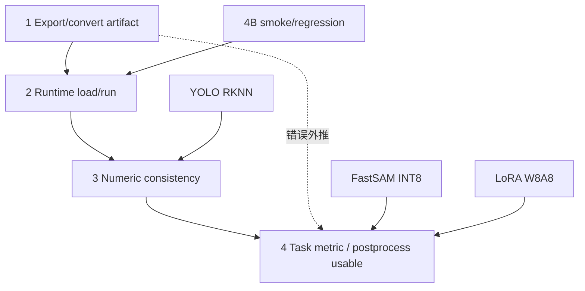

项目案例：FastSAM INT8 有 artifact，也能到输出，但 confidence/postprocess 不可用；YOLO RKNN 有 smoke latency，但 class score channels near-zero correlation，卡在 numeric consistency；LoRA 在 PC bf16 有任务收益，但 RK3588 W8A8 defect_type_exact=0/7，卡在端侧任务指标；4B 有 smoke 和 carpet regression，但不是 full soak。面试里这张图的作用是把“失败”说清楚：不是含糊地说不行，而是说明卡在哪一层、为什么不能进入主链路、后续要补哪类证据。证据：C08、C11、C12、C17。

### 5.10 参数依赖图：训练参数、导出参数、运行参数不能混
通用知识，不是项目新增成果：配置类问题最容易被追问“为什么这个值”。不要孤立解释 rank、alpha、batch、context、max tokens，要讲它们的耦合关系。

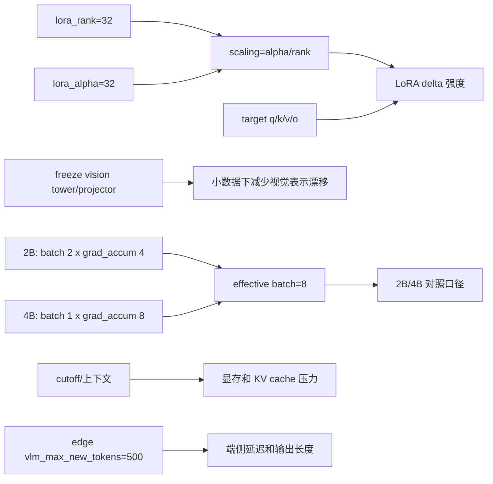

项目坐实：`qwen3vl_lora.yaml` 和 `qwen3vl_lora_4b.yaml` 均为 rank=32、alpha=32、dropout=0.05、target q/k/v/o、冻结 vision tower/projector、lr=5e-5、epochs=5、bf16=true；2B/4B 的 per-device batch 不同，但 gradient accumulation 后 effective batch 都是 8。运行侧 `edge/config.yaml` 有 `vlm_max_new_tokens=500`、`vlm_max_context=4096` 和 JSON watchdog。回答边界：这些配置能解释训练/运行取舍，但不能推出 LoRA 端侧有效；端侧事实仍是 C12 的 W8A8 cliff。

## 6. 量化与数值一致性八股
### 6.1 FP32 / FP16 / INT8 / W8A8
项目例子：YOLO ORT fallback 是 CPU FP32；FastSAM 安全主线是 FP16/no-quant；FastSAM INT8 失败；Qwen3-VL LLM 是 W8A8。通用知识，不是项目新增成果：FP32 精度高但慢/占内存，FP16 通常降低带宽和显存，INT8 需要 scale/zero_point，W8A8 是权重和激活 8-bit。面试回答：不同精度不是越低越好，必须看数值一致性和任务指标。

### 6.2 scale / zero_point
项目例子：FastSAM INT8 output0 zp=-119、scale=2.820890，conf>0.25 后 raw candidates=0。通用知识，不是项目新增成果：量化通常用 `real = scale * (q - zero_point)` 映射整数和浮点。scale 太大时，多个细粒度 confidence 会落在相近或不可用的量化桶里。面试回答：我不是泛泛说 INT8 不好，而是用 output attr 和后处理候选数定位到 confidence collapse。

### 6.3 dynamic vs static quantization
项目绑定：Evidence Map 没有把 dynamic quantization 作为已实施成果，所以只能作为通用知识。通用知识，不是项目新增成果：dynamic quantization 运行时动态估计 activation scale，static quantization 依赖 calibration data 预先确定 scale。面试回答：本项目可讨论 calibration 和 PTQ/QAT 思路，但不能说已经完成某种未核验证据的 dynamic quantization。

### 6.4 PTQ vs QAT
项目例子：FastSAM INT8、YOLO RKNN、LoRA W8A8 都体现 PTQ/部署量化后可能出问题；Evidence Map 没有 QAT 完成证据。通用知识，不是项目新增成果：PTQ 是训练后量化，成本低但对 outlier 敏感；QAT 在训练中模拟量化，可能更稳但成本更高。面试回答：当前项目能说诊断和 FP16/ORT fallback，QAT 只能说后续方向。

### 6.5 QDQ vs QOperator
项目绑定：当前 Evidence Map 未把 QDQ/QOperator 作为具体实现成果。通用知识，不是项目新增成果：QDQ 图显式插入 QuantizeLinear/DequantizeLinear 节点，便于保留浮点算子语义；QOperator 使用量化算子表示，runtime 支持情况不同。面试回答：如果被问 ONNX quantization，我可以解释这两类格式，但不会说项目已完成 QDQ/QOperator 改造。

### 6.6 per-tensor vs per-channel
项目例子：FastSAM INT8 的 per-tensor scale 过大是候选消失的重要线索。通用知识，不是项目新增成果：per-tensor 一个 scale 覆盖整个 tensor，per-channel 每个 channel 独立 scale，通常对权重量化更友好。面试回答：本项目安全结论不是“per-channel 已修复”，而是“per-tensor INT8 出问题，当前切 FP16/no-quant”。

### 6.7 calibration data
项目例子：EfficientAD Phase 8 用 1725 images/15 classes 做 score mode/threshold calibration；但这不是量化 calibration 全部。通用知识，不是项目新增成果：calibration data 要覆盖运行分布，否则 activation range 不准。面试回答：我会区分 threshold calibration 和 quantization calibration，不混成一个概念。

### 6.8 activation outlier
项目绑定：LoRA W8A8 cliff 和 FastSAM confidence collapse 都可以作为 activation/weight 分布敏感的讨论入口，但不能新增未验证 outlier 统计。通用知识，不是项目新增成果：outlier 会拉大量化范围，让多数普通值分辨率下降。面试回答：我只能说这是常见解释框架，项目事实是 W8A8 board defect_type 0/7、FastSAM scale=2.820890。

### 6.9 confidence collapse
项目例子：FastSAM INT8 conf>0.25 后 raw candidates=0。通用定义：confidence collapse 指模型输出的置信度分布在量化或后处理阈值下失去可分性。面试回答：我会说“阈值后无候选”，不说所有 confidence 数学上等于 0，避免过度表述。

### 6.10 LoRA delta weight 为什么容易被量化损伤
项目例子：PC bf16 defect_type=212/409，RK3588 W8A8 defect_type=0/7。通用知识，不是项目新增成果：LoRA 通过低秩 delta 改变模型行为，delta 幅度可能小，低比特量化可能把细粒度差异压掉。面试回答：这是对现象的合理解释，但项目结论仍以实测为准：LoRA 不作为当前 RK3588 端侧有效方案。

### 6.11 如何做 numeric consistency debug
项目例子：YOLO RKNN blocked 是 class score channels near-zero correlation；FastSAM 是 scale/zp 和后处理候选为 0。通用步骤，不是项目新增成果：固定输入，分别跑 PyTorch/ONNX/目标 runtime；比较每层或关键输出 shape/dtype/range/correlation；绕开后处理先看 raw tensor；最后再看任务指标。面试回答：转换成功不是终点，必须验证 raw output 和 postprocess。

### 6.12 FastSAM INT8 反量化推导：为什么不是“阈值调错”
项目例子：FastSAM output0 INT8 `zp=-119, scale=2.820890`，`conf>0.25` 后 raw candidates=0。反量化公式是 `real = (q - zp) * scale`，代入后 `q=-119 -> 0`，`q=-118 -> 2.820890`。confidence 后处理通常按 0 到 1 的概率/置信度语义使用，一个量化级距已经超过整个有效区间，所以候选消失的根因是量化分辨率和检测头数值范围不匹配，而不是阈值写错。修复为什么有效：FP16/no-quant 保留连续输出分布，2C-Fix report 中 fallback 变为 0%。边界：mask decode 仍未实现，所以项目成果是 bbox proposal，不是 mask segmentation。证据：C08、C09。

### 6.13 LoRA W8A8 cliff：事实、推断和不能说
项目事实：PC bf16 n=409 下 2B LoRA defect_type_exact=212/409 (51.8%)，category=389/409 (95.1%)；RK3588 W8A8 board n=14 下 defect subset defect_type_exact=0/7，category 约 93%，repeated bracket 1/14。通用机理推断：LoRA 通过低秩 delta 改变注意力投影，细粒度 defect_type 依赖的小幅增量可能比粗粒度 category 更容易被低比特量化损伤。不能说：已经定位到具体层，也不能说 delta 一定被全部量化为零。面试安全结论：LoRA 在 PC bf16 有方法学价值，但当前 RK3588 W8A8 路径不作为端侧有效方案。证据：C12。

## 7. Backend / Frontend / 可观测性八股
### 7.1 multipart/form-data
+ 通用解释：HTTP multipart/form-data 用 boundary 分隔多个 part，适合同时传文件和结构化字段。
+ 项目代码路径：`edge/src/common/http_client.cpp::post_report`；`backend/app/routers/edge.py::report_defect`。
+ 面试回答：Edge 通过 `curl_mime` 上传 `image` 和 `meta`，不是 Base64。Backend 接收 `UploadFile` 和 `Form` 字段后做校验。
+ 风险边界：客户端声明 `image/jpeg` 不等于服务端做了魔数校验。

### 7.2 UploadFile
+ 通用解释：FastAPI `UploadFile` 适合处理上传文件，可异步读取，避免一次性把大文件全部塞进内存。
+ 项目代码路径：`backend/app/routers/edge.py::report_defect`。
+ 面试回答：后端按 1MB chunk 读取 image，超过 2MB 返回 413，这比直接读全文件更可控。
+ 风险边界：这是工程限制，不是安全网关全部能力。

### 7.3 schema validation
+ 通用解释：schema validation 保证接口契约稳定，防止字段缺失、类型错误和版本不匹配。
+ 项目代码路径：`backend/app/routers/edge.py::report_defect`; `backend/app/schemas/defect.py`。
+ 面试回答：payload `schema_version` 必须是 `"v1"`，再经 Pydantic `DefectCreate` 校验；contract v1.3 是文档版本，不是 payload 值。
+ 风险边界：不要说 schema_version v1.3。

### 7.4 bbox validation
+ 通用解释：bbox validation 要检查归一化坐标、宽高和越界，防止前端渲染和后续逻辑异常。
+ 项目代码路径：`backend/app/routers/edge.py::report_defect`。
+ 面试回答：代码检查 `x+w<=1` 和 `y+h<=1`，说明 bbox 合法性是后端 contract 的一部分。
+ 风险边界：bbox validation 不等于 bbox ground truth accuracy。

### 7.5 JPEG size validation
+ 通用解释：上传大小限制保护服务端存储和内存。
+ 项目代码路径：`backend/app/routers/edge.py::report_defect`。
+ 面试回答：只允许 image/jpeg 或 image/jpg，流式读取并限制 2MB。
+ 风险边界：content_type 来自 header，没有看到图像解码级验证。

### 7.6 SQLite WAL 的好处和限制
+ 通用解释：WAL 能改善 SQLite 读写并发，写入先落 WAL，再 checkpoint。
+ 项目代码路径：`backend/app/db.py::_set_sqlite_pragma`。
+ 面试回答：项目代码设置 `PRAGMA journal_mode=WAL` 和 `synchronous=NORMAL`，可以说工程验证中启用了 WAL。
+ 风险边界：SQLite WAL 不是分布式生产数据库。

### 7.7 WebSocket broadcast
+ 通用解释：WebSocket 用于服务端主动推送实时事件。
+ 项目代码路径：`backend/app/ws/manager.py::ConnectionManager.broadcast`; `frontend/src/app/page.tsx`。
+ 面试回答：Backend 广播 `defect_created`、enrichment update、metrics_tick，Frontend 合并到 state。
+ 风险边界：`ConnectionManager` 是进程内 rooms/set，不是 Redis/Kafka。

### 7.8 进程内 manager vs 分布式消息系统
+ 通用解释：进程内 manager 简单但无法跨多实例共享连接状态；分布式系统通常需要 Redis pub/sub、Kafka 或外部 broker。
+ 项目代码路径：`backend/app/ws/manager.py`。
+ 面试回答：当前项目是工程验证，进程内 manager 足够支撑单进程 dashboard；生产多实例要补外部消息系统。
+ 风险边界：不要说已有分布式 broadcast。

### 7.9 live API / snapshot / mock fallback
+ 通用解释：前端 fallback 提高可用性和演示稳定性，但不同数据源代表不同可信度。
+ 项目代码路径：`frontend/src/lib/data-source.ts::useDataSource`。
+ 面试回答：优先 live API，失败后尝试 `phase10_ort_latest` 和 `real_run_latest` snapshot，最后 `seedDefects(80)` mock。
+ 风险边界：mock 是 synthetic；snapshot 不是 full run。

### 7.10 source-aware BBox overlay
+ 通用解释：观测 UI 应显示数据来源和 caveat，避免用户把 proposal、fallback、model output 混成 GT。
+ 项目代码路径：`frontend/src/components/v4/FrameInspector.tsx::FrameCanvas`。
+ 面试回答：FrameCanvas 区分 YOLO localizer、fallback placeholder、FastSAM/VLM proposal，并给 tooltip。
+ 风险边界：UI overlay 不证明 bbox 准确。

### 7.11 Chrome Trace
+ 通用解释：Chrome Trace 是事件时间线格式，可以展示阶段耗时、并发和瓶颈。
+ 项目代码路径：`frontend/src/components/v4/ProfilePage.tsx::toChromeTrace`。
+ 面试回答：ProfilePage 把 `trace_events` 转成 Chrome Trace JSON，支持复制和下载。
+ 风险边界：trace 准确性依赖 Edge/Backend 上报；snapshot 缺字段可能估算。

### 7.12 contract test
+ 通用解释：contract test 验证 API 请求/响应、错误码、字段兼容和事件契约。
+ 项目代码路径：`backend/tests/contract/`。
+ 面试回答：当前本地实测 `345 passed in 8.69s`；历史 34/34、83/83、311/311 是不同阶段。
+ 风险边界：contract tests 不是模型准确率测试。

## 8. 指标口径深度解释
+ Phase 9 full run vs snapshot：Phase 9 full run 是 30.2min、capture=366、gate_pass=37、VLM=36、json=36/36、RSS=3322MB stable；snapshot 只有导出的展示记录，不能当 full run 总量。
+ Phase 10 full run vs snapshot：Phase 10 full run 是 27m27s、2082 frames、0 crash、RSS=34MB、T3 avg=187.7ms；snapshot curated n=40，avg localizer=183.7ms，是前端展示/复盘口径。
+ json_parse_ok vs accuracy：json_parse_ok 只表示结构化 JSON 能被解析。检测准确率需要 category、defect_type、bbox、mAP、IoU 等指标；LoRA board 14/14 JSON 但 defect_type=0/7 是典型反例。
+ AUROC vs mAP vs IoU：AUROC 衡量 anomaly score 对正负样本的排序能力；mAP 衡量 detection precision/recall 在不同 IoU/score 下的综合表现；IoU 衡量预测框和 GT 框重叠。EfficientAD 的 AUROC 不能替代 YOLO mAP，也不能替代 bbox IoU。
+ TTFT vs decode_tps vs VLM total latency：TTFT 是首 token 时间，decode_tps 是生成吞吐，VLM total latency 包含视觉编码、prompt、decode 和后处理等总耗时。Phase 7 2E TTFT=2174ms、decode=9.97；Phase 9 VLM total avg=15419ms。
+ localizer latency vs E2E latency：Phase 10 的 187.7ms 是 T3 localizer avg，不是端到端总延迟。不能把它写成整条 pipeline latency。
+ RSS 在 VLM path 和 ORT path 中为何不能简单横比：Phase 9 VLM RSS=3322MB stable，Phase 10 ORT RSS=34MB；二者 runtime 和加载模型不同，只能说明各自路径资源稳定，不能简单说同一系统内存优化多少倍。
+ p50/p95 为什么不能编：Evidence Map 没有 p50/p95，就不能补。可以说当前有 avg/min/max、RSS、drop/high_watermark，生产化要补 p95/p99。
+ smoke vs soak：smoke 小样本验证能跑，如 YOLO RKNN 2-image latency 136.7ms；soak 长时间验证稳定，如 Phase 9 30.2min、Phase 10 27m27s。
+ pass_all beat sweep vs threshold mode：pass_all 是压力/调试模式，beat sweep 说明慢 VLM 下过快节拍会 drop；threshold mode 是正式 gate 运行口径，Phase 9 threshold dropped_count=0。

## 9. 20 个 2 分钟长答模板
### 9.1 项目是不是生产项目
开场结论：不是生产项目，而是基于 MVTec AD 公开数据集的 RK3588 端侧部署验证项目。这个问题我会主动先划边界，因为如果把它说成真实产线，会直接超出证据。项目事实是：数据来自 MVTec AD 15 类公开工业缺陷数据集；系统覆盖 Edge C++ runtime、FastAPI backend、Next.js dashboard，以及 RKNN/RKLLM/ORT 混合部署。通用知识上，benchmark 和 production data 是两种不同口径，benchmark 适合做方法和工程链路验证，但不能代表现场光照、相机、节拍、工艺和缺陷分布。代码路径可以看 `edge/src/main.cpp`、`backend/app/routers/edge.py`、`frontend/src/app/page.tsx`。指标上我会说 Phase 9 VLM threshold soak 30.2min，Phase 10 ORT extended soak 27m27s/2082 frames。风险边界是不能说真实工厂、客户上线或生产 SLA。继续追问价值时，我会回答：它的价值在于端侧部署和失败诊断，而不是商业落地宣传。

### 9.2 为什么端云分离
开场结论：端云分离是为了把实时推理、契约存储和可视化观测分开。项目事实上，Edge 端是 C++20 四线程 runtime，负责 T1 Capture、T2 EfficientAD gate、T3 VLM/ORT localizer、T4 Upload；Backend 用 FastAPI 接 multipart，校验 schema/bbox/JPEG size，写 SQLite WAL，然后通过 WebSocket broadcast；Frontend 做 live/snapshot/mock fallback、source-aware bbox overlay 和 Chrome Trace。通用知识上，边缘端应尽量减少连接管理和 UI 状态复杂度，把广播、分页、持久化和契约校验放到后端更清晰。关键代码路径是 `edge/src/common/http_client.cpp::post_report`、`backend/app/routers/edge.py::report_defect`、`backend/app/ws/manager.py::broadcast`、`frontend/src/lib/data-source.ts`。风险边界是 Edge 只 HTTP POST，不起 WebSocket；SQLite WAL 不是生产分布式数据库。继续追问生产化时，我会说需要 PostgreSQL、对象存储、消息队列和多实例 WS pub/sub。

### 9.3 为什么双路径
开场结论：双路径来自两个不同目标：Phase 7/9 VLM 路径证明端侧 VLM 能跑通，Phase 10 ORT 路径证明低延迟同步主链路更现实。项目事实是，路径 A 用 EfficientAD-S FP16 raw RKNN gate、FastSAM FP16/no-quant bbox proposal、Qwen3-VL-2B W8A8 RKLLM；Phase 9 跑 30.2min，json_parse_ok=36/36，但 VLM total avg=15419ms。路径 B 用 YOLOv8n ORT CPU FP32 localizer，Phase 10 跑 27m27s/2082 frames，T3 localizer avg=187.7ms。通用知识上，架构设计要区分“可运行”和“适合同步主路径”。代码路径是 `FastSamWorker::operator()` 和 `LocalizerWorker::operator()`。风险边界是 Phase 10 不是 VLM 加速，也不是 ORT NPU；它是不同模型和不同 runtime 的工程路径切换。继续追问时，我会说 VLM 后移到 async enrichment。

### 9.4 为什么 VLM 不做同步主链路
开场结论：因为板端 VLM 延迟是秒级到十几秒级，适合解释，不适合同步定位。项目事实包括 Phase 7 2E n=24：TTFT=2174ms、decode=9.97 tok/s、qwen3vl=11350ms、RSS=3324MB；Phase 9 VLM total avg=15419ms。相比之下，Phase 10 ORT CPU localizer T3 avg=187.7ms。通用知识上，VLM decode 是自回归生成，TTFT 和 token throughput 会成为瓶颈；localizer 是前向检测，延迟可控。代码上，VLM 路径在 `edge/src/vlm/qwen3vl_runner.cpp` 和 `edge/src/pipeline/fastsam_worker.cpp`，ORT localizer 在 `edge/src/pipeline/localizer_worker.cpp`。风险边界：不能说 VLM 没价值，Phase 9 已证明可跑；也不能说 Phase 10 调用了 VLM。继续追问时，我会说 Phase 10.1 把 VLM 限制为 narrative enrichment，并通过 guard 禁止改 bbox/category/confidence。

### 9.5 BoundedQueue 为什么 drop-oldest
开场结论：drop-oldest 是实时视觉里的延迟优先取舍。项目事实是 `BoundedQueue<T>::push_drop_oldest` 满队列时 `pop_front()`，记录 dropped 和 QueueStats；Q1 cap=4、Q2 cap=2、Q3 cap=4。通用知识上，producer-consumer 系统里如果消费者慢，阻塞上游会导致延迟扩散；实时视觉中旧帧价值下降，保留最新帧通常比完整处理所有旧帧更合理。代码路径是 `edge/include/edge/common/bounded_queue.hpp` 和 `edge/src/main.cpp::main`。指标上，Phase 9 threshold run dropped_count=0、Q2 high_watermark=2；Phase 8C pass_all beat=5000ms drop=23，说明压力下机制会暴露过载。风险边界：不能说永不丢帧，也不能说 queue 有 close/shutdown/drain。继续追问为什么不是阻塞时，我会说阻塞会把慢 VLM 的延迟传染到 Capture，破坏实时性。

### 9.6 `std::jthread` / `stop_token` 怎么退出
开场结论：当前 C++ runtime 通过 `std::jthread`、`std::stop_token` 和 stop-aware queue pop 做协作退出。项目事实是 `edge/src/main.cpp::main` 创建四个 `std::jthread`，worker 的 `operator()(std::stop_token st)` 接收 stop token；`BoundedQueue<T>::pop` 用 `condition_variable_any::wait(lk, st, pred)`。通用知识上，`jthread` 相比 `thread` 的核心优势是析构时 request_stop + join，减少忘记 join 的风险，但它不会强杀线程，必须由 worker 在阻塞点感知 stop。代码路径包括 `capture_worker.cpp`、`ead_worker.cpp`、`localizer_worker.cpp`、`upload_worker.cpp`。风险边界：队列没有 close/shutdown/drain；这也不是生产级 supervisor。继续追问子进程时，我会说 ORT T3 退出时写 `__EXIT__` 并 `kill_subprocess()`，但未显式分类 subprocess nonzero exit code。

### 9.7 EfficientAD 为什么只做 gate
开场结论：因为项目实测它的异常排序能力不足以作为 final detector，但可以做 load-shedding gate。项目事实是 Phase 8 raw_score mean AUROC=0.5320，map_mean=0.4561，1725 images/15 classes；Phase 9 capture=366、gate_pass=37、VLM=36，体现了 gate 减负。通用知识上，AUROC 衡量分数排序，不等于 bbox 定位，也不等于 mAP。EfficientAD 输出 anomaly score，适合判断是否值得进入更重的 T3，但最终 bbox/label 要靠 FastSAM/VLM 或 YOLO localizer。代码路径是 `edge/src/pipeline/ead_worker.cpp`，配置中有 score/gate mode。风险边界：不能说 EfficientAD 解决了缺陷检测，不能把 raw_score AUROC 包装成高精度。继续追问 threshold 时，我会说 threshold 与 raw_score 绑定，不能混 map_mean。

### 9.8 FastSAM INT8 为什么失败
开场结论：FastSAM INT8 失败是量化后 confidence 分辨率不适配后处理阈值。项目事实是 output0 INT8 zp=-119、scale=2.820890，conf>0.25 后 raw candidates=0；安全主线切到 FP16/no-quant，Phase 7 2E avg FastSAM=250.1ms。通用知识上，INT8 用 scale/zero_point 把浮点映射到整数，scale 过大时小的 confidence 差异会被量化级距吞掉。代码路径是 `edge/src/pipeline/fastsam_worker.cpp::decode_bboxes` 和模型 `models/fastsam_models/fastsam_s_noquant.rknn`。风险边界：不能说 INT8 已修复，也不能说 FP16 后完成 mask segmentation；当前只是 bbox proposal，mask decode 未实现。继续追问时，我会说后续可尝试更合适 calibration、per-channel 或 QAT，但这些不是当前已完成成果。

### 9.9 LoRA W8A8 cliff
开场结论：LoRA 在 PC bf16 有效，但在 RK3588 W8A8 上细粒度能力坍塌。项目事实是 PC bf16 n=409 时 2B LoRA defect_type_exact=212/409，也就是 51.8%；board W8A8 n=14 时 defect_type_exact=0/7，category 约 93%。通用知识上，LoRA 的低秩 delta 可能幅度较小，W8A8 量化会保留部分粗粒度语义，但破坏细粒度分类边界。代码路径主要是 `edge/src/vlm/qwen3vl_runner.cpp` 的板端运行路径，指标来自 Phase 8 结果文件。风险边界：不能说 LoRA 在 RK3588 端侧有效；不能用 JSON parse success 掩盖 defect_type 失败。继续追问怎么补救时，我会说可考虑更高精度、重训或不同部署路径，但当前结论是不能作为端侧有效方案。

### 9.10 YOLO RKNN 为什么 blocked
开场结论：YOLO RKNN blocked 是因为数值一致性不过，而不是完全没有转换产物。项目事实是 RKNN 2-image smoke latency total=136.7ms，但 class score channels near-zero correlation，standard 和 airockchip multi-output 都 fail。通用知识上，模型部署要分转换成功、runtime 能跑、数值一致、任务指标可用四层；只看 smoke latency 很危险。代码和报告路径包括 `docs/experiments/phase10_rknn_fp16_diagnostic.md`、`docs/experiments/phase10_rknn_issue_repro.md`、`edge/src/pipeline/localizer_worker.cpp`。风险边界：不能说 YOLO RKNN/NPU 主路径完成。继续追问为什么还用 YOLO 时，我会说训练好的 YOLOv8n 仍可通过 ORT CPU FP32 做工程 fallback，Phase 10 extended soak 证明这条路径可跑。

### 9.11 ORT CPU fallback 是否算失败
开场结论：它不是最终 NPU 优化成功，但也不是无意义失败，而是工程保底。项目事实是 YOLO RKNN numeric consistency blocked 后，Phase 10 采用 YOLOv8n ORT CPU FP32 localizer，extended soak 27m27s、2082 frames、0 crash、0 HTTP400、RSS=34MB、T3 avg=187.7ms。通用知识上，fallback 的价值是保证系统功能闭环和数值可信，再继续优化目标 runtime。代码路径是 `edge/src/main.cpp::main` 里 `localizer_backend == "ort"` 选择 `LocalizerWorker`，以及 `LocalizerWorker::parse_result` 设置 `localization_source="ort_yolov8n_cpu"`。风险边界：必须明确 CPU，不能写 ORT NPU，也不能写 RKNN 主路径完成。继续追问生产化时，我会说下一步是修 RKNN consistency，但当前成果是 ORT fallback 稳定跑通。

### 9.12 Phase 9 证明什么
开场结论：Phase 9 证明 VLM 路径在 RK3588/16GB 上可跑通并在 30.2min threshold soak 中稳定，但不证明低延迟或检测准确率。项目事实是 capture=366、gate_pass=37、VLM=36、upload_ok=33、upload_fail=2 HTTP400、dropped_count=0、json_parse_ok=36/36、RSS=3322MB stable，VLM total avg=15419ms。通用知识上，soak test 看 duration、crash、RSS、queue、latency、upload 等运行稳定性，不等于算法准确率测试。代码路径包括 `edge/src/main.cpp`、`edge/include/edge/common/bounded_queue.hpp`、`edge/src/pipeline/fastsam_worker.cpp`。风险边界：36/36 是 JSON parse success，不是 accuracy；snapshot 20 records 不是 full run。继续追问时，我会说 Phase 9 的结论推动了 Phase 10 低延迟路径。

### 9.13 Phase 10 证明什么
开场结论：Phase 10 证明 YOLOv8n ORT CPU localizer 更适合同步低延迟主链路。项目事实是 Phase 10 extended soak 27m27s、2082 frames、0 crash、0 HTTP400、RSS=34MB、T3 localizer avg=187.7ms；训练范围是 metal_nut+cable 两类、12 defect type、185 images、mAP50=0.593、mAP50-95=0.432。通用知识上，localizer latency 和 E2E latency不同，检测模型 mAP 和 runtime soak 指标也不同。代码路径是 `edge/src/pipeline/localizer_worker.cpp` 和 `scripts/phase10/ort_localizer.py`。风险边界：Phase 10 是 ORT CPU，不是 RKNN/NPU；只覆盖两类子集，不是 MVTec 15 类全量检测。继续追问时，我会说它解决的是同步主链路工程可用性，不是所有模型最终优化。

### 9.14 JSON parse 为什么不是准确率
开场结论：JSON parse success 只说明输出格式能被解析，不说明语义正确。项目事实有两个反例：Phase 9 json_parse_ok=36/36，但这是结构解析；LoRA board json_parse_ok=14/14，同时 defect_type_exact=0/7。通用知识上，结构化输出验证关注字段是否存在、JSON 是否合法、schema 是否能过；准确率要看 label 是否等于 GT、bbox IoU、mAP、AUROC 等。代码路径里 VLM metrics 写入在 FastSAM/VLM path，后端 schema validation 在 `backend/app/routers/edge.py`。风险边界：不能写 100% 检测准确率。继续追问怎么评价质量时，我会分开说 EfficientAD 看 AUROC、YOLO 看 mAP、VLM 看 category/defect_type/bbox，runtime 看 latency/RSS/drop。

### 9.15 SQLite WAL 能否生产
开场结论：项目代码确实启用了 SQLite WAL，但不能说它是生产级分布式数据库。项目事实是 `backend/app/db.py::_set_sqlite_pragma` 执行 `PRAGMA journal_mode=WAL` 和 `PRAGMA synchronous=NORMAL`。通用知识上，WAL 能改善 SQLite 读写并发和崩溃恢复行为，但 SQLite 仍是单机嵌入式数据库，不适合直接承担多实例、高并发、跨节点生产集群。项目代码还使用进程内 WebSocket manager，不是 Redis/Kafka。风险边界：简历可以写 FastAPI + SQLite WAL 工程验证，但不能写生产集群。继续追问生产化时，我会说要换 PostgreSQL/对象存储，WS 广播接外部 pub/sub，补认证、限流、审计和备份。

### 9.16 Backend contract 怎么保证
开场结论：Backend contract 通过 multipart guard、JSON/schema validation、bbox validation、JPEG size validation、DB write 和 WebSocket broadcast 形成闭环。项目事实是 `report_defect` 要求 multipart/form-data，`schema_version` 必须是 `"v1"`，Pydantic 校验 `DefectCreate`，bbox 检查 x+w/y+h 不越界，JPEG <=2MB，然后写 `Defect` row 并广播 `defect_created`。通用知识上，contract test 验证接口稳定性，不是模型准确率。代码路径是 `backend/app/routers/edge.py::report_defect`、`backend/app/ws/manager.py::broadcast`、`backend/tests/contract/`。指标是当前本地 contract tests 345 passed in 8.69s。风险边界：content_type 不是魔数校验，SQLite/WS manager 不是生产分布式。继续追问 version 时，答 payload 仍是 `"v1"`，v1.3 是 contract 文档版本。

### 9.17 Frontend observability 有什么价值
开场结论：Frontend 的价值不是证明模型准确，而是让链路状态、来源和性能瓶颈可见。项目事实是 dashboard 支持 live API、snapshot、mock fallback；FrameInspector 有 source-aware bbox overlay，区分 YOLO localizer、fallback placeholder、FastSAM/VLM proposal；ProfilePage 可以导 Chrome Trace JSON。通用知识上，可观测性要把“数据来自哪里、是否实时、哪个 stage 慢、输出是否 fallback”暴露出来，避免 demo 误导。代码路径是 `frontend/src/lib/data-source.ts`、`frontend/src/components/v4/FrameInspector.tsx`、`frontend/src/components/v4/ProfilePage.tsx`。风险边界：mock 是 synthetic，snapshot 是 historical recording，UI overlay 不是 ground truth。继续追问时，我会说 source-aware tooltip 正是为了防止把 proposal 当 GT。

### 9.18 Phase 10.1 为什么不能说 full soak
开场结论：因为 Evidence Map 明确显示 Phase 10.1 有 smoke/guard/worker，但 5d live soak blocked。项目事实是 real RK3588 EdgeVLM smoke 有 4/4 valid VLM calls、median VLM 约 12s、canonical field mutations=0；但 5d soak halted at 38/200，存在 random bboxes/confidence/defect_type 和 category mismatch。通用知识上，smoke test 证明路径能跑，full soak 证明长时间稳定，两者不能混用。代码路径是 `backend/app/services/enrichment_guard.py` 和 `backend/app/services/enrichment_worker.py`，worker 注释还说明 NOT auto-started。风险边界：不能说 full completed 或 5d passed。继续追问时，我会说 Phase 10.1 的安全成果是 guard 限制 canonical field mutation，而不是长稳完成。

### 9.19 最大失败是什么
开场结论：最大失败不是单点，而是多个“转换成功但端侧不可用”的问题：FastSAM INT8、LoRA W8A8 cliff、YOLO RKNN blocked、Phase 10.1 soak blocked。项目事实分别是 FastSAM INT8 conf>0.25 无候选，LoRA board defect_type=0/7，YOLO RKNN class score near-zero correlation，Phase 10.1 halted at 38/200。通用知识上，端侧 AI 部署的难点就在于从训练指标到硬件 runtime 之间有很多断层。代码路径包括 `fastsam_worker.cpp`、`localizer_worker.cpp`、`enrichment_guard.py`。风险边界：不能把失败包装成成功。继续追问能力体现时，我会说能力不在于只报好消息，而在于识别 blocked、保留证据、设计 fallback，把系统从不可用拉回可验证。

### 9.20 如果面试官说项目不落地怎么回答
开场结论：我会承认它不是生产落地项目，但它是完整端侧部署验证，价值在工程链路和边界意识。项目事实是它覆盖模型转换矩阵、RK3588 C++ runtime、Phase 9/10 soak、后端 contract tests 345 passed、前端 observability；也清楚记录了 YOLO RKNN blocked、LoRA W8A8 cliff、Phase 10.1 5d blocked。通用知识上，实习/项目面试看重的不只是商业落地，还看是否能把复杂系统拆清、指标讲清、失败复盘清楚。代码路径能落到 `edge/src/main.cpp`、`backend/app/routers/edge.py`、`frontend/src/components/v4/FrameInspector.tsx`。风险边界：不硬拗客户上线，不说生产 SLA。继续追问下一步时，我会讲生产化要补真实产线数据、相机接入、p95/p99、认证鉴权、分布式存储和更完整 NPU consistency。

## 10. 10 个 5 分钟系统设计长答
### 10.1 从零设计这个端云分离工业视觉系统
如果从零设计，我会先把目标拆成三层：端侧实时推理、后端契约存储、前端可观测。当前项目已完成的是基于 MVTec AD 公开数据集的工程验证，不是真实产线。Edge 端用 C++20 四线程：T1 Capture 读 image_loop，T2 EfficientAD gate 做负载削减，T3 走两种策略，Phase 7/9 是 FastSAM bbox proposal + Qwen3-VL，Phase 10 是 YOLOv8n ORT CPU localizer，T4 用 libcurl multipart 上传。Backend 用 FastAPI 接 `/api/edge/report`，做 multipart、schema_version、bbox、JPEG <=2MB 校验，写 SQLite WAL，再用 WebSocket broadcast 到 Frontend。Frontend 用 live API、snapshot、mock fallback 保证可看，用 source-aware overlay 和 Chrome Trace 避免误读。当前项目没完成的是生产级真实相机长跑、真实产线数据、分布式后端、多实例 WebSocket、完整安全网关和 p95/p99 指标。生产化要补相机/V4L2 或工业相机 SDK、数据采集闭环、模型再训练、长期 soak、告警、鉴权、对象存储、PostgreSQL、消息队列和回滚机制。不能夸大的边界包括：MVTec AD 不是真实产线，SQLite WAL 不是生产集群，Phase 10 ORT 是 CPU fallback，不是 NPU；Phase 10.1 没有 full soak completed。

### 10.2 如何在 RK3588 上部署多模型流水线
我会先把多模型部署拆成模型状态和 runtime 状态。当前项目已完成 EfficientAD/FastSAM/Qwen3-VL/YOLO 的多路径验证：EfficientAD-S FP16 raw RKNN 做 T2 gate；FastSAM FP16/no-quant 做 bbox proposal；Qwen3-VL-2B W8A8 RKLLM 在板端跑通；YOLOv8n 因 RKNN numeric consistency blocked，Phase 10 采用 ORT CPU FP32 fallback。C++ runtime 用 Q1/Q2/Q3 有界队列连接四个 worker，Q2 cap=2 用来限制慢 T3 的积压。部署时最重要的是不能把“模型文件转换出来”当“主路径可用”。当前项目里 FastSAM INT8 有输出但阈值后无候选，YOLO RKNN 有 2-image smoke latency 但 class score channels near-zero correlation，LoRA PC bf16 有效果但 W8A8 板端 defect_type 0/7。生产化要补每个模型的数值一致性报告、端侧 profiling、热启动、内存峰值、p95/p99 和错误恢复；还要决定哪些模型常驻内存，避免 2B/4B 同时加载。不能夸大：YOLO RKNN/NPU 主路径未完成，ORT CPU 是 fallback；FastSAM 不是 mask segmentation；LoRA 不是 RK3588 端侧有效方案。

### 10.3 如何设计端侧实时背压系统
端侧实时背压的核心不是“永不丢帧”，而是在过载时保持系统可控。当前项目已完成的机制是 `BoundedQueue` + drop-oldest + QueueStats：Q1 cap=4，Q2 cap=2，Q3 cap=4；队列满时 `push_drop_oldest` 丢最旧元素，记录 drop_count 和 high_watermark；consumer 用 `pop(stop_token)` 做 stop-aware blocking wait。这个设计适合实时视觉，因为旧帧时效性低，阻塞上游会让系统处理越来越旧的画面。Phase 9 threshold soak dropped_count=0、Q2 high_watermark=2，说明该配置下稳定；Phase 8C pass_all beat=5000ms drop=23，说明过载时机制会暴露压力。当前项目没完成的是生产级调度器、动态扩缩容、优先级队列、基于 SLA 的自适应阈值。生产化要补 p95/p99、丢帧策略审计、按产线节拍调参、告警和自愈。不能夸大：BoundedQueue 没有 close/shutdown/drain API；drop-oldest 不是无损；Phase 9 drop=0 不代表所有配置都不 drop。

### 10.4 如何做模型转换和数值一致性验证
我会把流程分成五层：导出、转换、运行、数值一致、任务指标。当前项目里 ONNX/RKNN/RKLLM/ORT 都出现过，但每条链路状态不同。EfficientAD/FastSAM 有 RKNN 路径，Qwen3-VL LLM 走 RKLLM，vision encoder 走 RKNN，YOLOv8n 当前主线走 ORT CPU。数值一致性验证不能只看模型能加载或能返回 tensor；要固定输入，对比 PyTorch/ONNX 与 RKNN/ORT 的 shape、dtype、range、scale/zero_point、channel correlation 和 postprocess 前后的结果。项目里的反例很典型：YOLO RKNN 2-image smoke latency 136.7ms，但 class score channels near-zero correlation，所以 blocked；FastSAM INT8 output0 scale=2.820890，conf>0.25 后无候选；LoRA W8A8 在 board 上 defect_type=0/7。当前没完成的是 YOLO RKNN consistency 修复、FastSAM INT8 最优量化方案、LoRA 端侧有效部署。生产化要补自动 consistency suite、逐层 dump、golden inputs、CI gating 和多板复现。不能夸大：转换矩阵完成不等于所有模型部署完成。

### 10.5 如何设计 VLM + localizer 混合架构
当前项目的最终架构思路是“localizer 同步，VLM 异步”。Phase 7/9 先把 VLM 放在同步 T3，证明 Qwen3-VL-2B W8A8 RKLLM 在 RK3588 上可跑：Phase 9 30.2min、36 VLM completions、json_parse_ok=36/36、RSS=3322MB stable。但它的 VLM total avg=15419ms，说明同步主链路会被拖慢。Phase 10 切到 YOLOv8n ORT CPU localizer，T3 avg=187.7ms，适合实时路径。Phase 10.1 再把 VLM 作为 enrichment，后端 guard 只允许 observation、severity_reason、accepted_box_ids，禁止 bbox/category/defect_type/confidence/anomaly_score。当前没完成的是 Phase 10.1 full soak；5d halted at 38/200。生产化要补 enrichment 队列、幂等、重试、任务状态持久化、质量审核和用户反馈闭环。不能夸大：VLM 不修改 canonical fields；Phase 10 v1 没调用 VLM；json_parse_ok 不是检测准确率。

### 10.6 如何做量化失败诊断
量化失败诊断要从输出形态、数值范围、后处理和任务指标四个层面看。当前项目的 FastSAM INT8 是 output0 scale=2.820890、zp=-119，导致 conf>0.25 后 raw candidates=0；这说明问题不只是 runtime 能不能跑，而是后处理阈值下输出不可用。LoRA W8A8 cliff 是另一类：PC bf16 n=409 defect_type=212/409，但 board W8A8 defect_type=0/7，说明低比特部署损伤细粒度能力。YOLO RKNN blocked 则是 class score channel correlation 失败。通用上，先固定输入，比对 FP32/ONNX 与目标 runtime 的 raw output；再看 quant params、activation range、outlier、per-tensor/per-channel；最后看任务指标。当前没完成 QAT 或 per-channel 修复，不能说这些已落地。生产化要补 calibration set 设计、自动报告、逐层 dump、误差阈值和回归测试。不能夸大：FP16/no-quant 是当前安全 fallback，不是 INT8 已修复；LoRA 不是端侧有效。

### 10.7 如何设计 Backend contract 和 WebSocket
Backend contract 的目标是保证 Edge 上报的数据结构可靠，不让前端和数据库承接不合法 payload。当前项目的 `report_defect` 先检查 multipart/form-data，再读取 image 和 meta；meta JSON 要求 `schema_version == "v1"`，再由 Pydantic `DefectCreate` 校验；bbox 额外检查 `x+w<=1`、`y+h<=1`；JPEG 只允许 image/jpeg 或 image/jpg，并限制 2MB；然后写 SQLite WAL 的 DB row，广播 `defect_created`。WebSocket manager 是进程内 rooms/set，支持 dashboard broadcast、metrics_tick、ping/stale close。当前没完成的是分布式 broadcast、鉴权、租户隔离、完整安全扫描和生产数据库。生产化要补 JWT/OAuth、RBAC、PostgreSQL、对象存储、Redis/Kafka pub/sub、限流和审计。不能夸大：contract tests 345 passed 是 API 契约质量信号，不是模型准确率；payload schema_version 不是 v1.3；SQLite WAL 不是生产集群。

### 10.8 如何设计可观测 dashboard
可观测 dashboard 的核心是把“数据来源、模型来源、性能瓶颈和风险边界”显示出来，而不是做一个漂亮 demo。当前项目 Frontend 先尝试 live API 和 stats，再尝试 snapshot，最后 mock fallback；FrameInspector 根据 localization_source/label_source 区分 YOLO localizer、fallback placeholder、FastSAM/VLM proposal；ProvenanceTab 显示 VLM enrichment narrative-only，不修改 bbox/defect_type/category/confidence/anomaly_score；ProfilePage 把 trace_events 转 Chrome Trace JSON。当前没完成的是生产级告警、用户标注反馈、权限隔离、多租户和实时大屏 SLA。生产化要补数据源状态、延迟 p95、错误率、上传失败趋势、队列 high watermark 告警和模型版本对比。不能夸大：mock 是 synthetic，snapshot 是 historical recording，UI overlay 不是 GT accuracy；Chrome Trace 依赖上报字段质量。

### 10.9 如何从 Phase 9 演进到 Phase 10
Phase 9 到 Phase 10 的演进不是同一模型优化，而是主链路职责调整。Phase 9 的价值是证明 VLM 路径可以在 RK3588 上跑通：30.2min、capture=366、VLM=36、json=36/36、drop=0、RSS=3322MB stable。但它暴露 VLM total avg=15419ms，无法作为低延迟同步定位链路。Phase 10 的思路是用 YOLOv8n localizer 承担同步 T3，训练范围是 metal_nut+cable 两类、12 defect type、185 images，RKNN 虽有 smoke 但 consistency blocked，所以采用 ORT CPU FP32 fallback，最终 extended soak 27m27s/2082 frames、T3 avg=187.7ms。当前没完成的是全 15 类 YOLO、本地 RKNN/NPU 主线和生产 p95/p99。生产化要扩数据、修 RKNN consistency、引入真实相机和更长 soak。不能夸大：Phase 10 不是 VLM 被加速，也不是 NPU 完成；它是工程路径切换。

### 10.10 如果要生产化，下一步怎么做
生产化我会按数据、模型、端侧、后端、前端、运维六条线补。数据上，必须引入真实产线相机、光照、节拍和缺陷分布，不能继续只靠 MVTec AD。模型上，扩展 YOLO localizer 到更多类别，修 RKNN numeric consistency，重新评估 EfficientAD gate 阈值，决定 VLM enrichment 的人工审核闭环。端侧上，补真实相机采集、p50/p95/p99、温度/功耗、长时间 soak、崩溃恢复、模型版本回滚。后端上，SQLite WAL 换 PostgreSQL/对象存储，WebSocket 进程内 manager 换 Redis/Kafka pub/sub，加认证鉴权、限流、审计和备份。前端上，补告警、误检/漏检反馈、模型版本对比、trace 聚合。运维上，补 CI/CD、合同测试、模型回归测试、灰度发布。当前项目已完成的是工程验证闭环和关键失败诊断；没完成真实生产 SLA。不能夸大：不能说真实产线部署、Phase 10.1 full soak、YOLO RKNN/NPU 主路径、LoRA 端侧有效。

## 11. 最后背诵版
### 11.1 30 个必须背的概念
1. RK3588/16GB 端侧部署验证
2. MVTec AD 公开数据集边界
3. Edge / Backend / Frontend 分层
4. T1 Capture
5. T2 EfficientAD gate
6. T3 FastSAM/VLM 或 YOLO ORT localizer
7. T4 Upload
8. `std::jthread`
9. `std::stop_token`
10. `condition_variable_any` stop-aware wait
11. BoundedQueue
12. drop-oldest
13. QueueStats
14. RAII move-only wrapper
15. RKNN
16. RKLLM
17. ONNX Runtime CPU fallback
18. numeric consistency
19. operator compatibility
20. FP16/no-quant
21. INT8 scale/zero_point
22. W8A8
23. PTQ vs QAT
24. AUROC
25. mAP
26. IoU
27. json_parse_ok
28. multipart/form-data
29. SQLite WAL
30. WebSocket broadcast

### 11.2 30 个必须背的数字
1. Phase 9 duration：30.2min
2. Phase 9 capture：366
3. Phase 9 gate_pass：37
4. Phase 9 VLM completions：36
5. Phase 9 json_parse_ok：36/36
6. Phase 9 dropped_count：0
7. Phase 9 Q2 high_watermark：2
8. Phase 9 RSS：3322MB stable
9. Phase 9 VLM total avg：15419ms
10. Phase 9 VLM total min：8628ms
11. Phase 9 VLM total max：28902ms
12. Phase 7 Qwen3-VL 2B TTFT：2174ms
13. Phase 7 Qwen3-VL 2B decode：9.97 tok/s
14. Phase 7 Qwen3-VL 2B RSS：3324MB
15. Phase 7 EfficientAD avg：350.8ms
16. Phase 7 FastSAM avg：250.1ms
17. Phase 8 EfficientAD raw_score AUROC：0.5320
18. Phase 8 EfficientAD map_mean AUROC：0.4561
19. FastSAM INT8 output0 scale：2.820890
20. FastSAM INT8 output0 zp：-119
21. LoRA PC defect_type：212/409 = 51.8%
22. LoRA board defect_type：0/7
23. YOLO train data：185 images
24. YOLO train/val：126/59
25. YOLO mAP50：0.593
26. YOLO mAP50-95：0.432
27. Phase 10 duration：27m27s
28. Phase 10 frames：2082
29. Phase 10 RSS：34MB
30. Phase 10 T3 localizer avg：187.7ms

### 11.3 30 个必须背的文件/函数路径
1. `edge/src/main.cpp::main`
2. `edge/src/main.cpp::print_queue_stats`
3. `edge/include/edge/common/bounded_queue.hpp::BoundedQueue`
4. `edge/include/edge/common/bounded_queue.hpp::push_drop_oldest`
5. `edge/include/edge/common/bounded_queue.hpp::pop`
6. `edge/include/edge/common/bounded_queue.hpp::QueueStats`
7. `edge/src/capture/capture_worker.cpp::CaptureWorker::operator()`
8. `edge/src/pipeline/ead_worker.cpp::EadWorker::operator()`
9. `edge/src/pipeline/fastsam_worker.cpp::FastSamWorker::operator()`
10. `edge/src/pipeline/fastsam_worker.cpp::decode_bboxes`
11. `edge/src/pipeline/localizer_worker.cpp::LocalizerWorker::operator()`
12. `edge/src/pipeline/localizer_worker.cpp::spawn_subprocess`
13. `edge/src/pipeline/localizer_worker.cpp::infer_one`
14. `edge/src/pipeline/localizer_worker.cpp::parse_result`
15. `edge/src/upload/upload_worker.cpp::UploadWorker::operator()`
16. `edge/src/common/http_client.cpp::HttpClient::post_report`
17. `edge/include/edge/common/unique_rknn.hpp::UniqueRknnCtx`
18. `edge/include/edge/common/unique_rkllm.hpp::UniqueRkllmHandle`
19. `edge/include/edge/vlm/qwen3vl_runner.hpp::Qwen3VLRunner`
20. `edge/src/vlm/qwen3vl_runner.cpp::~Qwen3VLRunner`
21. `edge/src/vlm_bbox_ref.py`
22. `backend/app/routers/edge.py::report_defect`
23. `backend/app/db.py::_set_sqlite_pragma`
24. `backend/app/ws/manager.py::ConnectionManager.broadcast`
25. `backend/app/services/enrichment_guard.py::validate_vlm_output`
26. `backend/app/services/enrichment_worker.py::process_enrichment_job`
27. `frontend/src/lib/data-source.ts::useDataSource`
28. `frontend/src/app/page.tsx::Home`
29. `frontend/src/components/v4/FrameInspector.tsx::FrameCanvas`
30. `frontend/src/components/v4/ProfilePage.tsx::toChromeTrace`

### 11.4 30 个危险说法与安全替代表述
| 危险说法 | 安全替代表述 |
| --- | --- |
| 真实产线部署 | 基于 MVTec AD 公开数据集的端侧部署验证 |
| 客户工厂上线 | 工程验证闭环，不是客户生产 SLA |
| MVTec AD 等同真实工业数据 | MVTec AD 是公开 benchmark，有 domain gap |
| ORT NPU | YOLOv8n ORT CPU FP32 fallback |
| YOLO RKNN/NPU 主路径完成 | YOLO RKNN numeric consistency blocked，主线 ORT CPU |
| Phase 10 调用了 VLM | Phase 10 v1 未调用 VLM，VLM metrics 置 0 |
| Phase 10.1 full soak completed | Phase 10.1 smoke + guard；5d soak halted at 38/200 |
| 100% 检测准确率 | 36/36 JSON parse success |
| json_parse_ok 代表模型质量 | json_parse_ok 只代表结构化输出可解析 |
| FastSAM mask segmentation | FastSAM FP16/no-quant bbox proposal |
| FastSAM INT8 已修复 | INT8 failure 被诊断，当前切 FP16/no-quant |
| FastSAM confidence 全部数学归零 | conf>0.25 后 raw candidates=0 |
| FastSAM FP16 confidence 0.70-0.88 | Evidence Map 未收录，不写 |
| EfficientAD final detector | EfficientAD load-shedding gate |
| EfficientAD 高精度缺陷检测 | raw_score mean AUROC=0.5320，不能高精度宣传 |
| Greater 由 C++ handler 修复 | 报告定位 Greater，代码 raw tensor bypass |
| LoRA RK3588 端侧有效 | LoRA PC bf16 有效，W8A8 board defect_type=0/7 |
| LoRA JSON 14/14 说明成功 | JSON 格式成功不等于 defect_type 正确 |
| Qwen3-VL 4B full soak | 4B smoke/regression，非 full soak |
| Phase 9 证明低延迟 | Phase 9 证明 VLM 路径可跑通但 avg=15419ms |
| Phase 10 证明 VLM 加速 | Phase 10 是 ORT CPU localizer 路径切换 |
| 187.7ms 是 E2E | 187.7ms 是 T3 localizer avg |
| 187.7ms 是 RKNN latency | 187.7ms 是 ORT CPU localizer |
| snapshot 40 records 是 full run | Phase 10 full run 是 2082 frames |
| snapshot 20 records 是 Phase 9 总量 | Phase 9 full run capture=366 |
| BoundedQueue close/shutdown/drain | BoundedQueue 无 close/shutdown/drain，靠 stop_token pop |
| drop-oldest 不丢帧 | drop-oldest 是丢最旧帧的背压策略 |
| upload_retry metric 已上报 | retry loop 有，upload_retry increment 未找到 |
| nonzero exit 已显式分类 | 未看到 waitpid exit status 分类 |
| SQLite WAL 生产分布式数据库 | SQLite WAL 是工程验证，非生产集群 |

