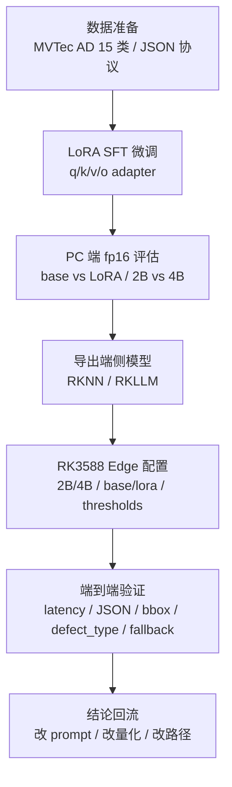
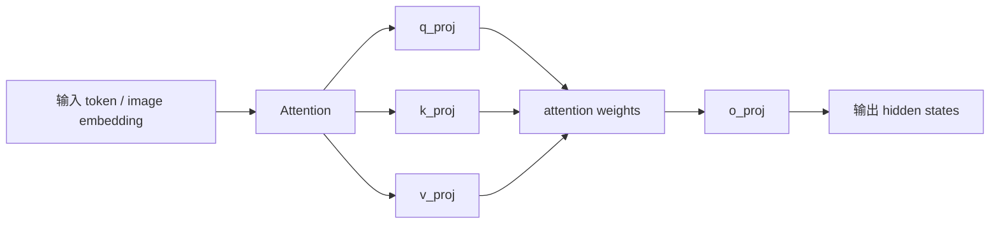
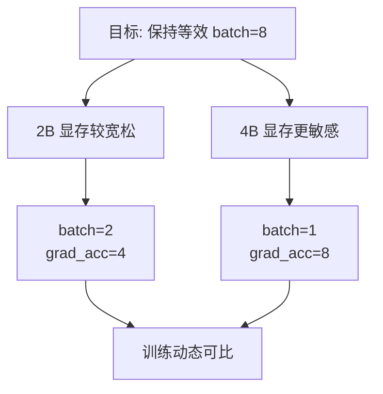
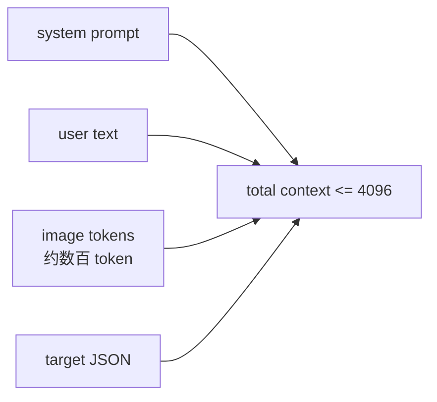
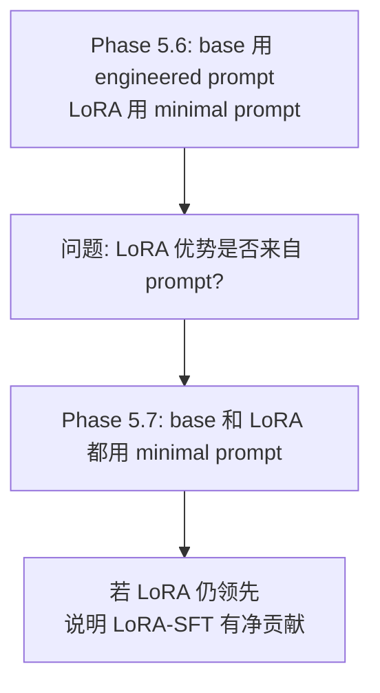
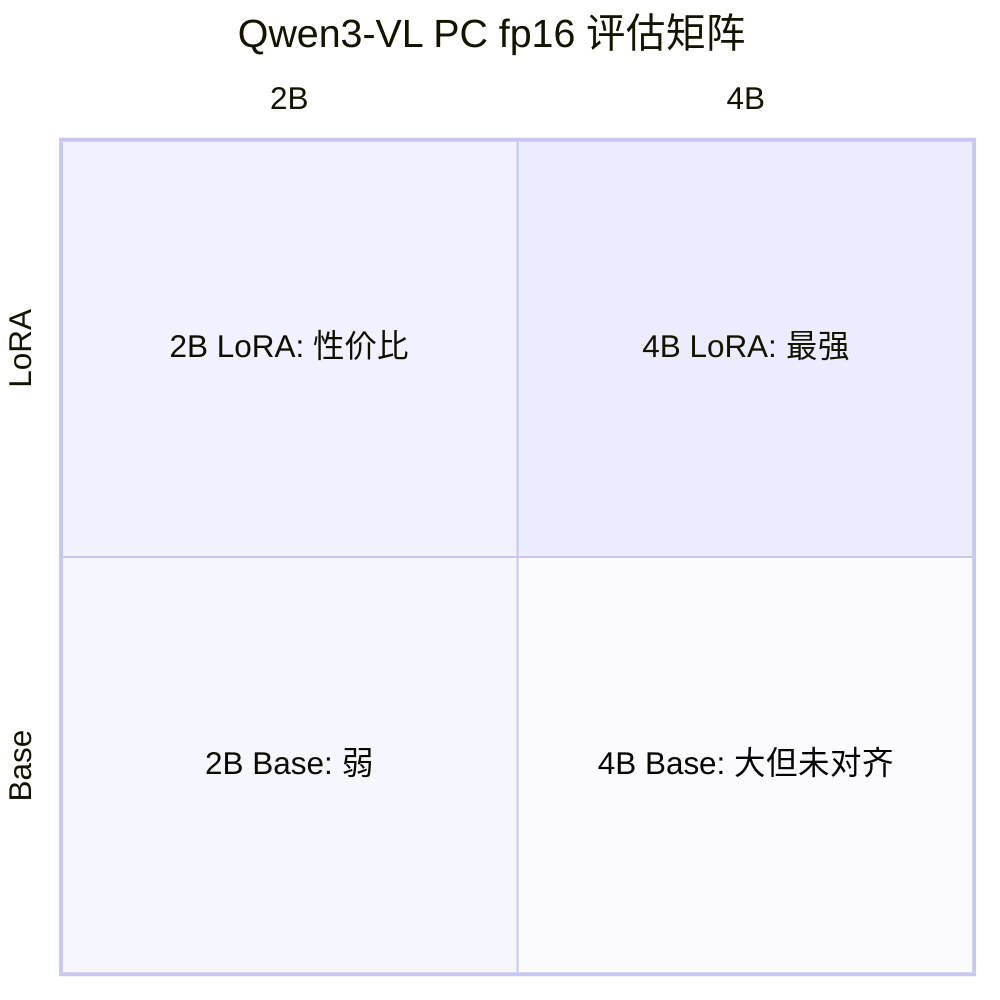
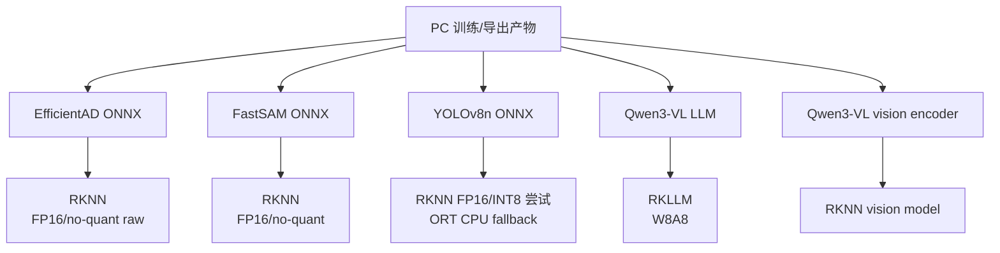
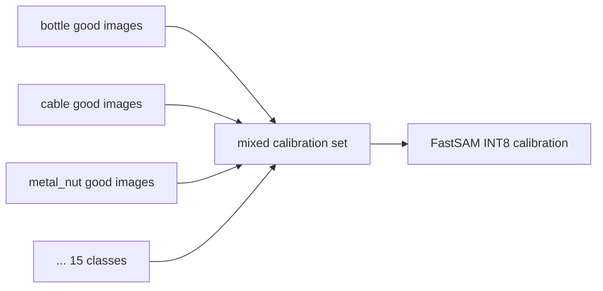
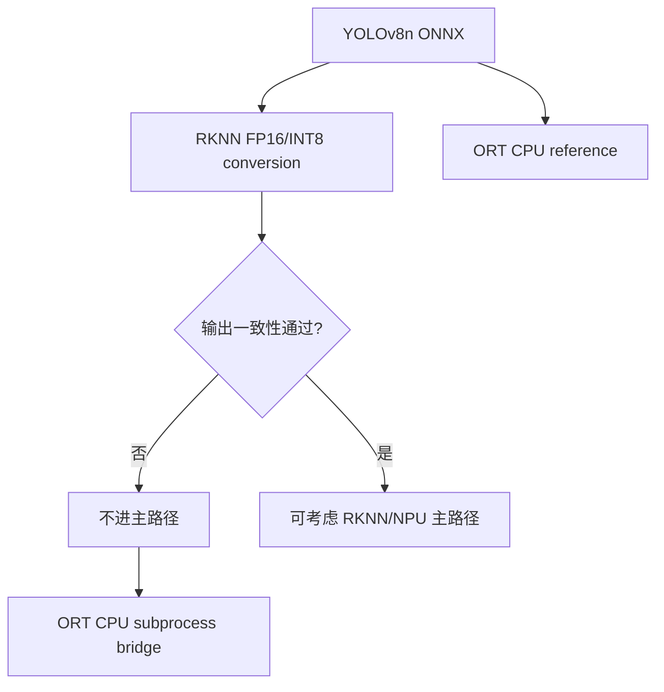
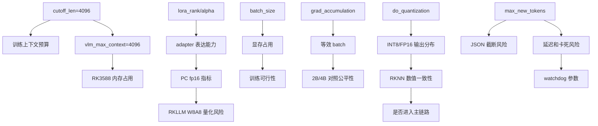

# 训练 / 微调 / 导出模型配置参数解读与面试防拷打手册
> 项目：`vlm-sam-industrial-vision-v2`  
适用场景：简历深挖、项目答辩、面试追问  
覆盖范围：Qwen3-VL LoRA 微调、PC 端评估、RKNN/RKLLM 导出、Edge 运行配置、量化/校准参数解释  
核心目标：把“我用了这些参数”升级成“我知道为什么这样配、有什么风险、面试官追问时怎么回答”。
>

---

## 0. 先给面试官的总口径
如果面试官问：“你这个项目训练、微调、导出参数是怎么选的？”

可以这样开场：

> 我没有把训练、微调、导出当成三个孤立步骤，而是按“数据协议 → LoRA 微调 → PC 评估 → RKNN/RKLLM 导出 → RK3588 运行约束”来闭环。  
Qwen3-VL 的 LoRA 微调里，我用 LLaMA-Factory 做 SFT，rank/alpha 都是 32，只打到 q/k/v/o projection，冻结 vision tower 和 multimodal projector，因为训练数据只有约 1200 条，不足以安全微调视觉塔。2B 和 4B 都维持等效 batch=8，学习率 5e-5，5 epochs，cosine scheduler，bf16。  
导出阶段我会区分模型类型：EfficientAD/FastSAM/YOLO 走 RKNN，Qwen3-VL LLM 走 RKLLM，Qwen3-VL vision tower 走 RKNN。RKNN 不是导出成功就算成功，还要看 Runtime、数值一致性和任务指标。FastSAM 和 EfficientAD 最后都没有盲目用 INT8，而是根据输出分布切到 FP16/no-quant 主线。  
所以我的参数选择不是拍脑袋，而是围绕显存、数据量、模型结构、量化风险、端侧延迟和可解释指标做取舍。
>

---

## 1. 整体生命周期：参数不是一堆散点，而是一条链


理解这个项目的参数时，要把它分成五类：

| 参数类别 | 作用 | 典型参数 | 面试追问点 |
| --- | --- | --- | --- |
| 数据参数 | 决定模型看到什么协议和分布 | `dataset`, `template`, `cutoff_len`, `max_samples` | 数据够不够？GT 怎么来？会不会过拟合？ |
| 微调参数 | 决定训练哪些权重、训练多激进 | `lora_rank`, `lora_alpha`, `lora_target`, `learning_rate` | 为什么 LoRA？为什么不全参？为什么 rank=32？ |
| 资源参数 | 控制显存和训练速度 | `batch_size`, `gradient_accumulation`, `bf16`, `gradient_checkpointing` | 为什么 2B/4B batch 不一样？等效 batch 怎么算？ |
| 导出参数 | 决定端侧文件和数值格式 | `target_platform`, `do_quantization`, `quantized_dtype`, `calib_samples` | 为什么不用 INT8？校准集怎么选？ |
| 运行参数 | 决定端侧行为和安全边界 | `max_context`, `max_new_tokens`, `conf_thresh`, `iou_thresh`, `watchdog` | JSON 截断怎么办？VLM 卡死怎么办？ |


---

## 2. Qwen3-VL LoRA 微调配置总览
项目里 2B 和 4B 都使用 LLaMA-Factory 做 LoRA SFT。

### 2.1 2B 配置
```yaml
model_name_or_path: models/qwen3vl_models/base/
dataset_dir: datasets/
dataset: industrial_vision_train
template: qwen3_vl
cutoff_len: 4096
max_samples: 2000

stage: sft
do_train: true
finetuning_type: lora
lora_target: q_proj,v_proj,k_proj,o_proj
lora_rank: 32
lora_alpha: 32
lora_dropout: 0.05
freeze_vision_tower: true
freeze_multi_modal_projector: true

per_device_train_batch_size: 2
gradient_accumulation_steps: 4
learning_rate: 5.0e-5
num_train_epochs: 5.0
lr_scheduler_type: cosine
warmup_ratio: 0.1
gradient_checkpointing: false
bf16: true
fp16: false
```

### 2.2 4B 配置
```yaml
model_name_or_path: models/qwen3vl_models/4b/base/
dataset: industrial_vision_train
template: qwen3_vl
cutoff_len: 4096
max_samples: 2000

finetuning_type: lora
lora_target: q_proj,v_proj,k_proj,o_proj
lora_rank: 32
lora_alpha: 32
lora_dropout: 0.05
freeze_vision_tower: true
freeze_multi_modal_projector: true

per_device_train_batch_size: 1
gradient_accumulation_steps: 8
learning_rate: 5.0e-5
num_train_epochs: 5.0
lr_scheduler_type: cosine
warmup_ratio: 0.1
gradient_checkpointing: false
bf16: true
fp16: false
```

两个配置的核心差异：

| 项 | 2B | 4B | 为什么 |
| --- | ---: | ---: | --- |
| 单卡 batch | 2 | 1 | 4B 显存压力更大 |
| 梯度累积 | 4 | 8 | 让等效 batch 都等于 8 |
| 等效 batch | 2×4=8 | 1×8=8 | 保持训练动态可比 |
| base path | `models/qwen3vl_models/base/` | `models/qwen3vl_models/4b/base/` | 模型尺寸不同 |
| output dir | `qwen3vl_lora_adapter_15cls` | `qwen3vl_lora_4b_adapter` | 防止产物互相覆盖 |


---

## 3. LoRA 参数逐项解释
### 3.1 `stage: sft`
含义：监督微调，也就是给模型看“图片 + 指令 → 目标 JSON 输出”的样本。

为什么不用 RLHF / DPO？

> 项目目标不是开放式偏好对齐，而是让模型学会固定工业视觉协议，包括 category、defect_type、severity、confidence、bbox、description。SFT 更直接、更稳定，数据量也更适合。
>

面试回答：

> 我这里不是做通用聊天对齐，而是让 VLM 学会项目 schema 和工业缺陷 ontology，所以选择 SFT。目标是结构化输出协议对齐，不是偏好优化。
>

---

### 3.2 `finetuning_type: lora`
含义：不更新全量模型权重，只训练低秩 adapter。

为什么不用全参微调？

| 方案 | 优点 | 风险 |
| --- | --- | --- |
| 全参微调 | 表达能力强 | 显存大、数据少时容易过拟合、保存/部署重 |
| LoRA | 成本低、训练快、adapter 可单独管理 | 表达能力受 rank 限制，量化后可能 cliff |
| QLoRA | 显存更省 | 对 Qwen3-VL + vision 组合更容易出兼容问题 |


面试回答：

> 数据只有约 1200 条，目标是协议对齐，不是重训视觉能力。LoRA 能在较低成本下让模型学会 category、defect_type 和 JSON schema，而且 adapter 产物便于做 2B/4B、base/LoRA 对照。
>

---

### 3.3 `lora_target: q_proj,v_proj,k_proj,o_proj`
含义：LoRA adapter 只挂在 Transformer attention 的 Q/K/V/O projection 上。

为什么不是所有 Linear 层？



选择 q/k/v/o 的理由：

| 层 | 作用 | LoRA 影响 |
| --- | --- | --- |
| `q_proj` | 决定当前 token 关注什么 | 改善缺陷区域和字段生成关注点 |
| `k_proj` | 决定被关注对象如何被匹配 | 改善类别/缺陷语义匹配 |
| `v_proj` | 决定被取出的信息内容 | 改善描述和字段取值 |
| `o_proj` | attention 输出投影 | 改善最终融合表达 |


面试回答：

> 我把 LoRA 打在 attention 的 q/k/v/o 上，是因为这个任务核心是视觉信息、prompt 约束和 schema 输出之间的对齐。q/k/v/o 能改模型如何关注图像区域和协议字段，同时参数量比全层 LoRA 小，适合小数据 SFT。
>

---

### 3.4 `lora_rank: 32`
含义：LoRA 低秩矩阵的秩。rank 越大，adapter 表达能力越强，但参数量、显存和过拟合风险也上升。

LoRA 的简化公式：

```latex
W' = W + ΔW
ΔW = B × A
A: r × d
B: d × r
r = lora_rank
```

rank=32 的理解：

| rank | 特点 | 适用情况 |
| ---: | --- | --- |
| 8 | 很轻，表达能力有限 | 格式微调、简单风格迁移 |
| 16 | 中等 | 小任务、轻量 schema |
| 32 | 更强 | 多类别、多 defect_type、bbox 风格对齐 |
| 64+ | 更强但更容易过拟合 | 数据更多或任务更复杂 |


面试回答：

> 这个任务不只是让模型输出 JSON，还要学 15 类工业 ontology、细粒度 defect_type 和 bbox 风格，rank 太小可能欠拟合；但数据又只有约 1200 条，不适合无限加大 rank。rank=32 是表达能力和过拟合风险之间的折中。
>

---

### 3.5 `lora_alpha: 32`
含义：LoRA 增量权重的缩放因子。实际缩放约为：

```latex
scaling = lora_alpha / lora_rank
```

在本项目中：

```latex
alpha = 32
rank  = 32
scaling = 1
```

为什么 alpha 和 rank 都是 32？

> 这样 LoRA 增量不会被额外放大或缩小，训练更稳，便于 2B/4B 对照。
>

面试回答：

> alpha=rank=32 时 scaling=1，LoRA 增量既不过强也不过弱。因为我要做 2B 和 4B 的公平对照，所以保持相同 rank/alpha，让差异主要来自模型尺寸，而不是 LoRA 缩放强度。
>

---

### 3.6 `lora_dropout: 0.05`
含义：训练时随机丢弃一部分 LoRA 路径，降低过拟合。

为什么不是 0？

> 数据量只有约 1200 条，而且 GT 来自 MVTec mask 自动生成，存在标签口径偏差。轻微 dropout 可以增加鲁棒性。
>

为什么不是 0.2？

> dropout 过大会影响 adapter 学习 schema 和 bbox 风格，小数据任务容易欠拟合。
>

面试回答：

> 我用了 0.05 的轻量 dropout，目的是防止小数据过拟合，但不想破坏 LoRA 学习固定 JSON schema 和 defect_type 体系。
>

---

### 3.7 `freeze_vision_tower: true`
含义：冻结视觉编码器，不训练 ViT / vision tower。

这是很容易被问到的点。

为什么冻结？

| 原因 | 解释 |
| --- | --- |
| 数据量不足 | 约 1200 条工业样本不足以安全微调视觉塔 |
| 防止灾难性遗忘 | 视觉塔已有通用视觉能力，小数据改动可能破坏它 |
| 训练稳定 | 只训练 LLM attention adapter，更容易收敛 |
| 部署简单 | 不改变 vision tower，后续导出和 embedding 对齐风险更低 |


面试回答：

> 这不是因为视觉塔不重要，而是因为数据量不足以安全训练视觉塔。我的目标是让模型学会工业协议和输出格式，所以冻结视觉塔，把学习压力放在语言侧 attention adapter 上。
>

---

### 3.8 `freeze_multi_modal_projector: true`
含义：冻结视觉特征到语言 embedding 的投影层。

为什么冻结 projector？

> projector 是视觉和 LLM 的接口层，乱动它会影响 image embedding 与 LLM token space 的对齐。数据规模小的时候，训练 projector 可能让模型在训练集上更贴合，但部署和泛化更不稳定。
>

面试回答：

> projector 是多模态对齐的关键接口。小数据下我不希望它漂移，所以冻结 projector，只让 LoRA adapter 学输出协议。后面 4B 导出时也证明 vision embedding shape 对齐很关键。
>

---

## 4. 训练超参数逐项解释
### 4.1 `per_device_train_batch_size` 与 `gradient_accumulation_steps`
2B：

```latex
per_device_train_batch_size = 2
gradient_accumulation_steps = 4
effective batch = 2 × 4 = 8
```

4B：

```latex
per_device_train_batch_size = 1
gradient_accumulation_steps = 8
effective batch = 1 × 8 = 8
```



为什么等效 batch 要一致？

> 这样 2B 和 4B 的训练噪声、学习率尺度、收敛动态更可比。否则 4B 如果 batch 太小，指标差异可能来自 batch，而不是模型尺寸。
>

面试回答：

> 4B 单步显存压力更大，所以 per-device batch 从 2 降到 1，但我把 gradient accumulation 从 4 提到 8，让等效 batch 仍然是 8。这样 2B/4B 对比更公平。
>

---

### 4.2 `learning_rate: 5e-5`
含义：LoRA adapter 的学习率。

为什么不是 1e-4 或 1e-5？

| LR | 风险 |
| ---: | --- |
| 1e-4 | 小数据 + schema 任务可能过冲，输出格式容易不稳 |
| 5e-5 | 常见 LoRA SFT 稳健选择，学习速度和稳定性折中 |
| 1e-5 | 可能收敛太慢，5 epochs 内学不充分 |


面试回答：

> 5e-5 是 LoRA SFT 里比较稳的中等学习率。任务既要学 schema，又要学 defect_type 和 bbox，不希望太小欠拟合，也不希望太大把基座模型的生成稳定性打坏。
>

---

### 4.3 `num_train_epochs: 5`
含义：完整遍历训练集 5 次。

为什么 5 epochs？

> 训练集约 1200 条，单 epoch 步数不多。3 epochs 可能没充分学到 defect_type/bbox 协议，10 epochs 又容易记忆训练集。5 epochs 是小数据 LoRA 的折中。
>

估算：

```latex
样本数 ≈ 1200
等效 batch = 8
每 epoch step ≈ 1200 / 8 = 150
5 epochs ≈ 750 optimizer steps
```

面试回答：

> 这个数据量不大，5 epochs 约几百个 optimizer step，足够让 adapter 学协议，但不会像 10+ epochs 那样明显增加过拟合风险。最后还是以 eval 指标而不是 epoch 数字本身判断。
>

---

### 4.4 `lr_scheduler_type: cosine`
含义：学习率从初始值平滑下降，后期更细致地收敛。

```mermaid
xychart-beta
    title "Cosine LR 示意"
    x-axis "training progress" [0, 20, 40, 60, 80, 100]
    y-axis "lr" 0 --> 1
    line [1, 0.9, 0.65, 0.35, 0.1, 0.0]
```

为什么用 cosine？

> 前期快速学习项目协议，后期降低学习率稳定输出格式，适合 LoRA SFT。
>

面试回答：

> cosine scheduler 前期保留学习速度，后期自然降学习率，能减少最后阶段把 JSON schema 学坏或震荡的风险。
>

---

### 4.5 `warmup_ratio: 0.1`
含义：前 10% 训练步骤从低学习率逐渐升到目标学习率。

为什么要 warmup？

> 一开始 LoRA adapter 是随机初始化，如果直接用完整学习率，容易让输出格式不稳定。warmup 让训练先平稳进入状态。
>

估算：

```latex
总 steps ≈ 750
warmup steps ≈ 75
```

面试回答：

> warmup 是为了避免刚开始 adapter 随机初始化时梯度冲击太大。这个任务对输出格式很敏感，所以我宁愿让前 10% 步骤平滑启动。
>

---

### 4.6 `bf16: true`, `fp16: false`
含义：训练用 bfloat16，而不是 float16。

为什么 bf16？

| 精度 | 优点 | 风险 |
| --- | --- | --- |
| fp32 | 稳 | 显存大、慢 |
| fp16 | 省显存 | 动态范围小，容易 overflow/underflow |
| bf16 | 接近 fp32 动态范围，显存省 | 需要硬件支持 |


面试回答：

> 在 RTX 4090 上 bf16 支持较好，动态范围比 fp16 更稳。VLM 训练里既有图像 token 又有文本 token，数值稳定性很重要，所以我用 bf16 而不是 fp16。
>

---

### 4.7 `gradient_checkpointing: false`
含义：不启用激活重计算。

为什么关闭？

> RTX 4090 48GB 显存足够当前 LoRA 设置。gradient checkpointing 可以省显存，但会增加训练时间。这里优先训练速度和稳定性。
>

面试回答：

> checkpointing 是显存换时间。当前 48GB 显存足够，所以我关闭它来提升训练速度。如果换成显存更小的卡，我会再打开。
>

---

## 5. 数据与 Prompt 参数解读
### 5.1 `dataset: industrial_vision_train`
这是 LLaMA-Factory 注册的数据集名。它不是单纯图片分类数据，而是多模态指令数据：

```latex
image + instruction -> JSON response
```

模型需要学习的是：

| 字段 | 学习目标 |
| --- | --- |
| `category` | 15 类 MVTec 产品类别 |
| `defect_type` | 类内缺陷子类型 |
| `severity` | low/medium/high 枚举 |
| `confidence` | 0~1 合法数值 |
| `bboxes` | 归一化 bbox |
| `description` | 简短中文观察说明 |


面试回答：

> 这个数据集的目标不是传统分类，而是 VLM 结构化输出协议。训练样本让模型从图片和提示直接生成项目 API 需要的 JSON。
>

---

### 5.2 `template: qwen3_vl`
含义：使用 Qwen3-VL 的多模态对话模板。

为什么重要？

> 多模态模型不只是拼文本。图片占位符、special token、system/user/assistant 格式都必须和模型预训练模板一致。模板错了，模型可能能跑，但图像 token 和文本 token 的对齐会错。
>

面试回答：

> template 保证训练时的 chat 格式和 Qwen3-VL 预训练/推理期望一致。多模态模型模板错了，可能不是报错，而是性能暗掉。
>

---

### 5.3 `cutoff_len: 4096`
含义：训练时最大上下文长度。

为什么是 4096？

项目里图片会产生大量视觉 token，再加 system prompt、user prompt、JSON response，需要留足空间。



面试回答：

> 4096 是为了容纳图像 token、prompt 和目标 JSON。虽然单条纯文本不长，但 VLM 的图片 token 开销很大，不能只按文字长度估算。
>

---

### 5.4 `max_samples: 2000`
含义：最多读取 2000 条样本。

为什么训练数据约 1200 条还设 2000？

> 这是留余量，防止后续扩展 15 类数据后配置不用改。它不是说实际训练了 2000 条。
>

面试回答：

> max_samples 是上限，不是实际样本数。设 2000 是给 15 类约 1200 条数据留 buffer，避免后续加样本时被配置截断。
>

---

### 5.5 Prompt：engineered prompt vs minimal prompt
PC 评估中有两种 prompt：

| Prompt | 用于 | 特点 |
| --- | --- | --- |
| engineered prompt | base 模型 | 约束更强、更长 |
| minimal prompt | LoRA 模型 | 更短，符合训练格式 |


这也是为什么做 Method Control：



面试回答：

> 我意识到 prompt 差异可能污染结论，所以做了 method control：base 和 LoRA 用相同 minimal prompt。如果 LoRA 仍然显著领先，才能说明收益来自 LoRA-SFT，而不是 prompt 工程假象。
>

---

## 6. 评估参数解读：不要把 JSON OK 当准确率
### 6.1 `max_tokens=200`
PC 主实验使用 `max_tokens=200`，greedy decoding。

为什么是 200？

> 结构化 JSON 输出通常不需要很长。200 可以控制生成长度和评估成本，同时暴露截断风险。
>

为什么后来补测 300？

> 因为部分样本 JSON 被截断，300 是截断敏感性补测，不替代主实验。
>

面试回答：

> 200 是主实验统一口径，不是说 200 最优。后面我用 300 做截断敏感性补测，目的是判断 JSON 失败有多少来自输出长度限制。
>

---

### 6.2 `do_sample=False`
含义：greedy decoding，不采样。

为什么不用 temperature sampling？

> 评估要可复现，工业检测也不需要随机创意输出。采样会增加 JSON 格式和指标波动。
>

面试回答：

> 工业质检需要稳定结构化输出，所以评估和部署都优先 greedy。随机采样适合开放式生成，不适合这里的 schema 任务。
>

---

### 6.3 指标解释
| 指标 | 能证明什么 | 不能证明什么 |
| --- | --- | --- |
| `json_parse_ok` | 输出是合法 JSON 且有必要字段 | 不代表语义正确 |
| `schema_ok` | 字段枚举、bbox、confidence 合法 | 不代表预测准 |
| `category_exact` | 粗类别正确 | 不代表缺陷子类正确 |
| `defect_type_exact` | 细粒度缺陷类型匹配 | 受 GT 目录名口径影响 |
| `bbox_iou_at_0_5` | bbox 与 GT mask 外接框较接近 | 不代表像素级分割 |
| `output_tokens` | 生成长度和截断风险 | 不代表质量 |


面试回答：

> JSON OK 只是格式指标。真正质量要看 category、defect_type、bbox IoU。这个项目里 LoRA board 的反例很典型：JSON 可以 parse，但 defect_type 可能完全不对。
>

---

## 7. PC 评估结论怎么解释
### 7.1 2×2 评估矩阵


四变体：

| 变体 | 模型 | 模式 | Prompt |
| --- | --- | --- | --- |
| `2B_base` | Qwen3-VL-2B | base fp16 | engineered |
| `2B_lora` | Qwen3-VL-2B + LoRA | LoRA fp16 | minimal |
| `4B_base` | Qwen3-VL-4B | base fp16 | engineered |
| `4B_lora` | Qwen3-VL-4B + LoRA | LoRA fp16 | minimal |


关键结论：

> LoRA 是决定性因素，不是模型尺寸本身。Base 模型即使更大，也不等于学会项目协议。
>

### 7.2 面试口语
> PC fp16 评估里，LoRA 对 category、defect_type、bbox 都有明显提升，说明它确实学到了工业协议和标注风格。但我没有直接把 PC 结论搬到 RK3588，因为端侧 W8A8 量化会改变生成质量。PC fp16 是模型能力验证，板端 W8A8 是部署可用性验证，它们必须分开说。
>

---

## 8. 导出模型：RKNN / RKLLM 参数地图
端侧有三类导出路径：



---

## 9. EfficientAD RKNN 导出参数解读
### 9.1 关键配置
```latex
Input:
models/efficientad_models/{category}/weights/onnx/model.onnx
或 model_raw.onnx --use-raw-onnx

Output:
model.rknn
或 model_raw_noquant.rknn

Normalization:
mean=[123.675, 116.28, 103.53]
std=[58.395, 57.12, 57.375]

Input size:
[1, 3, 256, 256]

INT8:
quantized_dtype="asymmetric_quantized-8"
do_quantization=True
calib_samples=100 默认
MIN_CALIB_SAMPLES=50

FP16/no-quant:
do_quantization=False
--use-raw-onnx --no-quant
```

### 9.2 参数解释
| 参数 | 含义 | 为什么重要 |
| --- | --- | --- |
| `--use-raw-onnx` | 使用 post-processor 前 raw tensor | 避开 `Greater` 和 Clip 后分数 |
| `--no-quant` | 不做 INT8，走 FP16 | raw INT8 输出分布不可信 |
| `outputs=["raw_score","raw_anomaly_map"]` | 指定 RKNN 输出 | 防止导出后仍使用后处理输出 |
| `input_size_list=[[1,3,256,256]]` | 固定输入尺寸 | EfficientAD 训练/推理尺寸固定 |
| `calib_samples` | INT8 校准图片数量 | 校准分布影响量化尺度 |
| `accuracy_analysis` | RKNN 工具链层级 cosine 分析 | 有帮助但不是最终任务指标 |


### 9.3 面试回答
> EfficientAD 我重点看的是输出语义，而不是只看能否 export。旧 ONNX 的 `pred_score/anomaly_map` 是 post_processor 后输出，不适合 gate；所以我用 `--use-raw-onnx` 指定 `raw_score/raw_anomaly_map`。后来 raw INT8 上板分布不可信，所以主线加 `--no-quant`，导出 `model_raw_noquant.rknn`。这里的 `accuracy_analysis` 只是工具链参考，最终还要看板端 raw_score 分布和 AUROC。
>

---

## 10. FastSAM RKNN 导出参数解读
### 10.1 关键配置
```latex
Input:
models/fastsam_models/fastsam_s.onnx

Output:
fastsam_s.rknn
或 fastsam_s_noquant.rknn

Normalization:
mean=[0, 0, 0]
std=[255, 255, 255]

Input size:
[1, 3, 640, 640]

INT8:
quantized_dtype="asymmetric_quantized-8"
do_quantization=True
calib_samples=100 默认

FP16/no-quant:
--no-quant
do_quantization=False
```

### 10.2 为什么 FastSAM 的 calibration 要混 15 类
FastSAM 是通用 bbox/seg proposal 模型，不是每个类别一个模型。所以校准集不能只来自某一类。



面试回答：

> EfficientAD 是 per-category 模型，所以校准可以按类别取 good images；FastSAM 是共享模型，输入会覆盖 15 类纹理，所以校准集要混合各类，避免量化尺度只适配单一纹理分布。
>

### 10.3 为什么最后不用 INT8
FastSAM INT8 的 output0 confidence scale 太粗，`conf>0.25` 后没有候选，所以切 FP16/no-quant。

| 参数 | INT8 | FP16/no-quant |
| --- | --- | --- |
| `do_quantization` | true | false |
| 输出文件 | `fastsam_s.rknn` | `fastsam_s_noquant.rknn` |
| calibration | 需要 | 不需要 |
| accuracy_analysis | 可做 | 跳过 |
| 实际主线 | 不用 | 用 |


面试回答：

> FastSAM 的问题不是导不出来，而是 INT8 后 detection confidence 不可信。`--no-quant` 不是偷懒，而是基于 output0 分布诊断做的工程取舍：先保证候选框可信，再谈性能。
>

---

## 11. YOLOv8n Phase 10 导出参数解读
### 11.1 关键配置
```latex
Input:
models/yolov8n_phase10/yolov8n_metal_nut_cable_best.onnx

Output:
yolov8n_metal_nut_cable_best_fp16.rknn
或 yolov8n_metal_nut_cable_best_int8.rknn

Classes:
metal_nut, cable

Input size:
640

Normalization:
mean=[0,0,0]
std=[255,255,255]

默认:
FP16 no-quant

可选:
--quantized --calib-samples 50
--opt-level 0/1/2/3
```

### 11.2 `--opt-level`
含义：RKNN 优化级别。越高可能优化更多，但也可能改变图结构或输出特性。

面试回答：

> YOLO 这类检测头模型，我不会只追求高 opt-level 或低 latency。检测头的 bbox/class score 一旦数值不一致，后处理就没有意义。所以优化级别要配合 ONNX reference 做一致性验证。
>

### 11.3 为什么 Phase 10 主路径是 ORT CPU fallback


面试回答：

> YOLOv8n 有 RKNN 转换脚本，但主链路不能只看是否导出成功。检测头输出要和 ONNX Runtime reference 对齐，否则 bbox 和 class score 都不可信。当前主路径用 ORT CPU fallback，是为了先保证闭环正确和可测。
>

---

## 12. Qwen3-VL RKLLM / vision 导出参数解读
### 12.1 Base / LoRA / 2B / 4B 运行选择
Edge 配置中通过两个开关控制：

```yaml
vlm_variant: "base"   # base | lora
vlm_model_size: "2B"  # 2B | 4B
```

对应路径：

```latex
2B base:
qwen3vl_2b_w8a8_base.rkllm
qwen3vl_2b_vision.rknn

2B LoRA:
qwen3vl_2b_w8a8_lora_15cls.rkllm
qwen3vl_2b_vision.rknn

4B base:
qwen3vl_4b_w8a8_base.rkllm
qwen3vl_4b_vision.rknn

4B LoRA:
qwen3vl_4b_w8a8_lora_15cls.rkllm
qwen3vl_4b_vision.rknn
```

### 12.2 `vlm_max_context: 4096`
含义：端侧最大上下文。

为什么 4096？

> RK3588 16GB 内存有限，VLM 还要和 EfficientAD、FastSAM、Edge runtime 共存。4096 是可运行性、输入图片 token 和输出 JSON 之间的折中。
>

面试回答：

> 训练时 cutoff_len 和端侧 max_context 都设 4096，是为了保持上下文预算一致。但端侧 4096 不是随便加大的，因为 RK3588 16GB 还要承载整个 pipeline。
>

---

### 12.3 `vlm_max_new_tokens: 500`
含义：VLM 最多生成 500 个新 token。

为什么 PC eval 用 200，Edge 用 500？

| 场景 | max tokens | 目的 |
| --- | ---: | --- |
| PC 主评估 | 200 | 统一评估口径，控制成本 |
| PC 截断补测 | 300 | 分析 JSON 截断敏感性 |
| Edge runtime | 500 | 防止复杂样本 JSON 被截断，但配 watchdog |


面试回答：

> PC 评估用 200 是为了统一 benchmark；Edge 配 500 是为了减少 JSON 截断。但 500 会增加卡死风险，所以同时加 JSON watchdog，检测重复括号和 n-gram，避免退化输出堵住 T3。
>

---

### 12.4 `vlm_npu_core_num: 3`
含义：RKLLM 使用 3 个 NPU core。

面试回答：

> 这是端侧吞吐配置，希望最大化 RK3588 NPU 资源利用。但 VLM 仍然是秒级延迟，所以 Phase 10 同步主链路转向 YOLO/ORT localizer，VLM 更适合异步 enrichment。
>

---

### 12.5 JSON Watchdog 参数
```yaml
vlm_json_watchdog_enabled: true
vlm_json_watchdog_max_decode_ms: 45000
vlm_json_watchdog_repeated_char_limit: 64
vlm_json_watchdog_repeated_ngram_limit: 32
```

为什么需要 watchdog？

> LoRA 或量化模型可能出现重复括号、重复短语、超长输出。如果没有 watchdog，一个坏样本可能阻塞 T3 很久。
>

面试回答：

> Watchdog 是部署安全参数，不是模型能力参数。它承认 VLM 可能退化，并用工程手段限制最坏情况，避免一个异常输出拖垮 pipeline。
>

---

## 13. 运行配置参数：不要和训练参数混淆
Edge 配置里这些参数不是训练参数，而是运行策略：

| 参数 | 含义 | 面试解释 |
| --- | --- | --- |
| `vlm_variant` | 选择 base 或 LoRA | A/B 测试和部署切换 |
| `vlm_model_size` | 选择 2B 或 4B | 性能/内存/质量权衡 |
| `capture_mode` | `image_loop` 或 `v4l2` | 工程验证 vs 摄像头接入 |
| `image_loop_beat_ms` | 静态图循环节拍 | soak 测试稳定输入 |
| `efficientad_score_mode` | raw score 统计方式 | 必须和阈值口径一致 |
| `efficientad_gate_mode` | threshold 或 pass_all | 正式 gate vs 联调 |
| `localizer_conf_thresh` | YOLO 置信度阈值 | 控制候选框数量 |
| `localizer_iou_thresh` | NMS IoU 阈值 | 控制重复框合并 |
| `jpeg_quality` | 上传图片质量 | 带宽、大小、可视化折中 |


---

## 14. 参数依赖图：哪些参数不能孤立改


面试里最容易被问的是：

> 如果把某个参数改大/改小，会怎样？
>

下面给出防拷打答案。

---

## 15. 高频追问与回答
### Q1：为什么 LoRA rank 是 32，不是 8 或 64？
> rank=8 可能只够学格式，不够学 15 类 defect_type 和 bbox 风格；rank=64 表达能力更强，但数据只有约 1200 条，过拟合和量化后不稳定风险更大。rank=32 是任务复杂度和数据规模之间的折中。
>

---

### Q2：为什么 alpha 也是 32？
> 因为 alpha/rank=1，LoRA 增量不额外放大也不缩小，训练比较稳。2B 和 4B 都用同样 alpha/rank，方便公平对照。
>

---

### Q3：为什么只训 q/k/v/o，不训 MLP？
> 这个任务核心是图像区域、文本 prompt 和 JSON 字段之间的注意力对齐。q/k/v/o 是 attention 的关键路径，能影响模型关注什么、取什么信息、如何输出。全层 LoRA 参数更多，小数据下过拟合风险更大。
>

---

### Q4：为什么冻结 vision tower？
> 数据规模不足以安全改视觉塔。我的目标不是重新学习视觉特征，而是让模型把已有视觉能力对齐到工业 JSON 协议。冻结视觉塔可以降低训练和导出风险。
>

---

### Q5：为什么冻结 multimodal projector？
> projector 是视觉 embedding 和 LLM token space 的接口。小数据训练 projector 容易让多模态对齐漂移，导致部署不稳定。这个项目里保持 projector 不动，只训练语言侧 adapter 更稳。
>

---

### Q6：为什么 4B batch_size 比 2B 小，但还说公平？
> 因为我用 gradient accumulation 保持等效 batch 一致。2B 是 2×4=8，4B 是 1×8=8。单步 batch 不同是显存约束，等效 batch 一样是为了训练动态可比。
>

---

### Q7：为什么不用 QLoRA？
> QLoRA 能省显存，但 Qwen3-VL 这种多模态模型加 vision 训练组合更容易出现兼容和稳定性问题。当前 4090 48GB 能跑 bf16 LoRA，所以优先用更稳的 bf16 LoRA。
>

---

### Q8：为什么 bf16，不用 fp16？
> bf16 动态范围更接近 fp32，训练 VLM 更稳。fp16 更容易出现 overflow/underflow。4090 支持 bf16，所以这里选 bf16。
>

---

### Q9：为什么 learning rate 是 5e-5？
> LoRA SFT 常用中等学习率。这个任务既要学 schema，又要学 defect_type 和 bbox，太小学不动，太大可能破坏格式稳定性。5e-5 是稳健折中。
>

---

### Q10：为什么训练 5 epochs？
> 数据约 1200 条，等效 batch=8，大概每 epoch 150 step，5 epochs 约 750 step。这个量足够 adapter 学协议，但不会像更长训练那样明显增加记忆训练集风险。
>

---

### Q11：为什么 PC 上 LoRA 有效，板端 W8A8 还不行？
> PC fp16 和 RK3588 W8A8 是两个不同数值环境。PC 评估证明 LoRA 学到了协议和细粒度任务；板端 W8A8 评估检验量化后生成质量。LoRA 在 PC 有效不代表量化后仍保留 defect_type 能力。
>

---

### Q12：为什么 max_tokens 评估用 200，Edge 用 500？
> 评估需要统一、可比、成本可控，所以主实验用 200。端侧为了减少复杂 JSON 截断，给到 500，但配合 watchdog 防止重复输出拖死 T3。
>

---

### Q13：为什么 EfficientAD 不继续 INT8？
> EfficientAD raw INT8 上板后输出分布与 ONNX reference 不一致，good/defect 分数重叠和饱和。端侧部署优先正确性，所以切 FP16/no-quant，而不是为了 INT8 标签牺牲输出可信度。
>

---

### Q14：为什么 FastSAM 不继续调低 conf 阈值？
> 因为问题不是阈值太高，而是 INT8 output0 confidence 的量化级距太粗，候选框链路本身被破坏。调低阈值可能制造假候选，但不解决数值精度问题，所以切 FP16/no-quant。
>

---

### Q15：为什么 YOLO RKNN 不作为主路径？
> 检测头输出必须和 ONNX Runtime reference 做一致性验证。如果 class score 或 bbox head 不可信，即使 latency 好也不能进主链路。当前主路径用 ORT CPU fallback 是工程保守选择。
>

---

### Q16：校准集为什么用 good images？
> EfficientAD 是异常检测模型，正常样本分布是它的基准；用 good images 校准符合它的主要输入分布。FastSAM/YOLO 的校准则要覆盖实际检测输入纹理，不能只看单类。
>

---

### Q17：`accuracy_analysis` 通过是不是就说明模型可用？
> 不是。accuracy_analysis 是层级 cosine 或工具链参考，只能说明某些层输出接近。端侧可用还要看 runtime、输出分布、后处理候选、任务指标和端到端稳定性。
>

---

### Q18：为什么不把 EfficientAD 当 final detector？
> 因为当前 raw_score mean AUROC 不够，类别间分布重叠明显。它适合做 load-shedding gate，减少进入慢模型的帧，但最终定位和类别判断要交给 T3 localizer/VLM。
>

---

### Q19：为什么 config 里有 `pass_all`？
> `pass_all` 是联调模式，防止 T2 gate 把帧全 drop，导致 T3、上传和前端没法调试。正式运行应使用 threshold，但联调需要保留 pass_all。
>

---

### Q20：如果面试官说“你这些参数是不是拍脑袋？”
可以回答：

> 参数不是孤立选的。LoRA rank/alpha、batch/grad accumulation、bf16 和 freeze 策略来自数据规模和显存约束；eval 的 max_tokens/do_sample 来自可复现评估；RKNN 的 no-quant 来自板端输出分布诊断；Edge 的 watchdog 来自 VLM 退化输出风险。每一类参数都有对应的失败模式和验证指标。
>

---

## 16. 可直接背的 2 分钟总回答
> 这个项目里训练、微调和导出参数我是按工程闭环来设计的。微调部分用 LLaMA-Factory 做 Qwen3-VL LoRA SFT，数据是 15 类工业视觉 JSON 协议样本。LoRA target 选 q_proj、k_proj、v_proj、o_proj，因为任务核心是图像区域、prompt 和 schema 字段之间的注意力对齐；rank 和 alpha 都设 32，让 scaling=1，表达能力比 8/16 更强，但又不过度扩大过拟合风险。  
>
> 视觉塔和 multimodal projector 都冻结，因为数据只有约 1200 条，不足以安全改视觉编码器和跨模态投影层。训练用 bf16 而不是 fp16，是为了更好的数值稳定性。2B 的 batch 是 2、grad accumulation 是 4，4B 的 batch 是 1、grad accumulation 是 8，两者等效 batch 都是 8，所以模型尺寸对照更公平。学习率 5e-5、5 epochs、cosine scheduler 加 10% warmup，是小数据 LoRA SFT 里稳定性和收敛速度的折中。  
>
> 评估上我不只看 JSON parse，而是看 schema、category、defect_type、bbox IoU 和 output tokens。还做了 method control，用相同 minimal prompt 比 base 和 LoRA，避免把 prompt 工程收益误判成 LoRA 收益。  
>
> 导出上我区分 RKNN 和 RKLLM。EfficientAD、FastSAM、YOLO 是 ONNX 到 RKNN，Qwen3-VL LLM 是 RKLLM，vision encoder 是 RKNN。RKNN 部署不是导出成功就结束，还要看 runtime 和数值一致性。EfficientAD 和 FastSAM 都因为 INT8 输出分布问题切到 FP16/no-quant；YOLO RKNN 没有稳定进入主路径，所以用 ORT CPU fallback 保证正确性。  
>
> 所以这些参数背后其实是一套原则：小数据只做 adapter，不乱动视觉塔；评估区分格式和语义；导出区分文件成功和数值可用；端侧优先正确性和可观测性，再追求性能。
>

---

## 17. 禁区：这些说法不要说
| 不要说 | 应该说 |
| --- | --- |
| “我全参微调了 Qwen3-VL” | “我做的是 LoRA SFT” |
| “我训练了视觉塔” | “我冻结 vision tower 和 projector，只训 LoRA adapter” |
| “LoRA 端侧成功了” | “LoRA PC fp16 有效，但 RK3588 W8A8 有 cliff” |
| “JSON OK 就是准确率” | “JSON OK 是格式指标，语义要看 defect_type/bbox” |
| “FastSAM 做了 mask segmentation” | “当前只用 output0 做 bbox proposal，mask decode 未完成” |
| “YOLO RKNN 是主路径” | “YOLO RKNN 做过尝试，主路径是 ORT CPU fallback” |
| “EfficientAD 是最终检测器” | “EfficientAD 是 load-shedding gate” |
| “INT8 都转好了” | “不同模型 INT8 结果不同，FastSAM/EfficientAD 主线用 FP16/no-quant” |
| “accuracy_analysis 过了就部署成功” | “还要看板端 runtime、输出分布和任务指标” |
| “这些参数是经验值” | “这些参数对应数据量、显存、模型结构和端侧失败模式” |


---

## 18. 一页速记表
| 模块 | 参数 | 数值 | 一句话解释 |
| --- | --- | ---: | --- |
| LoRA | `lora_rank` | 32 | 表达能力与小数据过拟合折中 |
| LoRA | `lora_alpha` | 32 | scaling=1，训练稳定 |
| LoRA | `lora_dropout` | 0.05 | 轻量防过拟合 |
| LoRA | `lora_target` | q/k/v/o | 改 attention 对齐，不全层乱动 |
| 多模态 | `freeze_vision_tower` | true | 数据少，不动视觉塔 |
| 多模态 | `freeze_projector` | true | 保持跨模态接口稳定 |
| 训练 | 2B batch/acc | 2/4 | 等效 batch=8 |
| 训练 | 4B batch/acc | 1/8 | 等效 batch=8 |
| 训练 | `learning_rate` | 5e-5 | LoRA SFT 稳健中间值 |
| 训练 | `epochs` | 5 | 约 750 step，学协议不过度 |
| 训练 | `bf16` | true | 数值稳定 |
| 评估 | `max_tokens` | 200 | 主实验统一口径 |
| Edge | `vlm_max_new_tokens` | 500 | 减少截断，配 watchdog |
| EfficientAD | `input_size` | 256 | 模型固定输入 |
| FastSAM/YOLO | `input_size` | 640 | YOLOv8-style 输入 |
| RKNN | `target_platform` | rk3588 | 板端目标 |
| RKNN | `do_quantization` | true/false | 是否 INT8 |
| RKNN | `--no-quant` | FP16 | 数值可信优先 |
| YOLO | `conf_thresh` | 0.25 | 候选框过滤 |
| YOLO | `iou_thresh` | 0.45 | NMS 去重 |
| VLM | watchdog | 45s/重复限制 | 防退化输出卡死 |


---

## 19. 最后一段压轴总结
> 训练参数体现的是我对数据规模和模型结构的判断：小数据只做 LoRA，不乱动 vision tower；2B/4B 保持等效 batch；bf16 保稳定。  
评估参数体现的是我对实验方法的判断：base/LoRA、prompt、模型尺寸要解耦；JSON parse 和 defect_type/bbox 不能混淆。  
导出参数体现的是我对端侧部署的判断：RKNN/RKLLM 文件成功只是第一步，真正要看 runtime、数值分布、后处理候选和端到端稳定性。  
这就是我准备这个项目时的核心方法论：**参数不是配置表，是工程假设；每个参数后面都要有验证证据和失败预案。**
>

