# RK3588 端侧模型转换失败分析与面试口语稿
> 项目：`vlm-sam-industrial-vision-v2`  
主题：EfficientAD-S / FastSAM-s / Qwen3-VL / YOLOv8n 在 RK3588 端侧部署中的转换、量化、数值一致性与任务可用性问题  
用途：学习理解、文档补充、简历项目复盘、面试口语表达
>

---

## 0. 一句话总论
这个项目里不能笼统说“模型转换失败”或“量化失败”。更准确的说法是：

> 我把端侧模型部署拆成四层验收：**能不能导出文件、能不能在 RKNN/RKLLM Runtime 执行、输出数值分布是否可信、最终任务指标是否可用**。不同模型失败在不同层：EfficientAD 主要是后处理图和 raw INT8 分布问题，FastSAM 是 YOLOv8-seg detection confidence 通道被 per-tensor INT8 量化破坏，Qwen3-VL 是 multimodal embedding / RKLLM 工具链 / W8A8 语义质量问题，YOLOv8n 则是 RKNN 路径未稳定成为主链路，最终用 ORT CPU bridge 保底。
>

最重要的面试亮点不是“我把模型都转成 RKNN 了”，而是：

> **我没有把 export success 当成 deployment success，而是建立了从图结构、runtime、数值一致性到业务指标的排障闭环。**
>

---

## 1. 四层判断框架：为什么“转换成功”不等于“部署成功”
很多端侧部署问题表面上都叫“转换失败”，但工程上必须拆成四层：

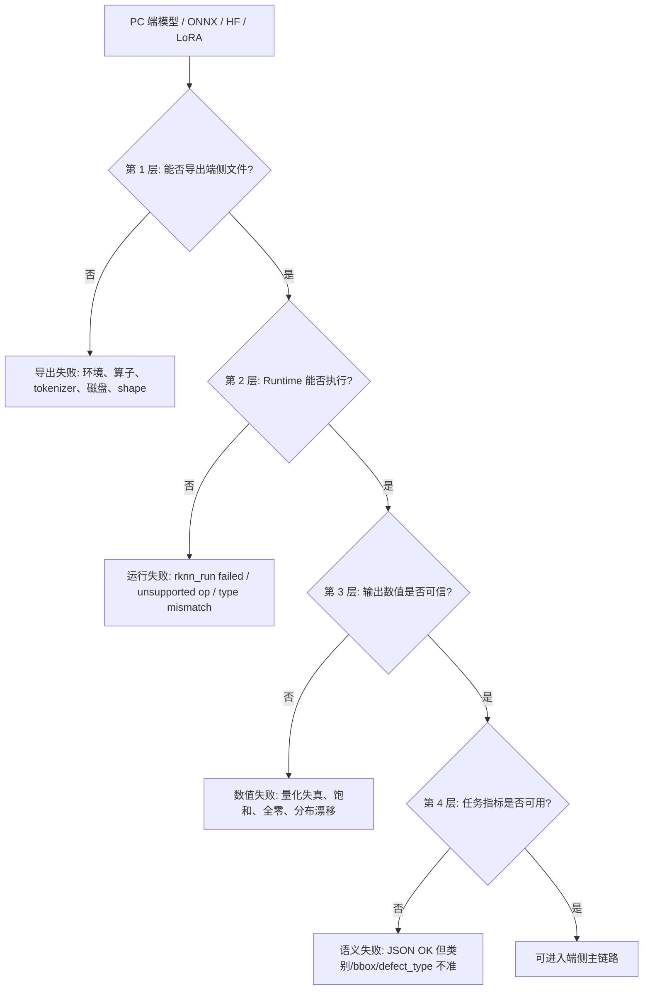

这四层对应的诊断方式不同：

| 层级 | 看什么 | 常见证据 | 本项目例子 |
| --- | --- | --- | --- |
| 文件导出 | 是否生成 `.rknn` / `.rkllm` | export 日志、文件大小、sha256 | Qwen3-VL RKLLM、4B vision merger patch |
| Runtime 执行 | `rknn_run` / `rkllm` 是否崩 | unsupported op、type mismatch | EfficientAD `Greater` INT8/FLOAT |
| 数值一致性 | ONNX vs RKNN 输出分布是否一致 | min/max/mean、top-k、cosine、候选数量 | FastSAM confidence 被 INT8 scale 破坏 |
| 任务可用性 | JSON、category、defect_type、bbox、延迟 | 端到端指标、fallback 比例 | Qwen3-VL LoRA W8A8 semantic cliff |


---

## 2. 整体端侧流水线视角
项目目标是 RK3588 16GB 边缘端跑三段式工业视觉推理：

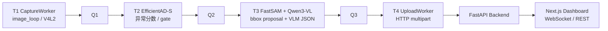

在这个流水线里，不同模型的职责不同：

| 阶段 | 模型 | 主要职责 | 失败影响 |
| --- | --- | --- | --- |
| T2 | EfficientAD-S | 判断是否异常，给 anomaly score | 漏检会直接 drop，T3 无法补救 |
| T3-A | FastSAM-s | 给 bbox proposal | bbox 不准会影响后续融合和前端展示 |
| T3-B | Qwen3-VL | 输出 defect_type / severity / confidence / JSON | 结构化语义质量下降 |
| Phase 10 | YOLOv8n localizer | 替代或补充定位 | 若 RKNN 数值不可信，只能走 ORT CPU fallback |


---

## 3. EfficientAD-S 深度分析
### 3.1 表面现象
最初看起来是 EfficientAD RKNN 运行失败，板端日志类似：

```latex
ElementwiseLogical: unsupported A type: INT8, B type: FLOAT
Op type: Greater, name: Greater:/post_processor/Greater_1
[T2] rknn_run failed: -1
```

这不是主干卷积网络不能转，也不是 NPU 完全跑不了 EfficientAD，而是 **Anomalib 导出的 ONNX 后处理图包含 RKNN Runtime 不支持的类型组合**。

### 3.2 具体坏在哪个结构
旧 ONNX 输出包含：

```latex
pred_score
pred_label
anomaly_map
pred_mask
```

其中 `pred_label` 和 `pred_mask` 是后处理阈值比较后的结果，需要执行 `Greater`：

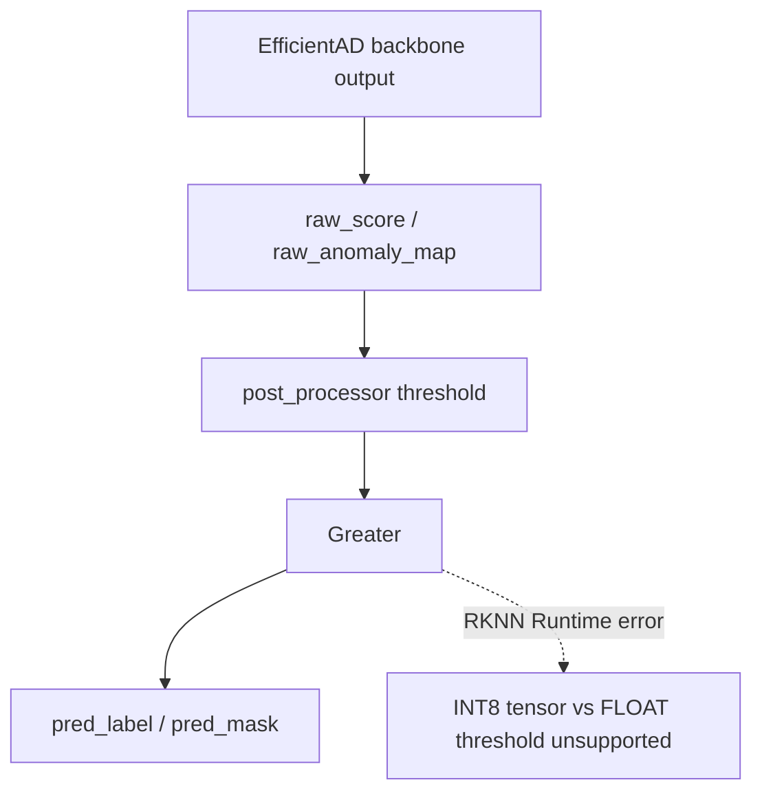

关键点：

+ `pred_label / pred_mask` 不是模型主干输出，而是阈值后处理结果。
+ RKNN Runtime 执行整张图，不是只执行 C++ 读取的输出。
+ 即使 C++ 不读取 `pred_label / pred_mask`，只要图里保留 `Greater`，`rknn_run` 仍可能失败。

### 3.3 为什么只保留 `pred_score/anomaly_map` 也不够
后来绕开 `Greater` 后，又发现 `pred_score/anomaly_map` 本身也不适合端侧 gate。

原因是这两个输出已经过后处理归一化与 Clip：

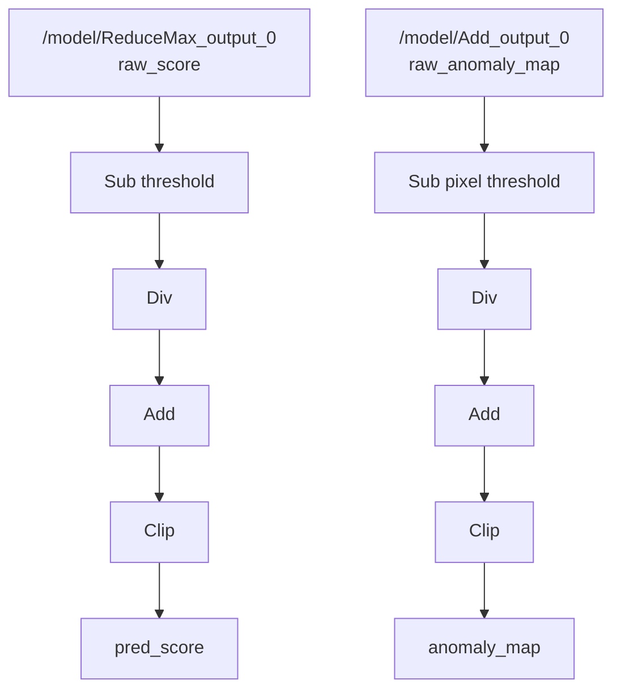

结果是 good 和 defect 的 `pred_score` 都接近 0.9~1.0。也就是说：

> 这个分数不是原始异常强度，而是经过 post_processor 尺度压缩后的结果，不能直接拿来做端侧 threshold gate。
>

### 3.4 raw INT8 为什么仍然不行
修复方向是导出 post-processor 前的 raw output：

```latex
/model/ReduceMax_output_0 -> raw_score
/model/Add_output_0       -> raw_anomaly_map
```

但 raw INT8 RKNN 上板后，输出分布仍然异常：

```latex
good-only map_mean ≈ 22~23
defect    map_mean ≈ 22~23
raw_score / map_max / topk 大量固定或饱和
```

这说明 raw INT8 的数值分布和 ONNX raw 输出不一致。工程结论是：

> EfficientAD T2 不适合继续走 raw INT8 主路线，改成 raw ONNX -> FP16/no-quant RKNN -> C++ FP16 parse。
>

### 3.5 最终工程解法
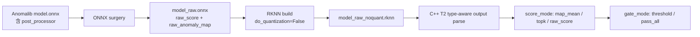

C++ 层还做了两个关键工程化设计：

| 设计 | 作用 |
| --- | --- |
| `score_mode` | 支持 `raw_score / map_max / map_mean / map_top1 / map_top01`，便于比较不同分数统计方式 |
| `gate_mode` | `threshold` 用于正式 gate，`pass_all` 用于联调，避免 T2 drop 导致 T3 无数据 |


### 3.6 面试口语说法
**30 秒版：**

> EfficientAD 的问题不是模型主干不能跑，而是 Anomalib 导出的 ONNX 把后处理也带进去了。后处理里有 `Greater`，RKNN Runtime 对 INT8 tensor 和 FLOAT threshold 的比较支持有问题，所以 `rknn_run` 失败。我进一步 trace 发现 `pred_score/anomaly_map` 也是 Clip 后输出，good 和 defect 分数饱和，不能作为 gate。最后我通过 ONNX surgery 导出 post-processor 前的 `raw_score/raw_anomaly_map`，并放弃 raw INT8，改成 FP16/no-quant RKNN，在 C++ 里实现 type-aware parse、score_mode 和 gate_mode。
>

**2 分钟版：**

> 当时我没有直接把问题归为“RKNN 不支持 EfficientAD”。我先看 runtime error，定位到 `Greater:/post_processor/Greater_1`，发现失败点在 Anomalib post_processor，而不是 backbone。然后我试图只保留 `pred_score/anomaly_map`，但用 ONNX Runtime 做 good/defect 分布测试后发现两者都接近 1，说明它们是归一化和 Clip 后的输出。于是我 trace graph，找到 post_processor 前的 `/model/ReduceMax_output_0` 和 `/model/Add_output_0`，导出成 `raw_score` 和 `raw_anomaly_map`。raw INT8 上板后又出现分布固定和饱和，所以我最终把主线改成 FP16/no-quant raw RKNN。这个过程说明我不是只会调用转换脚本，而是能从图结构、runtime 错误、数值分布和 C++ 解析一起闭环排障。
>

---

## 4. FastSAM-s 深度分析
### 4.1 表面现象
FastSAM INT8 RKNN 能加载，也能 `rknn_run`，但 bbox 结果不可信。典型日志是：

```latex
det dequant INT8: zp=-119 scale=2.820890
raw candidates after conf>0.25: 0
WARNING: 0 candidates above conf threshold 0.25
Falling back to top-5 anchors by raw conf score
```

这说明它不是 runtime 失败，而是 **能执行但 detection confidence 数值坏了**。

### 4.2 具体坏在哪个输出
FastSAM-s RKNN 有两个输出：

```latex
output0 [1,37,8400]     detection output
output1 [1,32,160,160]  prototype masks
```

本轮工程实际只使用 `output0` 做 bbox proposal，`output1` prototype mask decode 保留 TODO。

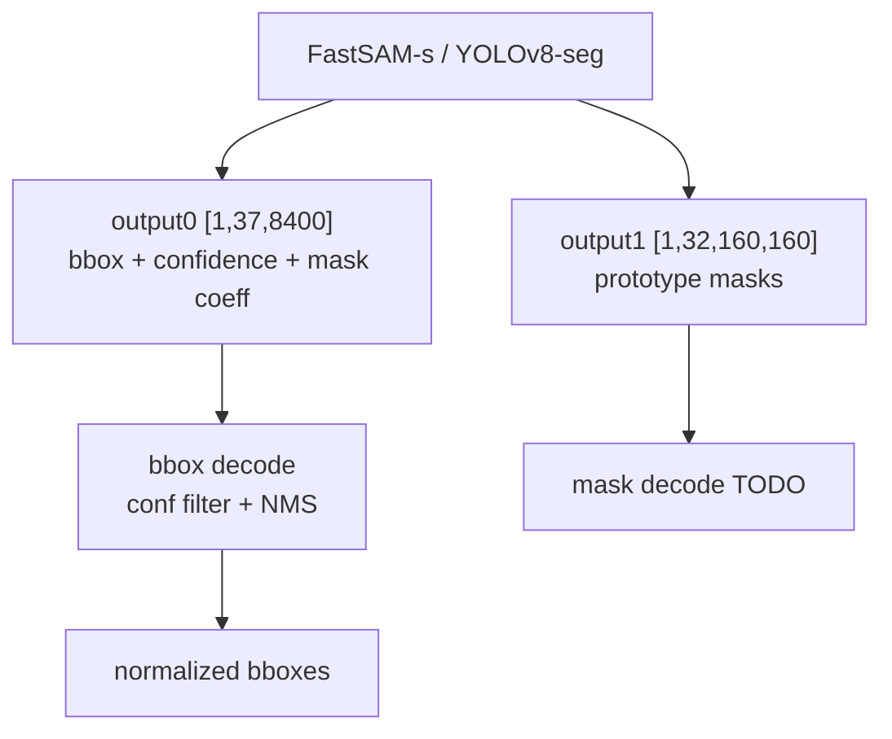

所以文档和面试里必须说清楚：

> 当前 FastSAM 用的是 bbox proposal，不是完整 mask segmentation。prototype mask decode 还没有接入。
>

### 4.3 INT8 per-tensor quantization 为什么破坏 confidence
INT8 原始模型属性：

```latex
output0 type=INT8 zp=-119 scale=2.820890
```

反量化公式：

```latex
float_value = (int8_value - zero_point) * scale
```

代入：

```latex
int8=-119 -> ( -119 - (-119) ) * 2.820890 = 0.0
int8=-118 -> ( -118 - (-119) ) * 2.820890 = 2.820890
```

但 YOLOv8-style confidence 正常范围是 `[0,1]`。也就是说，对 confidence 来说：

> 一个 INT8 量化级距就是 2.82，已经远大于整个 confidence 的有效范围。
>

所以 confidence 不是连续地落在 0.1、0.2、0.8，而是变成：

```latex
0.0, 2.82, 5.64, ...
```

再经过解码逻辑和阈值过滤，就会出现候选框全空或非常异常。

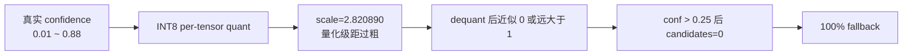

### 4.4 为什么 FP16/no-quant 能修复
FP16 no-quant 模型属性：

```latex
output0 type=FP16 zp=0 scale=1.0
output1 type=FP16 zp=0 scale=1.0
```

FP16 下首帧观察：

```latex
conf_channel max=0.8794
conf_channel top-10: 0.8794 0.8628 ...
raw candidates after conf>0.25: 24
after NMS: 3 bboxes
fallback_frames: 0
```

对比：

| 指标 | INT8 | FP16/no-quant |
| --- | --- | --- |
| output0 type | INT8 | FP16 |
| output0 scale | 2.820890 | 1.0 |
| conf top-1 | 接近 0 或异常 | 0.8794 |
| `conf>0.25` candidates | 0 | 24 |
| fallback 比例 | 100% | 0% |
| 结论 | 量化失真 | 可用 |


### 4.5 最终工程解法
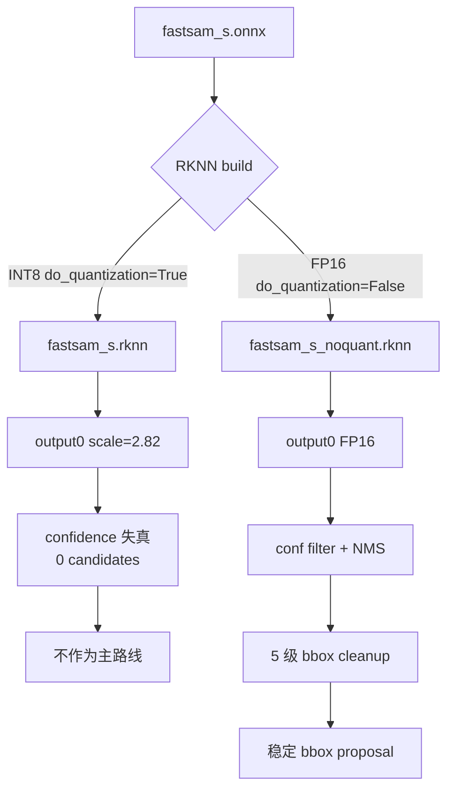

5 级 bbox 净化：

| 层级 | 操作 | 作用 |
| --- | --- | --- |
| L1 | clamp 到 `[0,1]`，移除退化框 | 防 API 校验失败 |
| L2 | 移除面积过小框 | 去噪 |
| L3 | 移除面积过大框 | 防整图框污染 |
| L4 | 高 IoU 去重 | 减少重复框 |
| L5 | 限制最大数量 | 控制 VLM 输入复杂度 |


### 4.6 面试口语说法
**30 秒版：**

> FastSAM 的问题不是不能转 RKNN，而是 INT8 per-tensor quantization 把 YOLOv8-seg detection head 的 confidence 通道破坏了。`output0 [1,37,8400]` 的 scale 是 2.82，而 confidence 本来在 0 到 1 之间，一个量化级距就超过整个有效区间，导致 `conf>0.25` 后没有候选框，100% fallback。最后我改成 FP16/no-quant RKNN，confidence 恢复到 0.8 左右，候选框和 NMS 正常，fallback 从 100% 降到 0%。
>

**2 分钟版：**

> 我先区分 FastSAM 的两个输出：`output0` 是 detection，`output1` 是 prototype mask。本阶段实际用的是 output0 做 bbox proposal，mask decode 暂时没做。INT8 模型虽然能跑，但 output0 的 per-tensor scale 是 2.820890，这对 bbox 坐标也许还能勉强处理，但对 confidence 这种 0 到 1 的小数非常致命。一个 int8 step 就是 2.82，导致 confidence 失去精度，阈值过滤后没有候选框。为验证这个判断，我加了 conf min/max/mean/top10 日志，FP16 no-quant 后 top confidence 回到 0.879，conf>0.25 有 24 个 candidates，NMS 后有稳定 bbox。所以这不是简单调阈值能解决，而是量化粒度与检测头数值范围不匹配。
>

---

## 5. Qwen3-VL 深度分析
### 5.1 先区分两类问题
Qwen3-VL 的问题要分成两类：

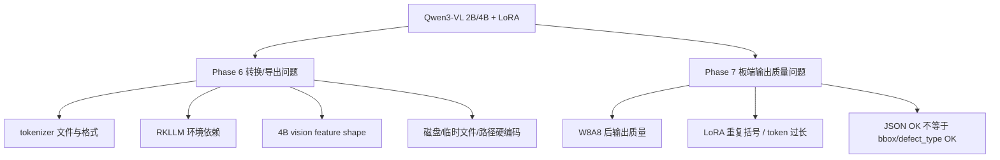

不能说“Qwen3-VL 转换失败”，因为 Phase 6 最终 2B/4B base、2B/4B LoRA RKLLM、2B/4B vision RKNN 都有产物。更准确的说法是：

> Qwen3-VL 的转换主要难在 multimodal export 工具链和 embedding 对齐；LoRA 的板端问题主要是 W8A8 后生成质量和 schema 稳定性下降。
>

### 5.2 Phase 6 工具链问题
| 问题 | 根因 | 解决方式 |
| --- | --- | --- |
| `accelerate` missing | embedding 环境缺依赖 | 安装到 embedding env |
| `protobuf` missing | 环境缺兼容版本 | 安装兼容 protobuf |
| `extra_special_tokens` list error | LLaMA-Factory 导出格式与 transformers 期望不一致 | patch `tokenizer_config.json` |
| 缺 `vocab.json / merges.txt` | LoRA 导出未复制 tokenizer 文件 | 从 base model 补齐 |
| RKLLM venv 污染 | pip 依赖冲突 | 建 clean venv |
| `pkg_resources` missing | setuptools 版本变化 | pin setuptools |
| `--savepath` ignored | 官方脚本硬编码输出目录 | patch 或先默认输出再移动 |
| `datasets.json` path error | 脚本相对路径硬编码 | 从指定父目录运行 |


### 5.3 4B vision feature shape mismatch
这是最有技术含量的 Qwen3-VL 转换问题。

问题：

```latex
model.visual(...) 返回 raw [N*4, 1024]
但 LLM 需要 projected [N, 2560]
```

修复：

```latex
image_embeds = model.model.visual.merger(image_embeds)
```

理解图：

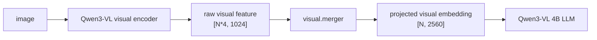

这个问题说明：

> 多模态模型不能只看 LLM 权重转换，还要确保 vision encoder 的输出维度和 LLM 的 `inputs_embeds` 对齐。
>

### 5.4 LoRA W8A8 语义 cliff
PC fp16 benchmark 里 LoRA 明显有效，例如：

| 变体 | Category Exact | DefType Exact | BBox IoU≥0.5 |
| --- | ---: | ---: | ---: |
| 2B_base | 53.1% | 11.2% | 1.5% |
| 2B_lora | 94.4% | 53.1% | 48.9% |
| 4B_base | 59.2% | 10.5% | 0.0% |
| 4B_lora | 95.8% | 64.8% | 64.5% |


这说明 LoRA 在 PC fp16 上确实学到了工业 ontology、defect_type 和 bbox 风格。

但板端 W8A8 后，2B LoRA 出现：

+ JSON 解析失败 1 帧
+ output_tokens 接近 500 上限
+ bbox 出现重复括号 / 嵌套层数过多
+ 格式质量低于 base

所以这里不能说“LoRA 没用”，而应该说：

> LoRA-SFT 在 PC fp16 上有效，但 RKLLM W8A8 部署后存在生成质量 cliff，需要单独做量化后评估、prompt 收缩、max token 控制和 schema 修复。
>

### 5.5 面试口语说法
**30 秒版：**

> Qwen3-VL 我会区分“转换产物”和“语义质量”。Phase 6 最终 2B/4B base、LoRA RKLLM 和 vision RKNN 都导出了，但过程中遇到 tokenizer 文件、RKLLM 环境和 4B vision feature shape mismatch。最关键的是 4B 的 `model.visual(...)` 输出还不是 LLM 需要的 embedding，需要过 `visual.merger`。另外，LoRA 在 PC fp16 benchmark 上提升很明显，但板端 W8A8 后出现 token 过长、bbox 格式不稳，所以我把它称为 W8A8 semantic cliff，而不是简单转换失败。
>

**2 分钟版：**

> Qwen3-VL 是多模态模型，所以部署难点不只是 LLM 转 RKLLM。我们需要先用较新的 transformers 生成 multimodal calibration embeddings，再用固定版本的 RKLLM toolkit 导出。2B 和 4B 的 embedding dim 不一样，4B 还遇到 visual feature shape mismatch：视觉塔输出 raw `[N*4,1024]`，但 LLM 需要 `[N,2560]`，所以必须调用 `visual.merger`。LoRA 方面，PC fp16 上 2B_lora 和 4B_lora 的 category、defect_type、bbox 指标都大幅优于 base，但 W8A8 部署后生成格式有退化，所以我没有把 JSON OK 当成唯一指标，而是继续看 output_tokens、bbox 格式、schema whitelist 和 fallback 比例。
>

---

## 6. YOLOv8n Phase 10 深度分析
### 6.1 当前证据下的保守结论
仓库里存在 YOLOv8n Phase 10 RKNN 转换脚本，支持：

```latex
FP16 no-quant:
models/yolov8n_phase10/yolov8n_metal_nut_cable_best_fp16.rknn

INT8:
models/yolov8n_phase10/yolov8n_metal_nut_cable_best_int8.rknn
```

类别范围是：

```latex
metal_nut
cable
```

同时存在 `ort_localizer.py`：

```latex
C++ LocalizerWorker 启动一个 Python ONNX Runtime CPU subprocess
stdin 输入图片路径
stdout 输出 JSON 检测结果
```

因此文档可以写：

> YOLOv8n RKNN 路径有转换脚本和产物设计，但没有稳定进入主链路；工程上使用 ONNX Runtime CPU subprocess bridge 作为 localizer fallback / 主保底路径。
>

### 6.2 为什么 ORT CPU bridge 不是倒退
很多人会觉得“都上 RK3588 了还跑 CPU ONNX 是失败”。面试中可以这样解释：

> 在端侧工程里，NPU 路径必须经过数值一致性验证。如果 RKNN 的检测头输出和 ONNX reference 不一致，贸然进入主链路会产生错误 bbox 和错误告警。ORT CPU bridge 虽然慢一点，但它提供了可信 reference 和可运行的工程闭环，也能作为后续 RKNN 调试的对照组。
>

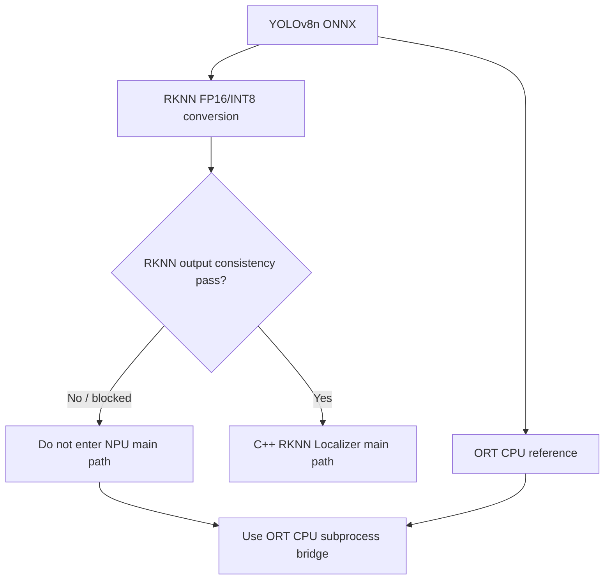

### 6.3 面试口语说法
**30 秒版：**

> YOLOv8n Phase 10 我没有强行把 RKNN 结果接入主链路。虽然有 FP16 和 INT8 转换脚本，但检测头输出必须和 ONNX Runtime reference 做一致性验证。如果 class score 或 bbox head 数值不可信，主链路宁愿先走 ORT CPU subprocess bridge，保证功能正确，再逐步替换成 RKNN。
>

---

## 7. 四个模型放在一张表里
| 模型 | 表面现象 | 真正失败层级 | 具体结构/输出 | 根因 | 解决方式 | 面试关键词 |
| --- | --- | --- | --- | --- | --- | --- |
| EfficientAD-S | `rknn_run failed` / 分数不区分 | Runtime + 数值 | `post_processor/Greater`，`pred_score/anomaly_map`，raw output | INT8/FLOAT Greater 不支持；post score Clip 饱和；raw INT8 分布失真 | raw ONNX + FP16/no-quant + C++ type-aware parse | ONNX surgery、post_processor、raw tensor |
| FastSAM-s | 能跑但无候选框 | 数值 | `output0 [1,37,8400]` confidence | INT8 per-tensor scale=2.82，confidence 量化级距过粗 | FP16/no-quant，bbox cleanup | confidence quantization、YOLOv8-seg head |
| Qwen3-VL | 导出复杂，LoRA 板端不稳 | 文件导出 + 任务语义 | tokenizer、vision embedding、RKLLM W8A8 | 环境依赖、4B visual merger、W8A8 semantic cliff | clean env、patch tokenizer、visual.merger、schema fallback | multimodal embedding、semantic cliff |
| YOLOv8n | RKNN 路径未主线 | 数值一致性 / 工程保底 | detection head class score | RKNN 输出可信度不足，需要 ORT reference | ORT CPU subprocess bridge | reference path、fallback、consistency |


---

## 8. 推荐写进项目文档的版本
### 8.1 长版
```markdown
### 模型转换与量化排障总结

本项目没有把“模型文件成功导出”视为“端侧部署成功”，而是按四层标准验收：文件导出、Runtime 执行、输出数值一致性、任务指标可用性。

EfficientAD-S 的失败点主要来自 Anomalib ONNX 后处理图。旧 ONNX 输出包含 `pred_score / pred_label / anomaly_map / pred_mask`，其中 `pred_label / pred_mask` 依赖 `post_processor` 中的 `Greater` 阈值比较，RKNN Runtime 在 INT8 tensor 与 FLOAT threshold 的组合下报 `ElementwiseLogical unsupported A type: INT8, B type: FLOAT`。进一步分析发现 `pred_score/anomaly_map` 已经是归一化和 Clip 后的后处理输出，good/defect 分数饱和，不适合端侧 threshold gate。因此最终通过 ONNX surgery 导出 post-processor 前的 `raw_score/raw_anomaly_map`。由于 raw INT8 RKNN 上板后输出分布仍有固定和饱和问题，最终采用 `model_raw.onnx -> FP16/no-quant RKNN -> C++ FP16 parse` 的主路线，并在 C++ T2 中加入 `score_mode` 与 `gate_mode`。

FastSAM-s 的问题不是 Runtime 失败，而是 YOLOv8-seg detection output 的 confidence 通道被 INT8 per-tensor quantization 破坏。原 INT8 RKNN 中 `output0 [1,37,8400]` 的 scale 为 2.820890，而 confidence 正常范围是 `[0,1]`，一个 INT8 量化级距已经超过整个 confidence 有效区间，导致 `conf>0.25` 后 raw candidates 为 0，100% fallback。改为 FP16/no-quant 后，confidence top-1 恢复到约 0.879，候选框和 NMS 正常，fallback 比例降为 0%。当前 FastSAM 仅使用 `output0` 做 bbox proposal，`output1 [1,32,160,160]` prototype mask decode 保留 TODO，因此文档中不夸大为完整 mask segmentation。

Qwen3-VL 的转换问题主要来自 multimodal RKLLM 工具链，而不是简单的模型失败。导出过程中需要处理 tokenizer 文件缺失、`extra_special_tokens` 格式不兼容、RKLLM 环境依赖冲突、输出路径硬编码等问题。4B 版本还需要额外处理 vision feature shape mismatch：`model.visual(...)` 返回 raw `[N*4,1024]`，必须经过 `model.model.visual.merger(...)` 投影到 LLM 期望的 `[N,2560]` embedding。LoRA 在 PC fp16 benchmark 中显著提升 category、defect_type 和 bbox 指标，但板端 W8A8 后存在 token 过长、bbox 格式不稳定和 JSON fallback，属于量化后 semantic cliff，需要单独评估，而不能简单写成“LoRA 转换失败”。

YOLOv8n Phase 10 中，RKNN FP16/INT8 转换脚本存在，但检测头输出需要和 ONNX Runtime reference 做数值一致性验证。在 RKNN 路径未稳定通过前，工程上使用 ORT CPU subprocess bridge 保证 localizer 的功能正确性，并作为后续 RKNN 调试的 reference path。
```

### 8.2 简历短句
```markdown
- 在 RK3588 上部署 EfficientAD-S / FastSAM / Qwen3-VL，建立“导出成功、Runtime 可执行、数值一致、任务可用”四层验收标准，定位 EfficientAD Anomalib post_processor `Greater` 类型不兼容、FastSAM detection confidence INT8 量化失真、Qwen3-VL 4B vision embedding shape mismatch 与 LoRA W8A8 semantic cliff 等问题。
- 通过 ONNX surgery 导出 EfficientAD raw tensors，采用 FP16/no-quant RKNN 与 C++ type-aware output parser；将 FastSAM 从 INT8 切换到 FP16/no-quant，使 bbox fallback 从 100% 降到 0%；设计 ORT CPU bridge 作为 YOLOv8n RKNN 数值一致性未通过前的可靠 fallback。
```

---

## 9. 面试问答模板
### Q1：你说模型转换失败，具体失败在哪里？
**答：**

> 我后来把“转换失败”拆成四层。第一层是文件能不能导出，第二层是 RKNN/RKLLM Runtime 能不能执行，第三层是输出数值和 ONNX reference 是否一致，第四层是业务指标是否可用。比如 EfficientAD 不是主干不能跑，而是 Anomalib 后处理里的 `Greater` 在 INT8/FLOAT 类型组合下导致 `rknn_run` 失败；FastSAM 则是能跑，但 detection head 的 confidence 被 INT8 per-tensor scale 破坏；Qwen3-VL 的问题主要是 multimodal embedding 和 W8A8 后语义质量。
>

### Q2：你怎么证明 FastSAM 是量化问题，不是后处理代码写错？
**答：**

> 我加了 output attr 和 confidence channel 诊断。INT8 模型的 `output0` scale 是 2.820890，而 confidence 正常是 0 到 1，一个量化级距就超过整个有效区间，导致 `conf>0.25` 后 candidates 为 0。切到 FP16/no-quant 后，conf top-1 到 0.879，top-10 都在正常范围，conf filter 后有 24 个 candidates，NMS 后有稳定 bbox。这个 A/B 说明问题主要来自 INT8 量化粒度，而不是 C++ 后处理。
>

### Q3：EfficientAD 为什么不用原来的 `pred_score`？
**答：**

> 因为 `pred_score` 是 post_processor 后的输出。我用 ONNX trace 看到它来自 raw score 减 threshold、归一化再 Clip。实际 good 和 defect 都接近 0.9 到 1.0，已经饱和，不能作为 gate。最后我导出 post_processor 前的 `raw_score` 和 `raw_anomaly_map`，再根据 raw map 的 mean/topk 做 score_mode。
>

### Q4：为什么不用 INT8？不是 RK3588 NPU 更适合 INT8 吗？
**答：**

> INT8 是性能友好，但前提是数值分布可用。EfficientAD raw INT8 上板后 good 和 defect 的 map_mean 都集中在 22 到 23，分布和 ONNX 不一致；FastSAM INT8 的 confidence scale 是 2.82，直接破坏检测头。对这两个模型来说，FP16/no-quant 虽然模型更大、可能慢一点，但能保证输出可信。工程上我优先保证正确性，再做性能优化。
>

### Q5：Qwen3-VL LoRA 不是 PC 上效果很好吗，为什么板端还不稳定？
**答：**

> PC fp16 和板端 W8A8 是两个不同分布。PC 上 LoRA 的确显著提升 category、defect_type 和 bbox 指标，说明 SFT 学到了工业 schema 和 ontology。但 RKLLM W8A8 后生成质量会有 cliff，比如 token 变长、bbox 括号嵌套、JSON fallback。所以我把 LoRA 的问题归为量化后语义稳定性，而不是 LoRA 本身无效。
>

### Q6：这个项目最能体现你工程能力的点是什么？
**答：**

> 我觉得不是单纯把模型转成 RKNN，而是建立了一套端侧模型部署的排障方法：先定位图结构和 unsupported op，再用 ONNX Runtime 做 reference，接着对比 RKNN 输出分布，最后用端到端任务指标验证。比如 EfficientAD 我做了 ONNX surgery，FastSAM 我定位到 confidence scale，Qwen3-VL 我处理了 multimodal embedding shape，YOLOv8n 我保留 ORT CPU bridge 做 reference fallback。这些都体现了我能从模型、工具链、C++ runtime 和业务指标一起闭环。
>

---

## 10. 记忆口诀
```latex
Export 成功，不等于 Run 成功；
Run 成功，不等于数值可信；
数值可信，不等于任务可用；
任务可用，还要看端到端节拍和 fallback。
```

对应本项目：

```latex
EfficientAD：后处理 Greater + raw INT8 分布坏
FastSAM：output0 confidence 被 INT8 scale 毁掉
Qwen3-VL：multimodal embedding + W8A8 semantic cliff
YOLOv8n：RKNN 未稳，ORT CPU bridge 保底
```

---

## 11. 最终口语总稿
> 这个项目里我最大的收获是，端侧 AI 部署不能把“模型转换成功”当成“工程成功”。我把整个过程拆成四层：文件能不能导出、Runtime 能不能执行、输出数值是否和 ONNX reference 一致、最终任务指标是否可用。  
>
> EfficientAD 的问题在 Anomalib 后处理图，`Greater` 对 INT8 tensor 和 FLOAT threshold 的组合在 RKNN Runtime 上不支持；而 `pred_score/anomaly_map` 又是 Clip 后输出，good 和 defect 都饱和，所以我通过 ONNX surgery 导出 post-processor 前的 raw tensors，并切到 FP16/no-quant。  
>
> FastSAM 的问题不是跑不起来，而是 detection head 的 confidence 通道被 INT8 per-tensor quantization 破坏。`output0 [1,37,8400]` 的 scale 是 2.82，而 confidence 有效范围是 0 到 1，导致阈值过滤后没有候选框。切到 FP16/no-quant 后，confidence 和 bbox 恢复正常。  
>
> Qwen3-VL 则是多模态部署问题，既有 tokenizer、RKLLM 环境、4B vision merger 这种转换问题，也有 LoRA 在 W8A8 后生成质量下降的问题。我没有只看 JSON OK，而是继续看 defect_type、bbox、output token 和 fallback。  
>
> 所以这个项目体现的是一套完整的端侧部署排障能力：从 ONNX graph、RKNN/RKLLM runtime、数值分布、C++ parser 到最终 API 和前端展示做闭环，而不是只会跑转换脚本。
>

